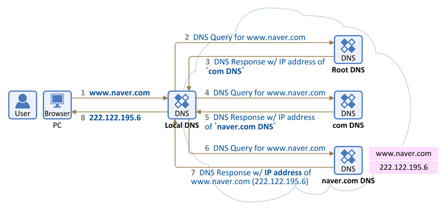

# DNS 동작 원리

## DNS 란 ?
> 도메인 네임 시스템은 호스트의 도메인 이름을 호스트의 네트워크 주소로 바꾸거나 그 반대의 변환을 수행할 수 있도록 하기 위해 개발되었다.

예를 들면 우리가 자주 접하는 naver.com , google.com 모두 DNS 를 가진 DN(Domain Name)이라고 할 수 있다.  
  
  이들은 사실 문자열의 탈을 쓴 IP라 볼 수 있다.

 

## DNS의 작동원리

1. 웹 브라우저에 www.naver.com을 입력하면 먼저 local DNS에게 www.naver.com 이라는 hostname에 대한 IP 주소를 질의하여 local DNS에 없으면 다른 DNS name 서버 정보를 받는다.

### Root DNS
- 인터넷의 도메인 네임 시스템의 루트 존이다.
- 루트 존의 레코드의 요청에 직접 응답하고 적절한 최상위 도메인에 대해 권한이 있는 네임 서버 목록을 반환함으로써 다른 요청에 응답한다.
- 전세계 961개의 루트 DNS가 운영되고 있다.
  

2. Root DNS 서버에 'www.naver.com' 질의
3. Root DNS 서버로 부터 "com 도메인" 을 관리하는 `TLD (Top-Level Domain)` 이름 서버 정보 전달 받음

> 여기는 TLD는 .com을 관리하는 서버를 칭함

4. TLD에 'www.naver.com' 질의
5. TLD에서 'name.com'관리하는 DNS 정보 전달
6. 'naver.com' 도메인을 관리하는 DNS 서버에서 'www.naver.com' 호스트네임에 대한 ip 주소 질의
7. Local DNS 서버에게 응! www.naver.com에 대한 IP 주소는 222.122.195.6 응답.
8. Local DNS 는 www.naver.com에 대한 IP 주소 정보 전달