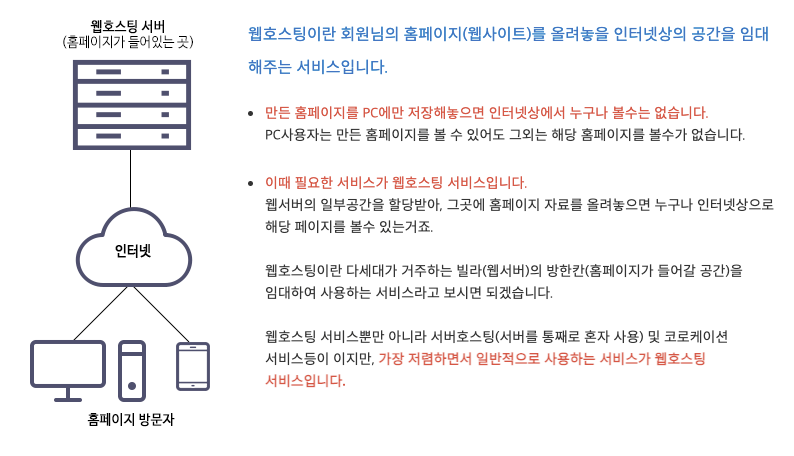
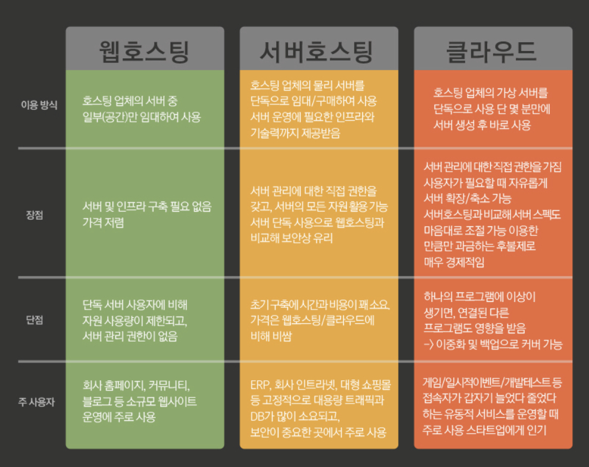
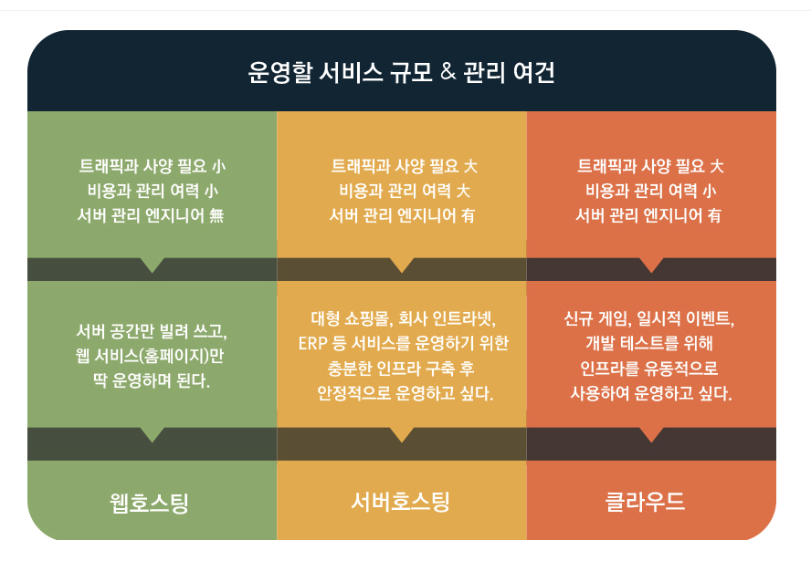

# 호스팅

## 호스팅이란 ?

- 어떠한 서비스를 빌려서 사용한다는 말이다.
- 그럼 웹 호스팅은? 말그대로 외부의 서버를 빌려서 기능을 사용한다는 말을 의미한다. 호스팅은 웹호스팅, 서버호스팅, 클라우드호스팅과 같은 종류가 있다.

 

## 웹 호스팅

- 예를들어 HTML이나 CSS 와 같은 코드를 이용해서 웹 페이지를 만들었다고 치자. 웹페이지를 하나 제작했다고 해서 누구나 내 사이트에 접속할 수 있는 것이 아니다. 배포과정을 거치고 도메인까지 연결을 해야 비로소 하나의 웹 페이지가 웹 사이트로 거듭나는 것이다.
- 이 배포 과정을 전문 업체에 맡기는 것이다. 물론 이 과정을 직접 할 수도 있지만 개인이 서버를 구매하고 설치하는것은 좀 많이 어렵다.

 

## 서버 호스팅

서버호스팅과 웹호스팅의 차이는 ?

- 웹 호스팅 : 서버중 `일부` 만 빌리는 서비스
- 서버 호스팅 : 서버 하나를 통째로 구매할 수 있으며 서버 운영에 필요한 인프라와 기술력까지 제공받을 수 있다.

> 웹 호스팅은 소규모 웹사이트에 주로 사용되고
> 서버 호스팅은 서버 관리에 대한 직접권한을 갖고 서버를 단독으로 사용하기 떄문에 보안상으로도 유리하지만 초기 구축단계에서 웹 호스팅에 비해 시간과 비용이 많이 든다는 단점이 있다. 보통 회사의 인터라넷, 대형 쇼핑몰등 고정적으로 대용량 트래픽과 DB가 많이 사용되는 곳에 사용됨

 

## 클라우드 호스팅

클라우드 호스팅은 웹호스팅의 장점과 서버호스팅의 장점을 모두 가지고 있는 호스팅이며 최근 많은 주목을 받는 호스팅 방법이다. 아마존의 EC2와 구글의 클라우드 플랫폼 등 다양한 서비스가 존재하며 장점을 나열해보자면 앉은자리에서 클릭 몇번으로 10분 안에 누구나 서버를 생성하고 관리할 수 있으며 트래픽 변동에도 유연하게 대처할 수 있기 때문에 일시적인 이벤트나 인프라가 유동적인 곳에 사용하기 편리하다는 장점이 있다. 단점도 있지만 점점 클라우드 호스팅의 변화로 단점이 사라지고 있는 추세이다.

 

## 비교

1. 개인 블로그 , 소규모 트래픽이 필요한 곳 : 웹 호스팅
2. 트래픽과 DB 사용량이 많아 서버 관리 인프라가 같이 필요한 곳 : 서버 호스팅
3. 트래픽 변화에 유동적인 대처가 가능하며 빠른 시간안에 서버를 구축할 수 있는 서비스 : 클라우드 호스팅