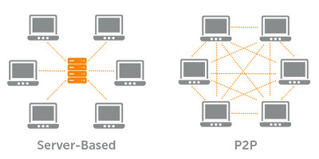

# P2P

- **중앙 서버 없이 대등한 관계**의 컴퓨터 그룹이 직접 서로 통신하는 분산 구조
- 망 구성에 참여하는 Peer들이 Processing power, 저장공간, bandwith등의 자원 공유
- application layer에 네트워크를 build 하는 overlay network
- 빠른 인터넷 연결 속도, end-user들의 높은 성능. peer가 많을 수록 power 상승
- 확장성, 신뢰성(복사본, 지리적 분산, No single point of failure), 저렴함
- **Structured P2P**
  - DHT(Distributed Hash Table) : key: hash(filename); value : a node (IP address)
  - assign : 가장 가까운 peer에게 key를 주기, find: key에 해당되는 노드들 찾기
- key lookup 방식
  - 직속 successor peer의 주소만 아는 경우: 물어보고->물어보고->물어보고.. 쿼리 O(N)유지 O(1)
  - 모든 peer의 주소를 아는경우: 쿼리 O(1) 유지 O(N)
  - Chord Lookup: 2^i로 뛰며 탐색해서 O(logN)