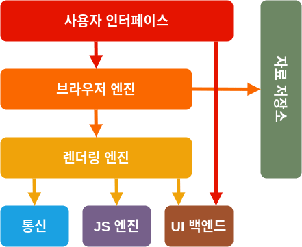

# 웹 브라우저의 동작원리

## 웹 브라우저와 웹 서버의 통신과정
- 브라우저의 주요 기능은 사용자가 자원을 서버에 요청하고 요청한 자원을 브라우저에 표시하는 것이다.
- 웹 브라우저에 URL을 입력하면 웹 서버라 불리는 프로그램이 웹 브라우저에 웹 페이지를 제공한다.

> 웹 브라우저가 웹서버에 웹 페이지를 달라고 하는 것 : 요청
> 요청한 웹 페이지를 웹 브라우저에 제공하는 것 : 응답

  
각 컴퓨터 주소는 IP를 가지고 있다. 그런데 아이피는 숫자들로 구성되어 있어서 외우기 쉽지 않다. 이런 이유로 IP 주소 대신에 사람이 기억하기 좋은 도메인 이름을 사용한다.  
  
웹 브라우저와 웹 서버는 IP 주소를 이용하여 연결하기 때문에 도메인 이름을 IP주소로 변환할 필요가 있는데, 이 때 사용하는 것이 바로 `DNS`이다. 웹 브라우저에서 URL을 입력하면, 웹 브라우저는 도메인 이름에 해당하는 IP 주소를 DNS에 요청하고 DNS는 IP주소를 응답으로 제공한다.

- 일반적으로 네트워크 프로그램에서 요청하는 쪽 `클라이언트`라고 부르고, 요청을 받아 알맞은 기능이나 데이터를 제공하는 쪽 `서버`라고한다.

 

## 웹 브라우저의 주요 기능
브라우저의 주요 기능은 사용자가 선택한 자원을 서버에 요청하고 브라우저에 표시하는 것이다. 브라우저의 `사용자 인터페이스`는 다음과 같은 요소들이 일반적이다.

- URL을 입력할 수 있는 주소 표시 줄
- 이전 버튼과 다음 버튼
- 새로 고침 버튼과 현재 문서의 로드를 중단할 수 있는 정지 버튼
- 홈 버튼

## 브라우저의 기본 구조

- 사용자 인터페이스 : 주소 표시줄, 이전/다음 버튼, 북마크 등 페이지 뷰 이외의 다른 부분
- 브라우저 엔진 : 사용자 인터페이스와 렌더링 엔진 사이 동작을 제어
- 렌더링 엔진: HTML , CSS 를 파싱해 화면에 요청한 컨텐츠를 표시
- 통신 : http 요청과 같은 네트워크 호출에 사용됨
- JS 엔진 : 자바스크립트 코드르 해석하고 실행
- UI 백엔드 : 기본적인 위젯(콤보 박스 등)을 그림
- 자료 저장소 : 자료를 저장하는 계층으로 쿠키 등을 저장하는 웹 데이터베이스

크롬은 대부분의 브라우저와 달리 각 탭마다 별도의 랜더링 엔진 인스턴스를 유지하는 것이 주목할만하다. 각 탭은 독립된 프로세스로 처리된다.

 

## 랜더링 엔진
랜더링 엔진은 **요청 받은 내용을 브라우저 화면에 표시**한다. HTML , XML 문서와 이미지를 표시할 수 있다. 플러그인이나 브라우저 확장 기능을 이용해 pdf와 같은 다른 유형도 표시할 수 있다.  
> 파이어폭스 , 크롬, 사파리는 두 종류의 렌더링 엔진으로 제작 되었다. 파이어폭스는 모질라에서 직접 만든 `Gecko` 엔진을 사용하고 사파리와 크롬은 `Webkit` 엔진을 사용한다.

### 동작 과정
1. DOM 트리 구축을 위한 html 파싱 : 브라우저는 서버로부터 html 문서를 모두 전달받는다. 렌더링 엔진은 전달받은 html 문서를 파싱해서 `dom` 트리를 구축한다. 그리고 외부 css 파일과 스타일 요소도 파싱한다.
2. 렌더 트리 구축 : `DOM` 트리와 스타일 정보를 합쳐서 렌더트리를 만든다.
3. 렌더 트리 배치 : 랜더 트리의 각 노드에 대해서 화면 상에서 어디에 배치할 지 결정한다.
4. 랜더 트리 그리기 : UI 백엔드에서 랜더 트리를 그리게 되고, 우리가 보는 화면에 출력된다.
  
웹킷 동작 방식.  
