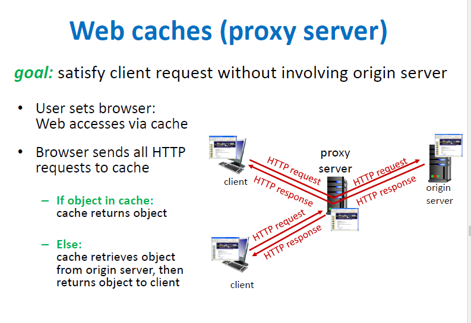

# 웹 캐시(프록시 서버)

- orogin 서버 없이도 미리 저장해둔 데이터로 중간에서 response
- client의 요청에 대한 응답 시간과 트래픽을 줄여주고 효과적으로 데이터 전달
- cache 서버의 데이터가 up-to-date인지 (origin 서버와 같은 상태인지) 체크해서 받는 Conditional GET 방법도 있음(if-modified-since 헤더)

