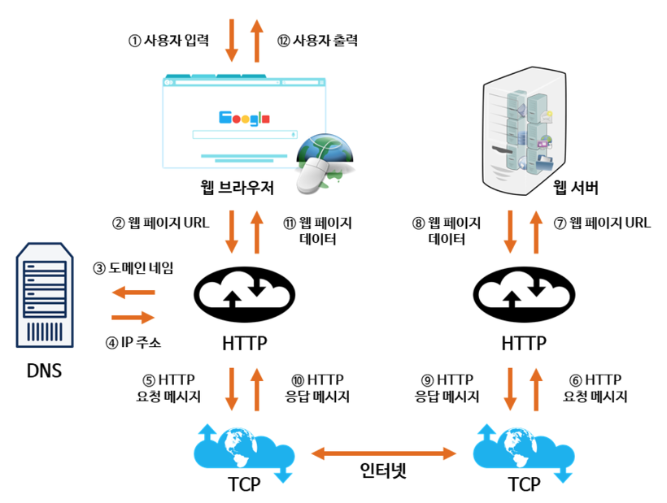
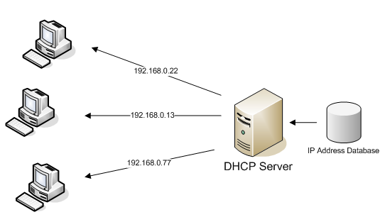
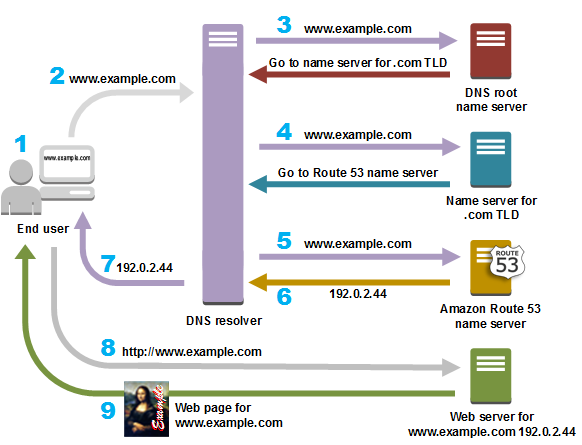

# 네트워크 웹 통신의 흐름

주소창에 url을 입력했을때 통신의 흐름에 대해 알아보자.  
  
웹 통신의 흐름을 보기 전에 알아야할 개념이 있다.

### IP 주소
컴퓨터 네트워크에서 장치들이 서로를 인식하고 통신을 하기 위해 사용하는 특수한 번호  
-> 현재 사용하는 IPv4는 128.0.0,.1과 같은 32비트 수로 구성되어 있다.

### Domain Name
IP 주소를 문자로 표현한 주소  
-> DNS : IP주소와 도메인 이름의 매핑 정보를 담는 데이터베이스

 

### 작동 방식

1. 사용자가 브라우저에 도메인 이름을 입력한다.
2. DNS서버에서 사용자가 입력한 도메인 이름을 검색 후 매핑되는 IP주소를 찾는다. 사용자가 입력한 URL 정보와 함께 리턴한다.
3. IP주소는 HTTP 프로토콜을 이용해서 HTTP 요청 메시지를 생성한다.
4. 생성된 HTTP 요청 메세지는 TCP프로토콜을 사용해 인터넷을 거쳐 해당 IP주소의 컴퓨터(서버)로 전송된다.
5. 서버는 클라이언트의 요청을 승인 후 응답 메시지를 전송한다.
6. 도착한 HTTP 응답 메시지는 HTTP 프로토콜을 사용하여 웹페이지 데이터로 변환되고, 웹 브라우저의 출력에 의해 사용자가 볼 수 있다.

### DNS 서버의 주소 찾기

### DHCP
- Dynamic Host Configuration Protocol

- 호스트의 IP 주소와 TCP/IP 설정 클라이언트에 의해 자동으로 제공하는 응용 계층 프로토콜

사용자는 DHCP 서버에서 자신의 IP주소, 가장 가까운 라우터의 IP주소, 가장 가까운 DNS 서버의 주소를 받는다.

### ARP
- Address Resolution Protocol
- 네트워크상에서 IP 주소를 물리적 네트워크 주소로 바인딩시키기 위해 사용되는 프로토콜
- DHCP로 얻은 라우터의 IP주소를 MAC 주소로 변환

 

### DNS 서버에서 IP 정보 수신

1. DNS 서버에 DNS Query(www.example.com)를 전송
 : 우리나라의 경우에는 통신사별로 지정된 DNS 서버가 있다.
2. DNS 서버는 루트 네임 서버에 DNS Query를 질의한다.
 : 루트 네임 서버는 .com의 ip주소를 반환한다.
3. .com 네임 서버에 DNS 쿼리를 질의한다.
 : .com 네임 서버는 example.com의 ip주소를 반환한다.
4. example.com 네임 서버에 DNS 쿼리를 질의한다.
 : www.example.com의 IP 주소를 반환한다.

 DNS 서버는 계층화 구조를 이루는데, 최상단인 계층인 가장 뒤쪽(.com .kr 등등)을 담당하는 DNS 서버는 전세계에 13개 뿐이다.

  

 ### 웹 서버 접속

위의 과정으로 접속하려는 서버의 IP 주소를 알아냈다.
1. HTTP Request를 위해 TCP socket을 개방하고 연결한다.

2. TCP 연결에 성공하면, HTTP Request가 TCP socket을 통해 보내짐
3. 웹 페이지의 정보가 응답으로 돌아옴