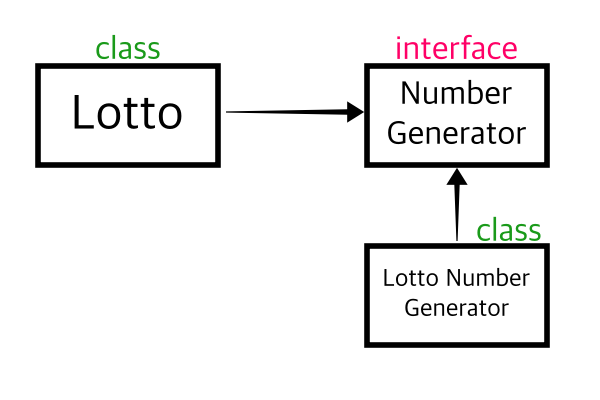

# 객체지향 5가지 원칙

### 5원칙
1. SRP (Single Responsibility Principle) : 단일 책임 원칙
2. OCP (Open-Closed Principle) : 개방 폐쇄 원칙
3. LSP (Liskov Substitution Principle) : 리스코프 치환 원칙
4. ISP (Interface Segragation Principle) : 인터페이스 분리 원칙
5. DIP (Dependency Inversion Principle) : 의존관계 역전 원칙

<br>

## SRP 단일 책임 원칙, Single Responsibility Principle
> 하나의 클래스는 하나의 책임만 가져야한다.

- 책임이란 기준이 모호하기 때문에 `변경`을 책임의 기준으로 삼으면 설계에 용이할 수 있다.
- 어떠한 역할에 대해 변경사항이 발생했을때, 영향을 받는 기능만 모아둔 클래스라면, 동일한 책임을 지닌 기능이 모인 집합으로써 SRP 원칙이 적용된 설계로 볼 수 있을것 같다.
- 이처럼 **변경사항이 있을때, 애플리케이션의 파급 효과가 적으면** 이 원칙을 잘 따른것으로 볼 수 있다.

<br>

## OCP 개방 폐쇄 원칙, Open Closed Principle
> 개방 폐쇄 원칙을 `높은 응집도와 낮은 결합도`라는 원리로 설명할 수 있다.

### 높은 응집도
응집도가 높다는건 하나의 모듈, 클래스가 하나의 책임 또는 관심사에만 집중되어 있다는 뜻이다. 같은 책임, 관심사를 기반으로 하나의 객체로 설계하기 때문에 객체의 변경이 발생하더라도 다른 곳에 미치는 영향이 제한적이다.

### 낮은 결합도
책임과 관심사가 다른 객체 또는 모듈과는 낮은 결합도를 유지해야 한다. 이는 높은 응집도보다 더 민감한 원칙이다.

- `결합도` 란 하나의 오브젝트가 변경이 일어날때 관계를 맺고있는 다른 오브젝트에게 변화를 요구하는 정도다.
- 즉 낮은 결합도란, 하나의 변경이 발생할 때 다른 모듈과 객체로 변경에 대한 요구가 전파되지 않는 상태라고 볼 수 있다.

다른 곳에서는 개방폐쇄원칙을 확장에 열려있고, 변경에 닫혀있다고도 한다.

### 확장에 열려있다?
- 모듈의 확장성을 보장하는 것을 의미한다.
- 새로운 변경사항이 발생했을 때 유연하게 코드를 추가 또는 수정할 수 있기 때문이라고 한다.

### 변경에 닫혀있다?
- 객체를 직접적으로 수정하는건 제한해야한다. 기능이 추가되거나 수정할 때, 객체를 직접적으로 수정해야 한다면 새로운 변경사항에 대해 유연하게 대응할 수 없는 애플리케이션이다.
- 이는 유지보수의 비용증가가 될 수 있으며, 객체지향적인 설계로 볼 수 없다.
- 따라서 객체를 직접 수정하지 않고도 변경사항을 적용할 수 있도록 설계해야 한다. 그래서 변경에 닫혀있다고 표현한 것으로 추론된다.

> 결과적으로 OCP는 `추상화`를 의미하는 것으로 해석된다. 객체를 추상화함으로써 확장엔 열려있고, 변경엔 닫혀있는 유연한 구조를 만들 수 있는 것이다.

> OCP를 구현하기 위해서는 DI , IoC가 필요하다.

<br>

## LSP 리스코프 치환 원칙, Liskov Substitution Principle
> 객체는 프로그램의 정확성을 깨지 않으면서 하위 타입의 인스턴스로 바꿀 수 있어야 한다.

- 하위 클래스는 `인터페이스 규약`을 지켜서 작성되어야한다. 다형성을 지원하기 위한 원칙, 인터페이스를 구현한 구현체는 믿고 사용하려면 LSP가 필요하다.
- 인터페이스의 메소드를 사용한다고 하면, 어떤 구현체를 사용하든 호출부에서 기대하는대로 동작되어야 한다는 것 이다.
  
```java
interface Calculator {
  int add(int num1 , int num2);
}
```

호출부에서 `add()`를 호출하면, 내부 로직을 모르더라도 파라미터에 들어온 데이터를 합산해서 반환해줄 것이라는 것을 기대하고 사용할테니 인터페이스의 구현체, 하위 클래스들은 이런 규약을 지켜서 설계 되어야한다.


<br>

## ISP 인터페이스 분리 원칙 , Interface Segragation Principle
> 범용 인터페이스 하나보다는 특정 클라이언트를 위한 여러 개의 인터페이스 분리가 더 좋다고 한다.

- `운전자가 자동차를 운전한다` 라는 명제를 객체간 관계로 비유하면 자동차에 대한 인터페이스, 운전자에 대한 인터페이스를 각각 분리하는 것이다.
- 그러면 `운전자`는 `택시기사`가 될 수도있고, `우버 드라이버`가 될 수 있다. `자동차`는 `버스`가 될 수도 있고, `택시`가 될 수도 있고 확장성이 커지는 셈이다.

<br>

## 의존관계 역전 원칙 , Dependency Inversion Principle
> 프로그래머는 구체화가 아니라 추상화에 의존해야 한다. 즉 구현 클래스가 아니라 인터페이스에 의존하라는 이야기다.

- 연극을 예로 들면 배역과 배우로 예를 들 수 있다. 이 대 연극은 특정 배우를 염두에 두고 기획되기 보다 배역에 집중해서 기획되어야 한다.
- 특정 배우에 의존했는데 만약 그 배우가 스케줄 또는 당일 컨디션때문에 연극에 출연이 불발 될 경우 해당 연극은 차질이 불가피해진다. 따라서 연극은 배우가 아닌 배역에 의존해야한다.



이렇게 의존관계를 설계하면 `LottoNumberGenerator` 객체에 대한 변경사항이 발생하거나 혹은 객체를 삭제할 일이 있어도 `Lotto` 클래스에는 직접적인 코드 변경을 할 필요가 없어진다.


