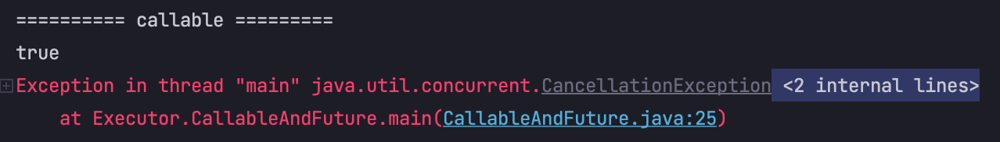

# Java Callable, Future

## Future
Future는 Runnable을 구현하는 클래스이고 Executor에 의해 실행된다.  
return null as a result of the underlying task. -> null 반환, NPE의 문제가 발생한다.
  
Thread는 Runnable과 Callable의 구현된 함수를 구현한다는 공통점이 있지만. 차이점도 존재한다.  

- Runnable: 어떤 객체도 리턴하지 않는다 Exception을 발생시키지 않는다.
- Callable: 특정 타입의 객체를 리턴한다. Exception을 발생시킨다.

```java
public class CallableAndFuture {
    public static void main(String[] args) throws ExecutionException, InterruptedException {
        ExecutorService executorService = Executors.newSingleThreadExecutor();

        Callable<String> hello = () -> {
            Thread.sleep(1000L);
            return "Hello";
        };
        Callable<String> hope = () -> {
            Thread.sleep(1000L);
            return "hope";
        };

        System.out.println("========== callable =========");
        Future<String> submit = executorService.submit(hello);
        System.out.println(submit.get());
    }
}
```

이렇게 Callable Type의 함수를 미리 구현하고 executorService.submit()을 통해 작업을 추가하고 해당 작업을 즉시 블록킹 하려면 .get()을 통해 결과를 볼 수 있다.  
  
람다식으로도 당연히 가능하다 어차피 람다는 타입을 통한 추론을 해주기 때문에

```java
Future<String> submit = executorService.submit(() -> {
    Thread.sleep(2000L);
    return "asdfgh";
});
System.out.println(submit.get());
```

## 프로세스 현황 파악하기
submit.isDone(); 을 사용하면 프로세스가 끝났는지 아닌지 booleanType으로 확인이 가능하다.  
submit.cancel(true);을 사용하면 프로세스를 강제 종료할 수 있다.
  
이렇게 되면 그 후에 오는 모든 작업에 관한 세부 메소드가 disabled가 된다.



## 여러 작업을 동시에 실행하기
ExecutorService.invokeAll()을 사용하여 가능하다.
```java
public class CallableAndFuture {
    public static void main(String[] args) throws ExecutionException, InterruptedException {
        ExecutorService executorService = Executors.newSingleThreadExecutor();

        Callable<String> hello = () -> {
            Thread.sleep(1000L);
            return "김희망";
        };
        Callable<String> hope = () -> {
            Thread.sleep(1000L);
            return "hope";
        };
        Callable<String> esperer = () -> {
            Thread.sleep(2000L);
            return "esperer";
        };

        List<Future<String>> futures = executorService.invokeAll(Arrays.asList(hello, hope, esperer));
        for (Future<String> f : futures){
            System.out.println(f.get());
        }

        executorService.shutdown();
    }
}
```

`invokeAll()`은 Collection tasks를 받기 때문에 Arrays.asList()를 통해 치환하여 파라미터로 넘겨준다.  
또 이 invokeAll() 메소드의 특징이 있는데 아래에 API docs를 참고해보자


이처럼 모든 task, hello, hope, esperer 3task가 모두 완료 되어야만 .isDone()이 true가 된다.  
결론적으로 3개의 tasks 중 가장 시간이 오래 걸리는 2초동안의 작업마저 모두 완료가 되어야 isDone을 true로 반환한다는 것이다.