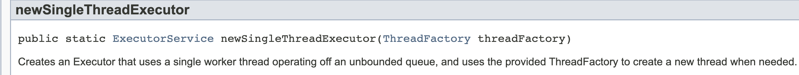

# Java Executors

스레드를 만들고 관리하는 작업을 고수준의 api에게 위임하는게 Executors 이다.  
  
스레드를 만들고 처리하고 실행하고 종료하는 것을 해주는 역할을 한다. 

## ExecutorService
우선 ExecutorService는 Executor를 상속받은 인터페이스로, Callable도 실행할 수 있으며 Executor를 종료시키거나, Callable을 동시에 실행하는 동의 기능을 제공한다.

```java
public class ExecutorEx {
    public static void main(String[] args) {
        ExecutorService executorService = Executors.newSingleThreadExecutor();
        executorService.submit(() -> {
            System.out.println("Thread " + Thread.currentThread().getName());
        });
    }
}
```
이 코드를 실행해 보면


이처럼 newSingleThreadExecutor()은 무제한 큐에서 작동하는 단일 스레드를 사용하는 Executor를 만들어 준다.  
그래서 프로세스가 실행되고 계속 유지되고 종료되지 않는 것을 확인할 수 있다.
  
프로세스를 종료하고 싶담녀 종료 메서드를 사용하여 프로세스를 닫아줘야 한다. executorService.shutdown();
  
Fork/Join 프레임워크를 사용하여 멀티 프로세스도 활용할 수 있다.