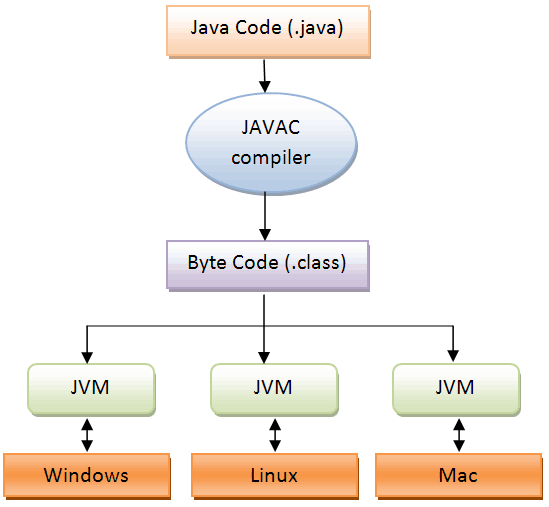
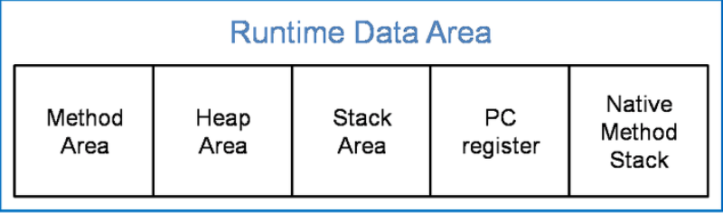
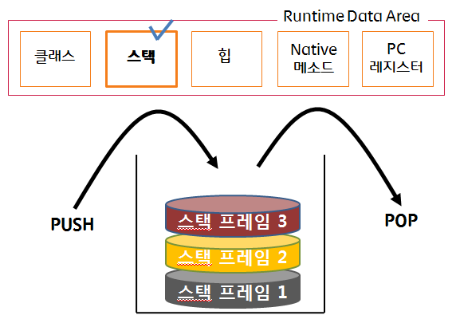

# JVM 메모리 구조

### JVM이란 ?
- JVM은 Java Virtual Machine의 약자로, 자바 가상 머신이라고 불린다.
- 자바와 운영체제 사이에서 중재자 역할을 수행하며, 자바가 운영체제에 구애 받지 않고 프로그램을 실행할 수 있도록 도와준다.
- 가비지 컬렉터를 사용한 메모리 관리도 자동으로 수행하며, 다른 하드웨어와 다르게 레지스터 기반이 아닌 `스택`기반으로 동작한다.

### 자바 프로그램 실행 단계

먼저, 자바 컴파일러에 의해 자바 소스 파일은 바이트코드로 변환됩니다. 그리고 이러한 바이트코드를 `JVM`에서 읽어드린 다음에, 이것저것 복잡한 과정을 거쳐 어떤 운영체제든간에 프로그램을 실행할 수 있도록 만드는 것 입니다.  
  
만약, 자바 소스 파일은 리눅스에서 만들었고 윈도우에서 이 파일을 실행하고 싶다면, 윈도우용 JVM을 설치만 하면 됩니다. 여기서 JVM은 운영체제에 종속적이라는 특징을 알 수 있습니다.

 

### JVM 메모리 구조
- JVM 구조는 크게 보면 , Garbage Collector , Execution Engine , Class Loader , Runtime Data Area로, 4가지로 나눌 수 있습니다.

자바 소스 파일은 자바 컴파일러에 의해 바이트 코드 형태인 클래스 파일이 됩니다.  
그리고 이 클래스 파일은 클래스 로더가 읽어들이면서 JVM이 수행됩니다.

#### 1. Class Loader
JVM 내로 클래스 파일을 로드하고, 링크를 통해 배치하는 작업을 수행하는 모듈입니다. 런타임 시에 동적으로 클래스를 로드합니다.

#### 2. Execution Engine
- 클래스 로더를 통해 JVM 내의 Runtime Data Area에 배치된 바이트 코드들을 명령어 단위로 읽어서 실행합니다.
- 최초 JVM이 나왔을 당시에는 인터프리터 방식이였기 때문에 속도가 느리다는 단점이 있지만 JIT 컴파일러 방식을 통해 이 점을 보완하였습니다. 
- JIT는 바이트코드를 어셈블리어같은 네이티브 코드로 바꿈으로써 실행이 빠르짐나 역시 변환하는데 비용이 발생했습니다.
- 이와 같은 이유로 JVM은 모든 코드를 JIT 컴파일러 방식으로 실행하지 않고, 인터프리터 방식을 사용하다가 일정한 기준이 넘어가면 JIT 컴파일러 방식으로 실행합니다.

#### 3. Garbage Collector
- 힙 메모리 영역에 생성된 객체들 중에서 참조되지 않은 객체들을 탐색 후 제거하는 역할을 합니다.
- GC가 역할을 하는 시간은 언제인지 정확히 알 수 없습니다.

#### 4. Runtime Data Area
- JVM의 메모리 영역으로 자바 애플리케이션을 실행할 때 사용되는 데이터들을 적재하는 영역입니다.
- 이 영역은 크게 Method Area, Heap Area , Stack Area, PC Register , Native Method Stack로 나눌 수 있습니다.

1. `Method area` : 모든 쓰레드가 공유하는 메모리 영역입니다. 메소드 영역은 클래스, 인터페이스,메소드 필드, Static 변수 등의 바이트 코드를 보관합니다.
2. `Heap area` : 모든 쓰레드가 공유하며, new 키워드로 생성된 객체와 배열이 생성되는 영역입니다. 또한, 메소드 영역에 로드된 클래스만 생성이 가능하고  Garbage Collector 가 참조되지 않는 메모리를 확인하고 제거하는 영역입니다.
3. `Stack area` : 메서드 호출 시 마다 각각 스택 프레임(메서드를 위한 공간)이 생성됩니다. 그리고 메서드 안에서 사용되는 값들을 저장하고, 호출된 메서드의 매개변수 지역변수 리턴 값 및 연산 시 일어나는 값들을 임시로 저장합니다. 마지막으로, 메서드 수행이 끝나면 프레임별로 삭제합니다.

4. `PC Register` : 쓰레드가 시작될 때 생성되며, 생성될 때마다 생성되는 공간으로 쓰레드마다 하나씩 존재합니다. 쓰레드가 어떤 부분을 무슨 명령으로 실행해야할 지에 대한 기록을 하는 부분으로 현재 수행중인 JVM 명령의 주소를 갖습니다.
5. `Native Method stack` : 자바 외 언어로 작성된 네이티브 코드를 위한 메모리 영역입니다.

 

> 참고 자료 : https://steady-coding.tistory.com/305