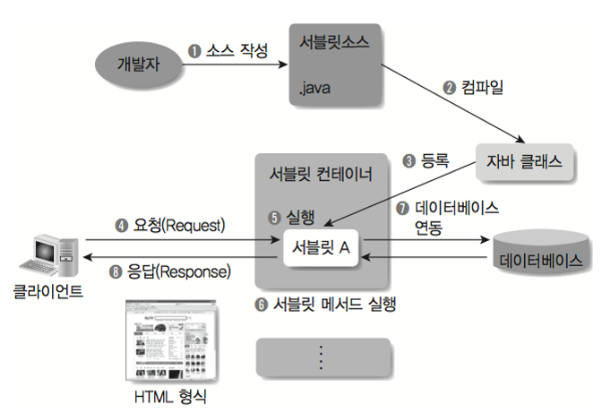
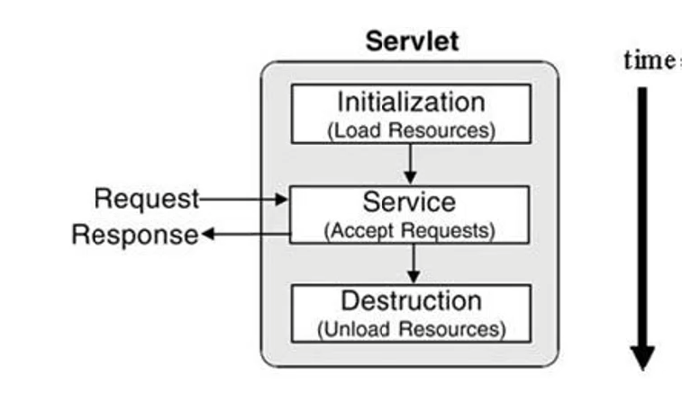

# Web 서블릿(Servlet) 이란?

### 서블릿이란?


**서블릿이란 Dynamic Web Page를 만들 때 사용되는 자바 기반의 웹 애플리케이션 프로그래밍 기술 입니다.**

- 웹을 만들떄 다양한 요청과 응답이 있기 마련이고 이 요청과 응답에는 규칙이 존재한다.
- 이러한 요청과 응답을 일일이 처리하려면 굉장히 힘들것이다.
- **서블릿은 이러한 웹 요청과 응답의 흐름을 간단한 메서드 호출만으로 체계적으로 다룰 수 있게 해주는 기술**로 이해할 수 있다.




- 서블릿은 자바 클래스로 웹 애플리케이션을 작성한 뒤 이후 웹 서버 안에 있는 웹 컨테이너에서 이것을 실행하고
- 웹 컨테이너에서 서블릿 인스턴스를 생성 후 서버에서 실행되다 웹 브라우저에서 서버에 요청을 하면 요청에 맞는 동작을 수행하고 웹 브라우저에 HTTP형식으로 응답한다.

<br>

### 서블릿의 주요 특징 
1. 클라이언트의 Request에 대해 동적으로 작동하는 웹 애플리케이션 컴포넌트
2. HTML을 사용하여 Response
3. Java의 스레드를 이용하여 동작한다.
4. MVC 패턴에서 `컨트롤러`로 이용된다.
5. HTTP 프로토콜 서비스를 지원하는 javax.servlet.http.HTTpServlet클래스를 상속받는다.
6. UDP보다 속도가 느리다.
7. HTML 변경 시 Servlet을 재 컴파일 해야하는 단점이 있다.

<br>

### 서블릿 컨테이너란?

- **말 그대로 서블릿을 담고 관리해주는 컨테이너다.**
- 서블릿 컨테이너는 구현되어 있는 servlet 클래스의 규첵이 맞게 서블릿을 관리해주며 클라이언트에서 요청을 하면 컨테이너는 HttpServletRequest, HttpServletResponse 두 객체를 생상하며
- post,get 여부에 따라 동적인 페이지를 생성하여 응답을 보낸다.

#### HttpServletRequest
http 프로토콜의 request 정보를 서블릿에게 전달하기 위한 목적으로 사용하며 헤더 정보, 파라미터, 쿠키, URI, URL 등의 정보를 읽어 들이는 메서드와 Body의 Stream을 읽어 들이는 메서드를 가지고 있습니다.

#### HttpServletResponse
WAS는 어떤 클라이언트가 요청을 보냈는지 알고 있고, 해당 클라이언트에게 응답을 보내기 위한 HttpServletResponse 객체를 생성하여 서블릿에게 전달하고 이 객체를 활용하여 content type, 응답 코드, 응답 메시지 등을 전송합니다.

### 서블릿 컨테이너의 주요 기능
1. 생명 주기 관리
   - 서블릿의 생명주기를 관리한다. 
   - 서블릿 컨테이너가 기동 되는 순간 서블릿 클래스를 로딩해서 인스턴스화 하고
   - 초기화 메서드를 호출, 요청이 들어오면 적절한 서블릿 메서드를 찾아 동작한다.
   - 서블릿의 생명이 다하는 순간 가비지 컬렉션을 통해 메모리에서 제거한다.

2. 통신 지원
   - 클라이언트의 Request를 받고 Response를 보낼 수 있게 웹 서버와 소켓을 만들어서 통신을 해준다.
   - 우리가 통신을 한다고 생각할 때 소켓을 만들고, 특정 포트를 리스닝하고, 연결 요청이 들어오면 스트림을 생성해 요청을 받는다고 알고있지만
   - 이 과정을 서블릿 컨테이너가 대신해 주고 있는것이다.
   - 서블릿 컨테이너느 이렇게 소켓을 만들고 listen, accept 등의 기능을 API로 제공하여 복잡한 과정을 생략할 수 있게 해주고
   - 개발자로서 비즈니스 로직에 더욱 집중할 수 있게 만들어 준다.

3. 멀티스레딩 관리
   - 서블릿 컨테이너는 해당 서블릿의 요청이 들어오면 스레드를 생성해서 작업을 수행합니다.
   - 그렇기에 동시에 여러 요청이 들어와도 멀티 스레딩 환경으로 동시다발적인 작업을 관리할 수 있습니다.
   - 또한 이렇게 한번 메모리에 올라간 스레드는 다시 생성할 필요가 없기에 메모리 관리에 효율적입니다.

4. 선언적인 보안관리
   - 서블릿 컨테이너는 보안 관련된 기능을 지원합니다.
   - 그렇기에 서블릿 또는 자바 클래스 안에 보안 관련된 메서드를 구현하지 않아도 됩니다.
   - 대체적으로 보안 관리는 XML 배포 서술자에 기록하기 때문에 보안 이슈로 소스를 수정할 일이 생겨도 자바 소스 코드를 수정하여 다시 컴파일 하지 않아도 됩니다.

<br>

### 서블릿 동작 과정




1. Servlet Request, Response 객체를 생성합니다.
2. 설정 파일을 참고하여 매핑할 Servlet을 확인합니다.
3. 해당 서블릿 인스턴스 존재 유무를 확인하고 없으면 init() 메서드를 호출하여 생성합니다.
4. Servlet Container에 스레드를 생성하고 service를 실행합니다.
5. 응답을 처리하였으면 distroy() 메서드를 실행하여 Servlet Request, Response 객체를 소멸합니다.

#### 작성 예시

```java
public class myServlet extends HttpServlet {

    @Override
    public void init(ServletConfig config) throws ServletException {
        System.out.println("init method 호출!");
    }
    
    @Override
    public void destroy() {
        System.out.println("destroy method 호출!");
    }
    
    @Override
    protected void doGet(HttpServletRequest request, HttpServletResponse response)
        throws ServletException, IOException
    {
        System.out.println("doGet service method 호출!");		
    }
    
    @Override
    protected void doPost(HttpServletRequest request, HttpServletResponse response)
        throws ServletException, IOException
    {
        System.out.println("doPost service method 호출!");		
    }
	
}
```

- init()
  - 서블릿이 처음으로 요청될 때 `초기화`하는 메서드입니다.
  - 클래스를 new 해서 사용하듯 서블릿 클래스도 초기화해야 사용이 가능합니다.
  - 이렇게 초기화된 서블릿은 싱글톤으로 관리되어 다음에 한번 더 해당 서블릿 클래스를 호출시키면 초기화가 다시 일어나는 것이 아니라 기존에 있던 서블릿 클래스를 호출합니다.

- service()
  - 서블릿 컨테이너가 `요청을 받고 응답을 내려줄 때 필요한 서블릿의 service 메서드` 입니다. Servlet interface를 구현한 HttpServlet 클래스의 doGet, doPost 같은 메서드들이 호출됩니다

- destroy()
  - 더이상 사용되지 않는 서블릿 클래스는 주기적으로 `서블릿 컨테이너가 이 메서드를 호출하여 제거`합니다.
  - 이렇게 제거된 서블릿은 service 메서드들에 해당하는 모든 스레드를 종료하거나
  - 사용시간이 오래되어 타임아웃된 경우에는 이 클래스를 다시 사용하기 위해서는 init을 다시 해주어야 합니다.