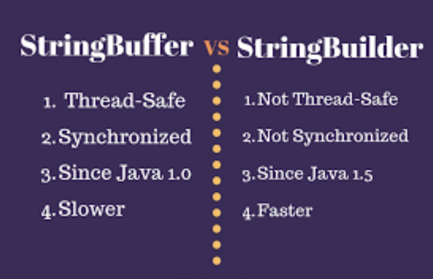
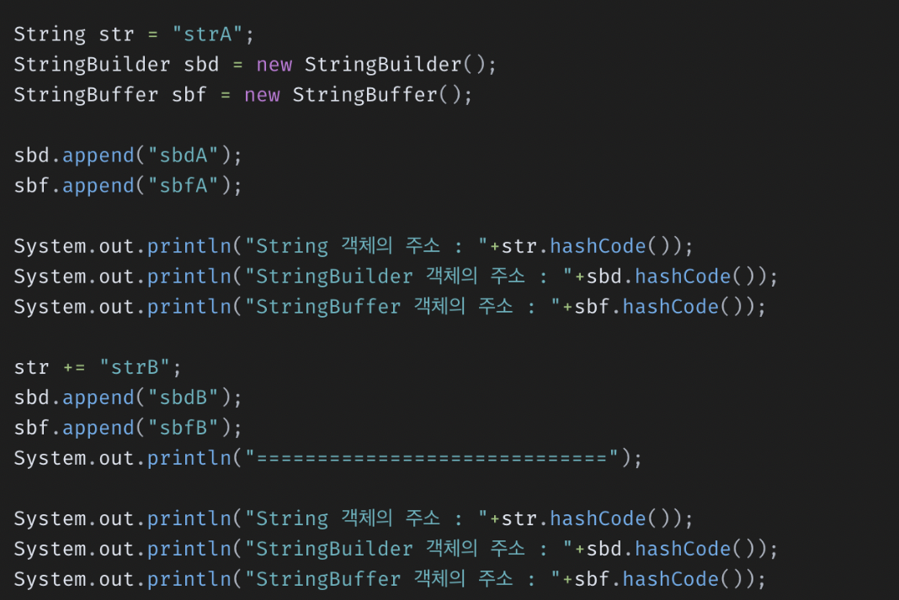
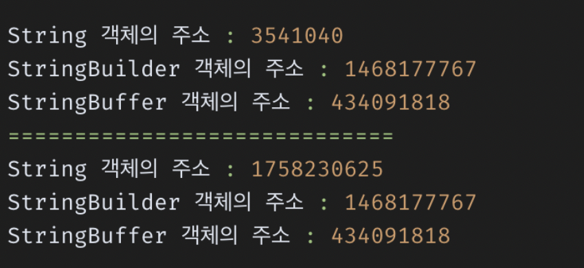
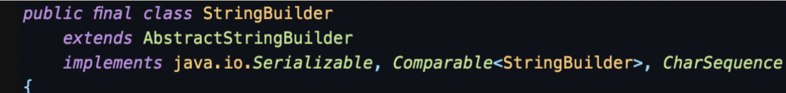
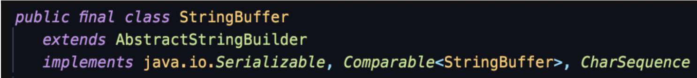
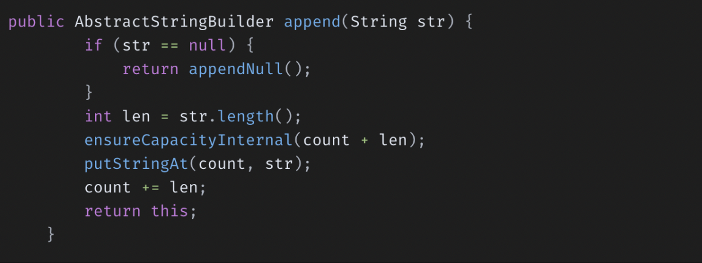

#### 개요

자바 면접 질문들을 찾아보던중 StringBuilder와 StringBuffer의 차이를 설명해보라는 내용이 있었다.

그렇기에 이 주제로 한번 정리를 해보려고 한다.

#### 자바의 문자열 클래스

자바에선 문자열 클래스가 String, StringBuffer, StringBuilder로 3가지가 있다. 그리고 이 3가지

클래스들은 각자의 차이점이 존재한다.

#### String vs StringBuilder, StringBuffer

Java에서 String 객체는 한번 값이 할당되면 그 공간은 변하지 않는다. 하지만 

StringBuilder, StringBuffer 객체는 한번 값이 할당되더라도 한번 더 다른 값이 할당되면

할당된 공간이 변하는 특성을 가지고 있다.

여기서 할당된 공간이 변하지 않는 특성은 **불변성**이라고 하고

할당된 공간이 변하는 특성은 **가변성**이라고 한다.

**String**

**\-> 불변성을 갖는다.**

**StringBuilder, StringBuffer**

**\-> 가변성을 갖는다.**

String, StringBuilder, StringBuffer 클래스를 사용해 문자열을 선언하고

값을 바꾸고 hashCode로 주소값을 출력했을때 String 객체에 주소만 변환이 되어서 출력이 된다.

#### String Constant Pool

String 변수에 값을 할당하는 방법은 2가지가 있다.

1\. 리터럴 변수에 대입

2\. new 키워드를 사용하는 방법

리터럴 값으로 할당하는 경우와 new 키워드에 할당하는 경우에 값만 같을 경우

3개의 주소비교(==)의 결과가 과연 같을까?

아니다. 그 이유는 String 타입 값 할당 방식에 따른 저장 방식이 다르기 때문이다.

**리터럴 값으로 할당**

String을 리터럴 값으로 할당하는 경우에는 Heap 메모리 영역인 특별한 메모리 공간인

String constant pool이라는 공간에 저장이 된다. 

만약 String constant pool에 존재하는 리터럴 값을 사용하게 된다면 새롭게 리터럴 값을 만들어 

String constant pool에 저장하는 것이 아닌 **현재 존재하는 값**을 사용하게 된다.

그렇기에 리터럴로 값을 할당한 두 변수의 값이 같으면 == 연산자로 print를 할경우 true가 나오게된다.

**new 키워드로 값을 할당하는 경우**

new 키워드를 통해 String 변수에 값을 할당하게 되면 일반적인 객체와 동일하게 

**Heap 영역에 동적으로 메모리 공간이 할당되게 됩니다.**

위와 같은이유로 == 연산자로 출력을 하게되면 false를 출력하게 된다.

서로 다른 메모리 공간을 참조하기 때문이다.

#### StringBuilder vs StringBuffer

String과 달리 StringBuilder와 StringBuffer는 둘 다 가변성을 갖는다고 배웠다.

위에 보이는 것처럼 두 클래스 모두 AbstractStringBuilder라는 추상 클래스를 상속받아 구현되어있기 때문이다.

AbstractStringBuilder 추상클래스의 멤버 변수엔 다음 2가지 변수가 존재한다.

\- value: 문자열 값을 저장하는 바이트형 배열

\- count: 현재 문자열 크기의 값을 가지는 int형 변수

StringBuilder, StringBuffer클래스의 문자열을 수정하고싶으면 append()라는 메서드를 사용하게 된다.

AbstractStringBuilder안에 append라는 메서드가 구현되어있는데 내부 구조는 이렇게 되어있다.

다음과 같이 문자열을 추가하게되면 추가할 문자열의 크기만큼 현재의 문자열을 저장하는 공간을 늘리고

늘려준 공간에 추가할 문자열을 넣어주는 방식으로 구현이 되어있다.

위에서 살펴본 내부동작을 통해서 값이 변경되어도 **같은 주소 공간을 참조**하게 되는 것이며,

값이 변경되는 **가변성**을 띄게 된다.

StringBuilder, StringBuffer는 둘다 같은 특징을 지니고 있지만 차이점이 있다

바로 **동기화(Synchronization)**에서의 차이점이다.

StringBuilder는 동기화를 지원하지 않고 StringBuffer는 동기화를 지원한다.

동기화를 지원하기때문에 멀티스레드환경에서도 안전하게 동작할 수 있다.

그 이유는 StringBuffer에 메서드는 synchronized 키워드를 사용하기 때문이다.

_자바에서 synchoronized 키워드는 여러개의 스레드가 한 개의 자원에 접근하려 할때_

_**현재 데이터를 사용하고 있는 스레드를 제외하고 나머지 스레드들이 데이터에 접근할 수 없도록** 막는_

_역할을 수행해준다._

예시로 A스레드와 B스레드로 모두 같은 StringBuffer 클래스 객체의 append 메서드를 사용하면

다음과 같은 절차를 수행한다.

1\. A스레드: StringBuffer객체의 append 동기화 블록에 접근 및 실행

2\. B스레드: 객체의 append 동기화 블록에 들어가지 못하고 block 상태가 된다.

3\. A스레드: sb의 append() 동기화 블록에서 탈출한다.

4\. B스레드: block 에서 running 상태가 되며 객체의 append 동기화 블록에서 접근 및 실행한다.

_StringBuilder 클래스 주석에서 동기화가 필요할 경우 String Buffer을 추천한다는 문구를 확인할 수 있다._

#### 상황별 사용해야 할 String 클래스

**String**

**\->** String은 불변성을 갖는다. 즉 변하지 않는 문자열을 사용할 경우 String 타입을 사용하는 것이 성능면에서 좋다.

**StringBuilder**

**\->** 동기화를 지원하지 않는 반면, 속도면에선 StringBuffer보다 성능이 좋다.

\-> 즉 **단일 스레드 환경, 문자열의 추가, 수정, 삭제**등이 빈번히 발생하는 경우 사용하는 것이 성능면에서 유리하다.

**StringBuffer**

**\->** 동기화를 지원하며 멀티 스레드 환경에서도 안전하게 동작할 수 있습니다.

\-> 즉 **멀티 스레드 환경, 문자열의 추가,수정,삭제 등이 빈번히 발생하는 경우** 사용하는 것이 성능면에서 유리하다.

참고 글

[https://velog.io/@heoseungyeon/StringBuilder%EC%99%80-StringBuffer%EB%8A%94-%EB%AC%B4%EC%8A%A8-%EC%B0%A8%EC%9D%B4%EA%B0%80-%EC%9E%88%EB%8A%94%EA%B0%80](https://velog.io/@heoseungyeon/StringBuilder%EC%99%80-StringBuffer%EB%8A%94-%EB%AC%B4%EC%8A%A8-%EC%B0%A8%EC%9D%B4%EA%B0%80-%EC%9E%88%EB%8A%94%EA%B0%80)

 [StringBuilder와 StringBuffer는 무슨 차이가 있는가?

Java에서 String 클래스는 불변성을 갖습니다. 그래서 변하지 않는 문자열을 자주 사용하는 경우엔 좋은 성능을 기대할 수 있습니다. 하지만 문자열에 대한 변경이 자주 일어나는 프로그램에서 Stri

velog.io](https://velog.io/@heoseungyeon/StringBuilder%EC%99%80-StringBuffer%EB%8A%94-%EB%AC%B4%EC%8A%A8-%EC%B0%A8%EC%9D%B4%EA%B0%80-%EC%9E%88%EB%8A%94%EA%B0%80)

[https://coding-factory.tistory.com/546](https://coding-factory.tistory.com/546)