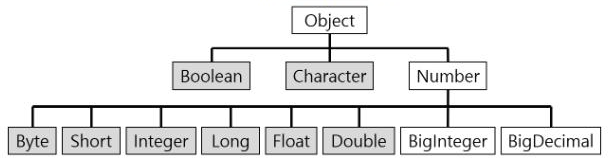
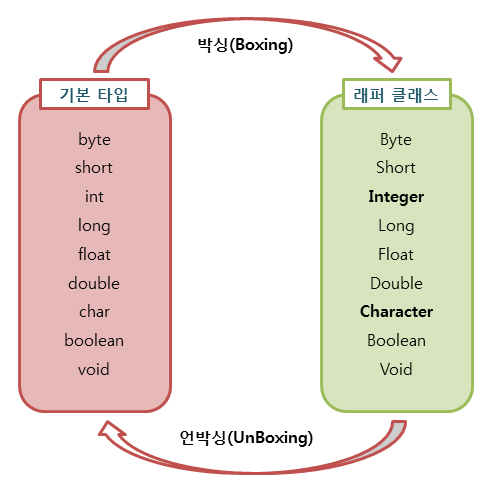

# 래퍼 클래스(Wrapper Class) , 박싱과 언박싱

### 래퍼 클래스란(Wrapper Class)?
자바의 자료형은 크게 기본타입(primitive type)과 참조 타입 (reference type)으로 나누어집니다.  
대표적으로 기본 타입은 char int float double boolean 등이 있고 참조 타입은 class, interface 등이 있는데 프로그래밍을 하다보면 기본 타입의 데이터를 객체로 표현해야 하는 경우가 종종 있습니다. 이럴때 **기본 자료 타입을 객체로 다루기 위해서 사용하는 클래스들을 래퍼클래스라고 합니다.**
자바는 모든 기본타입은 값을 갖는 객체를 생성할 수 있습니다. 이런 객체를 포장 객체라고도 하는데 그 이유는 기본 타입의 값을 내부에 두고 포장하기 때문입니다. 래퍼 클래스로 감싸고 있는 기본 타입 값은 외부에서 변경할 수 없습니다. 만약 값을 변경하고 싶다면 새로운 포장 객체를 만들어야합니다.

#### 래퍼 클래스 종류
기본 타입 | 래퍼 클래스
--|--
byte | Byte
char | Character
int | Integer
float | Float
double | Double
boolean | Boolean
long | Long
short | Short

래퍼 클래서는 java.lang 패키지에 포함되어 있는데, 다음과 같이 기본 타입에 대응되는 래퍼 클래스들이 있습니다. char 타입과 int 타입이 각각 Character와 Integer의 래퍼 클래스를 가지고 있고 나머지는 기본 타입의 첫 글자를 대문자로 바꾼 이름을 가지고 있습니다.

<br>

### 래퍼 클래스 구조도

위의 계층에서 볼 수 있듯 모든 래퍼 클래스의 부모는 Object이고 내부적으로 숫자를 다루는 래퍼클래스의 부모 클래스는 Number 클래스 입니다. 모든 래퍼 클래스는 최종 클래스로 정의됩니다.

<br>

### 박싱(Boxing), 언박싱(UnBoxing)


- 기본 타입을 포장 객체로 만드는 과정을 `박싱` 이라고 합니다.
- 반대로 포장 객체에서 기본 타입의 값을 얻어내는 과정을 `언박싱` 이라고 합니다.

```java
public class Wrapper_Ex {
    public static void main(String[] args)  {
        Integer num = new Integer(17); // 박싱
        int n = num.intValue(); //언박싱
        System.out.println(n);
    }
}
```

### 자동 박싱(AutoBoxing)과 자동 언박싱(AutoUnBoxing)
기본 타입 값을 직접 박싱,언박싱하지 않아도 자동적으로 박싱과 언박싱이 일어나는 경우가 있습니다.
- 자동 박싱의 포장 클래스 타입에 기본값이 대입될 경우 발생
  - ex )  int 타입의 값을 Integer 클래스 변수에 대입하면 자동 박싱이 일어나 힙 영역에 Integer 값이 생성됨

```java
public class Wrapper_Ex {
    public static void main(String[] args)  {
        Integer num = 17; // 자동 박싱
        int n = num; //자동 언박싱
        System.out.println(n);
    }
}
```

<br>


### 래퍼 클래스 간단한 사용 예제
```java
public class Wrapper_Ex {
    public static void main(String[] args)  {
        String str = "10";
        String str2 = "10.5";
        String str3 = "true";
        
        byte b = Byte.parseByte(str);
        int i = Integer.parseInt(str);
        short s = Short.parseShort(str);
        long l = Long.parseLong(str);
        float f = Float.parseFloat(str2);
        double d = Double.parseDouble(str2);
        boolean bool = Boolean.parseBoolean(str3);
		
        System.out.println("문자열 byte값 변환 : "+b);
        System.out.println("문자열 int값 변환 : "+i);
        System.out.println("문자열 short값 변환 : "+s);
        System.out.println("문자열 long값 변환 : "+l);
        System.out.println("문자열 float값 변환 : "+f);
        System.out.println("문자열 double값 변환 : "+d);
        System.out.println("문자열 boolean값 변환 : "+bool);
    }
}
```

결과
```
문자열 byte값 변환 : 10
문자열 int값 변환 : 10
문자열 short값 변환 : 10
문자열 long값 변환 : 10
문자열 flot값 변환 : 10.5
문자열 double값 변환 : 10.5
문자열 boolean값 변환 : true
```
- 래퍼 클래스의 주요 용도는 기본 타입의 값을 박싱해서 포장 객체로 만드는 것 이지만, 문자열을 기본 타입 값으로 변환할 때도 사용됩니다.
- 대부분의 래퍼 클래스에는 parse + 기본 타입명으로 되어있는 정적 메서드가 있습니다. 이 메서드는 문자열을 매개 값으로 받아 기본타입 값으로 변환합니다.

### 값 비교

```java
public class Wrapper_Ex {
    public static void main(String[] args)  {
        Integer num = new Integer(10); //래퍼 클래스1
        Integer num2 = new Integer(10); //래퍼 클래스2
        int i = 10; //기본타입
		 
        System.out.println("래퍼클래스 == 기본타입 : "+(num == i)); //true
        System.out.println("래퍼클래스.equals(기본타입) : "+num.equals(i)); //true
        System.out.println("래퍼클래스 == 래퍼클래스 : "+(num == num2)); //false
        System.out.println("래퍼클래스.equals(래퍼클래스) : "+num.equals(num2)); //true
    }
}
```

- 래퍼 객체는 내부의 값을 비교하기 위해 == 연산자를 사용할 수 없습니다.
- 이 연산자는 내부으 ㅣ값을 비교하는 것이 아니라 래퍼 객체의 `참조 주소`를 비교하기 때문입니다.
- 비교 대상인 래퍼는 객체이므로 서로의 참조 주소가 다릅니다. 객체끼리 비교를 하려면 내부의 값만 얻어 비교해야 하기에 `equals()`를 사용해야 합니다.
- 래퍼 클래스와 기본 자료형과의 비교는 == 연산과 equals연산 모두 가능합니다.
- 그 이유는 컴파일러가 자동으로 오토박싱 언박싱을 해주기 때문입니다.