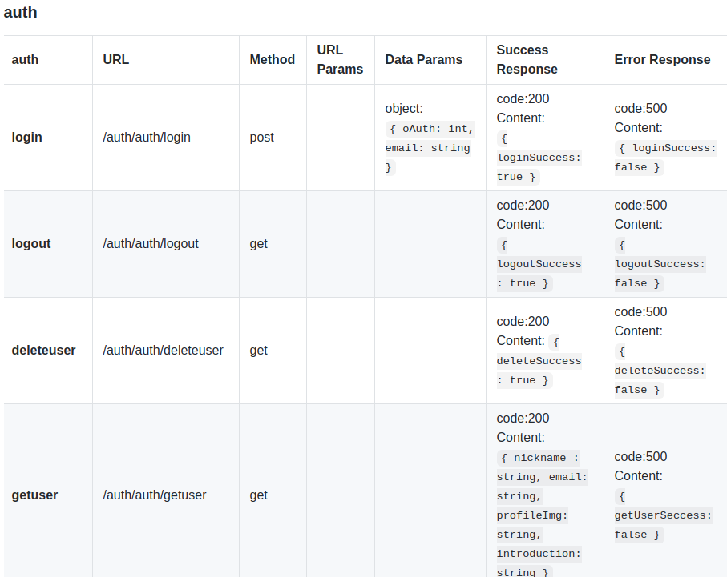

# Back-end API 문서 효율적인 설계방법

### 꼭 들어가야 하는 내용
- API Title - api 이름
- URL - api 경로
- Method - request 방식
- Data Params - Post 요청시 body 안에 넣어줄 값
- URL Params(만약 있을 경우)
  - Required - url params로 넘길 값
- Success Response - 응답이 성공적이지 못할 경우 반환되는 값과 코드
- Sample Casll - 요청과 응답 예시

위의 내용은 꼭 들어가야하고 api 문서를 표로 작성해도 좋고 글머리 표를 이용해서 작성해도 좋다.

 

### 좋은 API 문서 작성하는법

1. 개발 시작전 문서 작성
**개발을 시작하기 전에 문서를 먼저 작성하는 것을 고려**해보자 개발을 하지 않았는데 어떻게 문서를 작성할 수 있을까 싶지만, 해당 API가 어떤 기능을 할 것이며 이를 위해 사전에 필요한 사항들을 정리하는 것만으로도 유용하다.
이를 통해 api 개발의 방향을 명확히 할 수 있으며, 문서 초안을 동료들에게 공유하고 피드백도 받을 수 있다.

2. 두괄식 명시
**API 문서의 첫 부분에는 해당 API가 정확히 어떤 작업을 위한 것인지 개괄적으로** 명시해야한다. 이를 통해 문서에 접근한 이들은 해당 문서가 본인에게 필요한 것인지 판단 가능하다.  
  
또한 개발 API 문서에는 아주 다양한 기능들이 포함되어 있을 것이다.  
API 호출에 필요한 인증, 헤더 타입 등등 **이를 처음 보는 사용자가 어디서부터 어떻게 시작해야 하는지 기초적인 사항들을 도입부에서 설명**하는 것이 좋다.

3. 문서를 읽는 대상자 고려하기

API  문서를 읽는 대상은 크게 개발자와 사용자로 나눌 수 있다.  
**개발자와 사용자를 모두 고려하여 문서를 작성**해야 합니다.  
  
개발자들은 자신이 원하는 부분을 문서에서 빠르게 탐색하고 테스트하기를 원합니다. 이를 위해 **일관적인 문서 구조와 예시를 제공**할 필요가 있습니다. 세부 사항으로는 일관적인 헤딩 사요으 하이퍼링크 제공, 문단 나누기 및 리스트 활용을 고려할 수 있습니다.  
  
사용자들의 수준은 초보에서 고급까지 다양할 수 있습니다. **초보 수준의 사용자를 염두에 두되 고급 사용자도 원하는 정보를 정확하게 얻을 수 있도록** 해야 합니다. 즉, **필수적인 정보들을 정화갛게 담되 가능한 쉬운 용어를 사용**하는 것이 좋습니다. API 문서는 개발 지식이 없는 사람이 보더라도 이해할 수 있을 정도로 쉽고 간결하게 작성되어야 합니다.

1. 예시를 포함하기  

대부분의 개발자들은 API 문서에서 안내하는 예시 코드를 복사 및 붙여넣기 하여 사용하기를 선호합니다. 이를 통해 테스트를 진행하고, 필요에 맞춰 수정해서 빠르게 사용할 수 있기 때문입니다. **API의 핵심 엔드포인트를 테스트할 수 있는 예시를 제공하는 것이 좋습니다.**  

또한 **응답 성공 예시와 에러 예시를 첨부**해야 합니다. 이 때 모든 에러가 아닌 가장 대표적인 에러들만 첨부하는 것이 좋습니다. 그렇지 않으면 문서가 너무 길어질 수 있습니다.