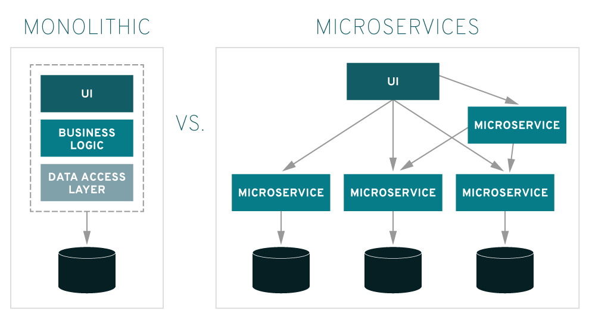

# 모놀리식 아키텍처 (Monolithic Architecture)

### 모놀리식 아키텍처
- 전통의 아키텍처를 지칭한다. 소프트웨어의 모든 구성요소가 한 프로젝트에 통합 되어 있는 형태다.
- 모놀리식 아키텍처의 경우 모든 프로세스가 긴밀하게 결합되고 단일 서비스로 실행된다.
- 따라서 애플리케이션의 한 프로세스에 대한 수요가 급증하면 해당 아키텍처 전체를 확장해야한다.
- 코드베이스가 증가하게 되면 모놀리식 애플리케이션의 기능을 추가하거나 개선하기가 더 복잡해진다.

### 장점
1. 소규모 프로젝트에서는 합리적이다.
2. 개발, 빌드, 배포, 테스트가 용이하다.

### 단점
1. 어플리케이션 구동시간이 늘어나고 빌드, 배포 시간이 길어진다.
2. 조그마한 수정사항이 있어도 전체를 다시 빌드하고 배포해야한다.
3. 많은 양의 코드가 몰려있어 유지보수가 힘들다.
4. 일부부느이 오류가 전체에 영향을 미친다.
5. 기능별로 알맞는 기술, 언어, 프레임워크를 선택하기가 까다롭다.
6. scale out이 불가능하다.

 

### 마이크로 서비스 아키텍처와 비교

