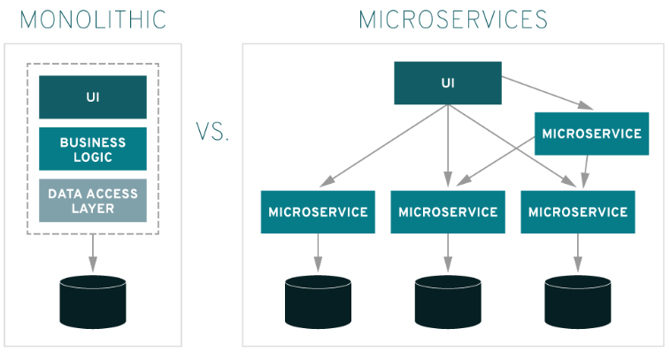
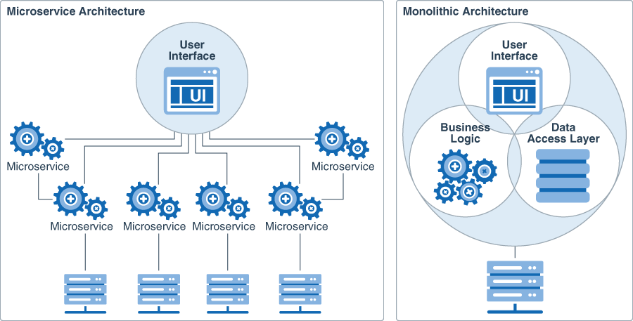

# MSA 마이크로서비스 아키텍쳐 (MicroService Architecture)란?

### MSA란?
**MicroService Architecture**

- MSA는 MicroService Architecture의 줄임말로, 소프트웨어 개발 기법 중 하나입니다.
- MSA는 작고, 독립적으로 배포 가능한 각각의 기능을 수행하는 서비스들로 구성된 프레임워크입니다.
- 경령화되고 독립적인 여러 개의 서비스를 조합하여 애플리케이션을 구현하는 방식으로 서비스마다 자체 데이터베이스를 가지고 동작하기 때문에 개발부터 빌드, 배포까지 효율적으로 수행할 수 있습니다.

### MSA 등장 배경

애플리케이션 개발 초기에는 전체 소스 코드를 하나의 배포 유닛(war or ear)으로 내장시키는 'Monolithic' 방식을 사용하였습니다. 하지만 기존 애플리케이션의 사소한 변경사항이 있더라도 자체적인 QA(Quality Assurance) 주기에 따라 업데이트를 하거나 일부 서비스 업데이트로 오류가 발생한 경우 전체 시스템을 중단하고 오류를 해결하는 등의 다운타임이 발생하는 일이 빈번하였습니다. 이러한 문제점을 해결하기 위해 애플리케이션의 핵심 서비스를 분할하는 MicroService Architecture라는 방식이 생겨났으며 각 서비스들을 독립적으로 구축하고 배포할 수 있게 되었습니다.

 

### Monolithic 이란?
**소프트웨어의 모든 구성요소가 한 프로젝트에 통합되어 있는 형태이며, 모듈별로 개발을 하고 개발이 완료된 하나의 결과물로 패키징 하여 배포되는 형태를 의미합니다.**

#### 장점
- 개발 초기에는 단순한 아키텍처 구조와 개발에 용이함

#### 단점
- 서비스 규모가 커짐에 따라 전체 시스템 구조 파악 및 유지보수가 어려워짐
- 부분 장애가 전체 서비스의 장애로 확대될 수 있음
- 배포 시간이 오래걸림
- 한 Framework와 언어에 종속적
- 부분적인 Scale-out(여러 서버로 나누어서 일을 처리하는 방식)이 어려움

 

### MSA 장점
- 분산형 개발을 통해 개발 주기가 단축되기 때문에 빠르고 유연한 배포가 가능(출시 기간 단축)
- 서비스가 독립적이기 때문에 다른 서비스에게 영향을 주지 않음(뛰어난 복구 능력)
- 서비스별 기술 도입 및 확장이 자유로움 (높은 확장성)
- 모놀리식 방식에 비해 애플리케이션이 모듈화 되고 규모가 작기 때문에 우려사항이 줄어듦(손쉬운 배포)
- 다중 언어 지원(Ployglot) API를 사용 (향상된 개방성)
- 하나의 애플리케이션을 여러 부분으로 분할했기 때문에 각 서비스 업데이트 및 개선 용이(편리한 액세스)

### MSA 단점
- 각 서비스들은 API를 통해 통신하므로 네트워크 통신에 의한 오버헤드 발생
- 서비스별로 로그가 생성되므로 중앙 로그 모니터링이 존재X
- 하나의 프로젝트에 수많은 서비스들이 존재하므로 모든 서비스 모니터링 오버헤드 증가
- 하나의 서비스에서 다른 서비스를 호출하므로 장애 발생 시 경로 및 장애 추적이 힘듦
- 서비스가 분산되어 있기 때문에 모놀리식에 비해 상대적으로 많이 복잡