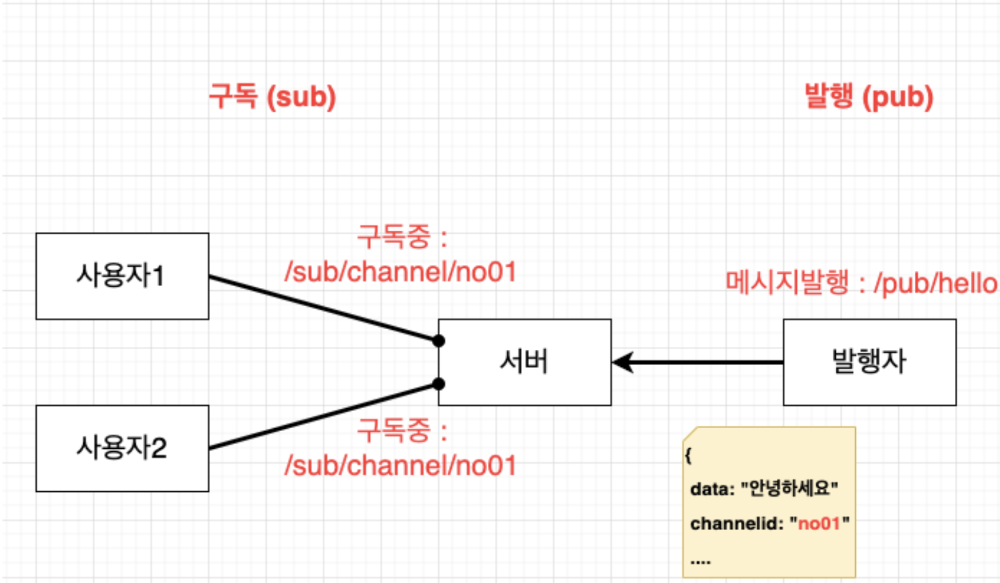
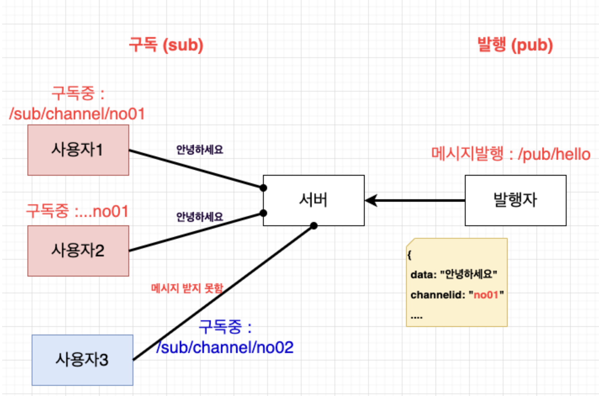
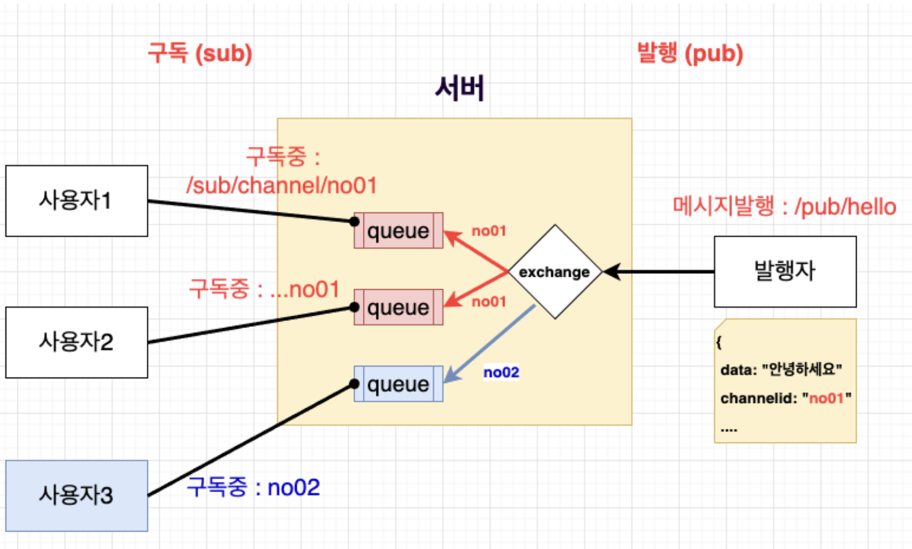

# PUB/SUB (발행/구독) 아키텍처의 이해

두명의 사용자 클라이언트가 있다. 사용자는 서버와 웹소켓으로 연결되어 있는데, 구독하는 주소를 동일하게 no01에 구독하도록 설정했다.

발행자 메시지의 타겟을 no01로 설정해서 메시지를 보냈는데, 서버에서는 발행자의 메시지를 확인한 후 no01 채널을 구독하는 모든 사용자(클라이언트)에게 메시지를 보내고싶어한다.

구독url이 다른 사용자는 어떻게 될까? 아래 그림과 같이, 다른 구독 url로 구독중이라면 메시지를 받지 못하게 된다.

구독과 발행 역할을 동시에 수행할 수 있다.

구독과 발행을 동시에 하는 대표적인 예시는 채팅 기능이다. 채팅 메시지는 단방향으로만 받기만 하지 않는다. 서로 메시지를 주고 받아야 한다.

조금만 더 구체적으로 알아보자. 각 구독자는 각각의 큐를 갖는다. 쉽게 이해하면, 개인 우편함이라 생각해도 된다.

아파트에 가면 각각의 호수 번호가 적혀잇는 우편함을 볼 수 있다. 우편함에는 주소가 적혀 있을 것이다.

신문을 구독하면 아침마다 집 문앞에 신문이 놓여있던 신문 배달이란 것이 있었다. 사용자 1, 2는 조선일보 신문을 받고, 사용자3은 한겨례 신문을 받기로 했다면, 조선일보 신문이 no01이라는 구독 채널이고, 한겨례 신문이 no02 라는 구독 채널이라고 생각해도 된다. 각자 구독중인 신문만 받아야하고, 각자 우편함이 따로 존재할 것이다.

암튼, 발행자는 반드시 채널 id를 지정해서 전달해야한다. 그래야 해당 채널을 구독중인 사용자에게 메시지를 보낼 것이다.

채널 아이디에 해당하는 구독자가 전혀 없다면, 메시지는 전송 되지 않을것이다.