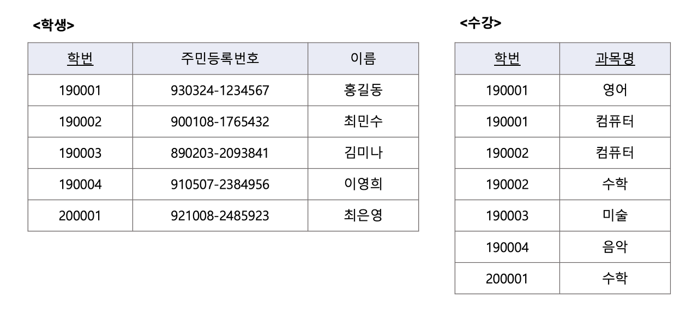

# 키(Key)의 개념 및 종류

### 키(key)
- 데이터베이스에서 조건에 만족하는 튜플을 찾거나 순서대로 정렬할 때, 기준이 되는 속성을 말한다.

### 슈퍼키(Super key)
- 한 릴레이션 내에 있는 속성들의 집합으로 구성된 키. 릴레이션을 구성하는 모든 튜플 중 슈퍼키로 구성된 속성의 집합과 동일한 값은 나타내지 않는다.
- 릴레이션을 구성하는 모든 튜플에 대해 `유일성`은 만족하지만 `최소성`은 만족하지 못한다.

ex) 릴레이션에서는 학번, 주민등록번호,(학번,주민등록번호),(학번,주민등록번호,이름) 등이 슈퍼키이다.

### 후보키(Candidate Key)
- 릴레이션을 구성하는 속성들 중에서 튜플을 유일하게 식별하기 위해 사용되는 속성들의 부분집합.
- 유일성과 최소성을 모두 만족.

ex)
1. <학생> 릴레이션에서 학번이나 주민등록번호는 유일성과 최소성을 만족하므로 후보키가 된다.
2. <수강> 릴레이션에서는 학번,과목명으로 조합해야 유일성과 최소성을 만족하기 때문에 (학번,과목명)으로 조합된 것이 후보키가 된다.

> 학번, 과목명과 같이 2개 이상의 필드를 조합하여 만든 키를 복합키라고 한다.

### 기본키(Primary key)
- 후보키 중에서 특별히 선정된 키로 중복된 값을 가질 수 없다.
- 후보키의 성질을 갖는다 즉, 유일성과 최소성을 가지며 튜플을 식별하기 위해 반드시 필요한 키
- NULL 값을 가질 수 없다. 즉, 튜플에서 기본키로 설정된 속성에는 NULL 값이 있어서는 안된다.

ex)
1. <학생> 릴레이션에서 후보키인 학번이나 주민등록번호중에서 선택하여 기본키로 설정할 수 있고, <수강> 릴레이션에서는 학번, 과목명을 조합해야 기본키로 설정할 수 있다.
2. 학번이 <학생> 릴레이션이 기본키로 정의되면 이미 입력된 학번 190001은 다른 튜플의 학번 속성 값으로 입력할 수 없다.

### 대체키(Alternate Key)
- 후보키 중에서 선정된 기본키를 제외한 나머지 후보키를 의미한다.

ex)
1. <학생>릴레이션에서 학번이 기본키로 설정되면 주민등록번호는 대체키가 된다.

### 외래키(Foreign Key)
- 다른 릴레이션의 기본키를 참조하는 속성 또는 속성들의 집합을 의미
- 릴레이션 간의 관계를 표현할 때 사용
- 한 릴레이션에 속산 속성 A와 참조 릴레이션의 기본키인 B가 동일한 도메인 상에서 정의 되었을 때의 속성 A를 외래키라고 한다.
- 참조 릴레이션의 기본키와 동일한 키 속성을 가진다.
ex)
1. <수강> 릴레이션의 학번은 <학생> 릴레이션의 기본키인 학번을 참조하고 잇으므로 <수강> 릴레이션에서 학번은 외래키가 된다.
2. <수강> 릴레이션의 학번 속성에는 <학생> 릴레이션의 학번 속성에 없는 값을 입력할 수 없다.
3. <학생>릴레이션과 <수강>릴레이션은 학번을 기준으로 관계가 설정된 것이다.

 

### 유일성
- 하나의 키 값으로 하나의 튜플만을 유일하게 식별할 수 있어야한다.

### 최소성
- 키를 구성하는 속성 하나를 제거하면 유일하게 식별할 수 없도록 꼭 필요한 최소의 속성으로 구성되어야 한다. 그러나 학번이나 주민등록번호가 최소성을 만족한다고 해서 슈퍼키가 아닌 것은 아니다. 슈퍼키는 최소성과 관계없이 튜플을 유일하게 구분할 수 있으면 된다.
- 슈퍼키 중에서 유일성과 최소성을 만족시키는 것들이 후보키가 되는 것이다.