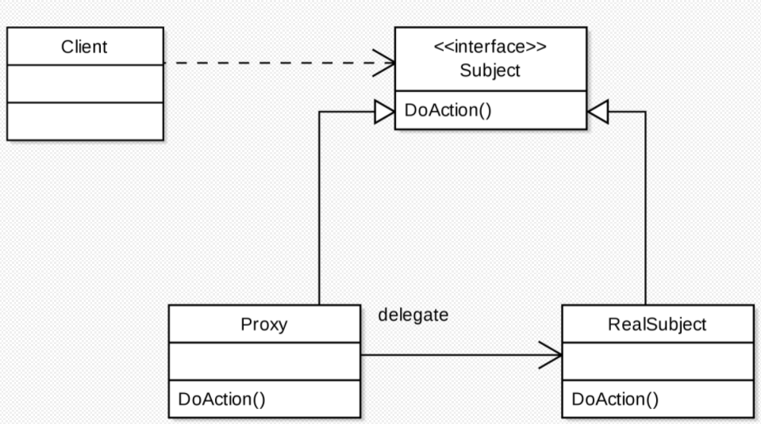

# 프록시 패턴

### 프록시 (Proxy)
- 프록시(Proxy)를 번역하면 대리자, 대변인의 의미를 갖고있다. 대리자, 대변인은 누군가를 대신해서 그 역할을 수행하는 존재이다.
- 이는 프로그램에도 똑같이 적용된다. 즉, 프록시에게 어떤 일을 대신 시키는 것이다.

어떤 객체를 사용하고자 할때, 객체를 직접적으로 참조하는 것이 아닌 해당 객체를 대항하는 객체를 통해 대상 객체에 접근하는 방식을 사용하면 해당 객체가 메모리에 존재하지 않아도 기본적인 정보를 참조하거나 설정할 수 있고, 실제 객체의 기능이 필요한 시점까지 객체의 생성을 미룰 수 있다.



## 프록시 패턴의 장단점

### 장점
- 사이즈가 큰 객체가 로딩되기 전에도 프록시를 통해 참조를 할 수 있다.
- 실제 객체의 public, protected 메소드를 숨기고 인터페이스를 통해 노출시킬 수 있다.
- 로컬에 있지 않고 떨어져있는 객체를 사용할 수 있다.
- 원래 객체에 접근에 대해 사전처리를 할 수 있다.

### 단점
- 객체를 생성할 때 한 단계를 거치게 되므로, 빈번한 객체 생성이 필요한 경우 성능이 저하될 수 있다.
- 프록시 내부에서 객체 생성을 위해 스레드가 생성, 동기화가 구현되어야 하는 경우 성능이 저하될 수 있다.
- 로직이 난해해져 가독성이 떨어질 수 있다.

<br>

### 프록시 패턴의 종류

- **가상 프록시**
  - 꼭 필요로 하는 시점까지 객체의 생성을 연기, 해당 객체가 생성된 것 처럼 동작하도록 만들고 싶을 때 사용하는 패턴.
  - 프록시 클래스에서 작은 단위의 작업을 처리하고 리소스가 많이 요구되는 작업들이 필요한 경우만 주체 클래스를 사용하도록 구현한다.
- **원격 프록시**
  - 원격 객체에 대한 접근을 제어 로컬 환경에 존재하며, 원격 객체에 대한 대변자 역할을 하는 객체
  - 서로 다른 주소 공간에 있는 객체에 대해 마치 같은 주소 공간에 있는 것 처럼 동작하게 하는 패턴이다.(ex : Google Docs)
- **보호 프록시**
  - 주체 클래스에 대한 접근을 제어하기 위한 경우에 객체에 대한 접근 권한을 제어하거나 객체마다 접근 권한을 달리하고 싶을 경우 사용하는 패턴
  - 프록시 클래스에서 클라이언트가 주체 클래스에 대한 접근을 허용할지 말지 결정하도록 할 수 있다.

<br>

## 프록시 패턴 구현

예를 들어 용량이 큰 이미지와 글이 같이 있는 문서를 화면에 띄운다고 가정했을때, 텍스트는 용량이 작아서 빠르게 나타나지만 이미지는 용량이 크기 때문에 느리게 로딩되는 것을 확인할 수 있다. 만약 이렇게 처리되지 않고 텍스트와 이미지 로딩이 모두 끝난 후 화면이 나온다면 사용자는 로딩이 끝날때까지 기다려야 한다.  

따라서, 로딩이 먼저 끝난 텍스트를 먼저 나오게 하는 것이 좋다. 이와 같은 방식을 가지려면 텍스트 처리용 프로세스, 이미지 처리용 프로세스를 별도로 운영하면 된다.

```java
public interface Image {
    public void displayImage();
}
```
```java
// Real_Image.java
public class Real_Image implements Image {
	private String fileName;
    
    public Real_Image(String fileName) {
    	this.fileName = fileName;
    }
    
    private void loadFromDisk(String fileName) {
    	System.out.println("로딩: " + fileName);
    }
    
    @Override
    public void displayImage() {
        System.out.println("보여주기: " + fileName);
    }
}
```
```java
// Proxy_Image.java
public class Proxy_Image implements Image {
    private String fileName;
    private Real_Image realImage;
    
    public Proxy_Image(String fileName) {
    	this.fileName = fileName;
    }
    
    @Override
    public void displayImage() {
    	if (realImage == null) {
        	realImage = new Real_Image(fileName);
        }
        realImage.displayImage();
    }
}
```
```java
// Proxy_Pattern.javva
public class Proxy_Pattern {
    public static void main(String args[]) {
        Image image1 = new Proxy_Image("test1.jpg);
        Image image2 = new Proxy_Image("test2.jpg);
        
        image1.displayImage();
        image2.displayImage();
    }
}
```
위의 코드에서도 보았듯이 Proxy_Pattern클래스에서 Real_Image클래스에 직접 접근하지 않고 Proxy_Image클래스에서 객체를 생성하여 대신 일을 수행하는걸 확인할 수 있다.