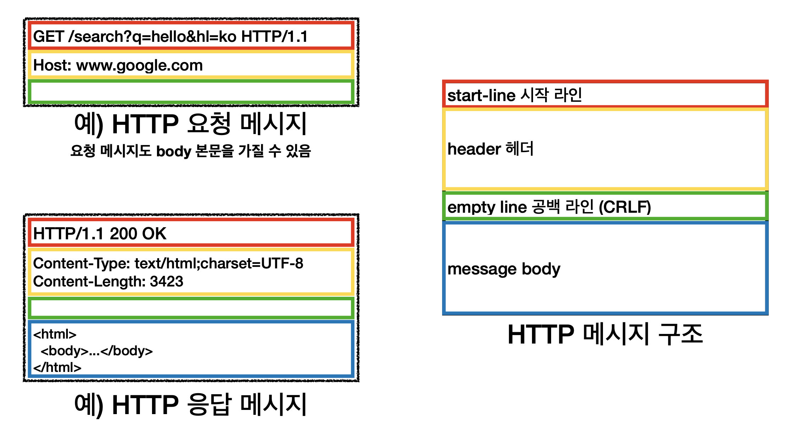

# HTTP 메시지

### 요청 메시지
- start-line : `request-line` / status-line
- `request-line` = method SP(공백) request-target(Path=요청대상) SP HTTP-version CRLF(엔터)

#### HTTP 메서드 (GET 조회)
종류 : GET , POST , PUT, DELETE..  
서버가 수행해야 할 동작 지정
- GET : 리소스 조회
- POST : 요청 내역 처리

#### 요청 대상 (/search?p=hello&hl=ko)
absolute-path\[?query] 절대경로\[쿼리]  
절대 경로 = "/" 로 시작하는 경로  
참고: *, http://...?x=y 와 같이 다른 유형의 경로지정 방법도 있다.  

#### HTTP version

 

### 응답 메시지 

- start-line = request-line / status-line

- status-line = HTTP-version SP status-code SP reason-phrase CRLF

- HTTP 버전
-HTTP 상태 코드: 요청 성공, 실패를 나타냄
200: 성공  
400: 클라이언트 요청 오류  
500: 서버 내부 오류  
  
이유 문구: 사람이 이해할 수 이쓴 짧은 상태 코드 설명 글

 

### HTTP 헤더
header-field = field-name ":" OWS field-value OWS (OWS:띄어쓰기 허용)  
field-name은 대소문자 구분 없음

#### HTTP 요청 메시지
GET/search?=q=hello&hl=ko HTTP/1.1  
**Host : www.google.com**

#### HTTP 응답 메시지
HTTP/1.1 200 OK  
**Content-Type : text/html;charset=UTF-8**  
**Content-Length : 3423**  
  
**용도**
- HTTP 전송에 필요한 모든 부가정보
- 예 ) 메시지 바디의 내용, 메시지 바디의 크기, 압축, 인증, 요청 클라이언트(브라우저)
- 표준 헤더가 너무 많음
- 필요시 임의의 헤더 추가 가능
- 예 ) helloworld: hihi

#### HTTP 메시지 바디

**용도**
- 실제 전송할 데이터
- HTML 문서, 이미지 , 영상 JSON 등등 바이트로 표현할 수 있는 모든 데이터 전송 가능

**단순함 확장 가능**
- HTTP는 단순하다 스펙도 읽어볼만..
- HTTP 메시지도 매우 단순하다.
- 크게 성공하는 표준 기술은 단순하지만 확장 가능하다.

 

### HTTP 정리
- HTTP 메시지에 모든 것을 전송
- HTTP 역사 HTTP/1.1을 기준으로 학습
- 클라이언트 서버 구조
- 무상태 프로토콜
- HTTP 메시지
- 단순함 , 확장 가능
- 지금은 HTTP의 시대
