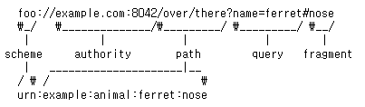

# URI

### URI(Uniform Resource Identifier)
- resource를 식별하는 통합된 방법
- URI는 locater , name 또는 둘 다 추가로 분류될 수 있다.
- URI 안에는 URL , URN 이 있다.

위가 URL , 아래가 URN 인데 보통 URL을 주로 쓴다.

 

### URI 단어 뜻

- Uniform : 리소스 식별하는 통일된 방식
- Resource : 자원 URI로 식별할 수 있는 모든 것(제한없음)
- Identifier : 다른 항목과 구분하는데 필요한 정보

### URL , URN 단어 뜻
- URL - Locator : 리소스가 있는 위치를 지정
- URN - Name : 리소스에 이름을 부여
- 위치는 변할 수 있지만, 이름은 변하지 않는다.
- urn:isbn:8960777331(어떤 책의 isbn URN)
- URN 이름만으로 실제 리소스를 찾을 수 있는 방법이 보편화 되지 않음
- 앞으로 URI를 URL과 같은 의미로 이야기 하겠음

 

### URL 분석
https://www.google.com/search?q=hello&hl=ko  

전체 문법  

scheme://[userinfo@]host[:port][/path][?query][#fragment]  
https://www.google.com:443/search?q=hello&hl=ko  

- 프로토콜(https)
- 호스트명(www.google.com)
- 포트 번호 (443)
- 패스(/search)
- 쿼리 파라미터(q=hello&hl=ko)

#### scheme
scheme://[userinfo@]host[:port][/path][?query][#fragment]  
https://www.google.com:443/search?q=hello&hl=ko  
- 주요 프로토콜 사용
- 프로토콜 : 어떤 방식으로 자원에 접근할 것인가 하는 약속 규칙 예) http , https , ftp 등등
- http는 80포트 , https는 443 포트를 주로 사용, 포트는 생략 가능
- https는 http에 보안 추가

#### userinfo
scheme://[userinfo@]host[:port][/path][?query][#fragment]  
htps://www.google.com:443/search?q=hello&hl=ko  

- URL에 사용자정보를 포함해서 인증
- 거의 사용하지 않음

#### host
scheme://[userinfo@]host[:port][/path][?query][#fragment]  
htps://www.google.com:443/search?q=hello&hl=ko  

- 호스트명
- 도메인명 또는 IP주소를 직접 사용가능

#### port

scheme://[userinfo@]host[:port][/path][?query][#fragment]  
htps://www.google.com:443/search?q=hello&hl=ko  

- 포트(PORT)
- 접속 포트
- 일반적으로 생략, 생략시 http는 80,
- https는 443

#### query
scheme://[userinfo@]host[:port][/path][?query][#fragment]  
htps://www.google.com:443/search?q=hello&hl=ko  
- 리소스 경로(path) , 계층적 구조
- 예 ) /home/file1.jpg, /members, /members/100, /items/iphone12  

#### fragment
scheme://[userinfo@]host[:port][/path][?query][#fragment]  
https://docs.spring.io/spring-boot/docs/current/reference/html/getting-started.html#getting-started-introducing-spring-boot  

- fragment
- html 내부 북마크 등에 사용
- 서버에 전송하는 정보 아님