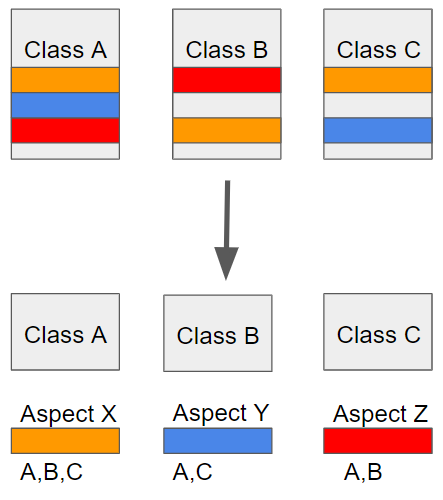

# Spring AOP (Aspect Oriented Programming) 개념 

### Spring AOP

AOP는 Aspect Oriented Programming의 약자로 관점 지향 프로그래밍이라고 불린다. 관점 지향은 쉽게 말해 어떤 로직을 기준으로 핵심적인 관점, 부과적인 관점으로 나누어서 보고 그 관점을 기준으로 각각 모듈화하겠다는 것이다. 여기서 모듈화란 어떤 공통된 로직이나 기능을 하나의 단위로 묶는 것을 말한다.  
  
예로들어 핵심적인 관점은 우리가 적용하고자 하는 핵심 비즈니스 로직이 된다. 또한 부가적인 관점은 핵심 로직을 실행하기 위해서 행해지는 데이터베이스 연결, 로깅, 파일 입출력 등을 예로 들 수 있다.  
  
AOP에서 각 관점을 기준으로 로직을 모듈화한다는 것은 코드들을 부분적으로 나누어서 모듈화하겠다는 의미다. 이때. 소스 코드상에서 다른 부분에 계속 반복해서 쓰는 코드들을 발견할 수 있는 데 이것을 흩어진 관심사라 부른다.



위와 같이 흩어진 관심사를 Aspect로 모듈화하고 핵심적인 비즈니스 로직에서 분리하여 재사용하겠다는 것이 AOP의 취지다.

### AOP 주요 개념
- Aspect : 위에서 설명한 흩어진 관심사를 모듈화 한 것. 주로 부가기능을 모듈화함.
- Target : Aspect를 적용하는 곳(클래스,메서드 ..)
- Advice : 실직적으로 어떤 일을 해야할 지에 대한 것, 실질적인 부가기능을 담은 구현체
- JoinPoint : Advice가 적영될 위치, 끼어들 수 있는 지점, 메서드 진입 지점, 생성자 호출 시점, 필드에서 값을 꺼내올 때 등 다양한 시점에 적용가능
- PointCut : JoinPoint의 상세한 스펙을 정의한 것. 'A란 메서드의 진입 시점에 호출할 것'과 같이 더욱 구체적으로 Advice가 실행될 지점을 정할 수 있음

### Spring AOP 특징
- 프록시 패턴 기반의 AOP 구현체, 프록시 객체를 쓰는 이유는 접근 제어 및 부가기능을 추가하기 위해서임
- 스프링 빈에만 AOP를 적용 가능
- 모든 AOP기능을 제공하는 것이 아닌 스프링 IoC와 연동하여 엔터프라이즈 애플리케이션에서 가장 흔한 문제(중복 코드, 프록시 클래스 작성의 번거로움, 객체들 간 관계 복잡도 증가..)에 대한 해결책을 지원하는 것이 목적

<br>

### 스프링 AOP : @AOP

의존성 추가
```js
implementation 'org.springframework.boot:spring-boot-starter-aop'
```

다음에는 아래와 같이 @Aspect 어노테이션을 붙여 이 클래스가 Aspect를 나타내는 클래스라는 것을 명시하고 @Component를 붙여 스프링 빈으로 등록한다.

```java
@Component
@Aspect
public class PerfAspect {

  @Around("execution(* com.saelobi..*.EventService.*(..))")
  public Object logPerf(ProceedingJoinPoint pjp) throws Throwable{
    long begin = System.currentTimeMillis();
    Object retVal = pjp.proceed(); // 메서드 호출 자체를 감쌈
    System.out.println(System.currentTimeMillis() - begin);
    return retVal;
  }  
}
```

@Around 어노테이션은 타겟 메섣를 감싸 특정 Advice를 실행한다는 의미이다. 위 코드의 Advice는 타겟 메서드가 실행된 시간을 측정하기 위한 로직을 구현하였다. 추가적으로 execution... 가 의미하는 바는 com.saelobi 아래의 패키지 경로의 EventService 객체의 모든 메서드에 이 Aspect를 적용하겠다는 의미이다.

```java
public interface EventService {

    void createEvent();

    void publishEvent();

    void deleteEvent();
}
```

```java
@Component
public class SimpleEventService implements EventService {

    @Override
    public void createEvent() {
        try {
            Thread.sleep(1000);
        } catch(InterruptedException e) {
            e.printStackTrace();
        }
        System.out.println("Created an event");
    }

    @Override
    public void publishEvent() {
        try {
            Thread.sleep(1000);
        } catch (InterruptedException e){
            e.printStackTrace();;
        }
        System.out.println("Published an event");
    }

    public void deleteEvent() {
        System.out.println("Delete an event");
    }
}

```

```java
@Service
public class AppRunner implements ApplicationRunner {

    @Autowired
    EventService eventService;

    @Override
    public void run(ApplicationArguments args) throws Exception {
        eventService.createEvent();
        eventService.publishEvent();
        eventService.deleteEvent();
    }
}
```

```
Created an event
1003
Published an event
1000
Delete an event
0
```

또한 경로지정 방식 말고 특정 어노테이션이 붙은 포인트에 해당 Aspect를 실행할 수 있는 기능도 제공한다.

```java
@Component
@Aspect
public class PerfAspect {

  @Around("@annotation(PerLogging)")
  public Object logPerf(ProceedingJoinPoint pjp) throws Throwable{
    long begin = System.currentTimeMillis();
    Object retVal = pjp.proceed(); // 메서드 호출 자체를 감쌈
    System.out.println(System.currentTimeMillis() - begin);
    return retVal;
  }
}
```

```java
@Target(ElementType.METHOD)
@Retention(RetentionPolicy.CLASS)
public @interface PerLogging {
}
```

```java
@Component
public class SimpleEventService implements EventService {

    @PerLogging
    @Override
    public void createEvent() {
        try {
            Thread.sleep(1000);
        } catch(InterruptedException e) {
            e.printStackTrace();
        }
        System.out.println("Created an event");
    }

    @Override
    public void publishEvent() {
        try {
            Thread.sleep(1000);
        } catch (InterruptedException e){
            e.printStackTrace();;
        }
        System.out.println("Published an event");
    }

    @PerLogging
    @Override
    public void deleteEvent() {
        System.out.println("Delete an event");
    }
}
```

```java
Created an event
1003
Published an event
Delete an event
0
```

위 출력 결과에서 @PetLogging 어노테이션이 붙은 메서드만 Aspect가 적용된 것을 볼 수 있다.  
  
마찬가지로 스프링 빈의 모든 메서드에 적용할 수 있는 기능도 제공한다.

```java
@Component
@Aspect
public class PerfAspect {

@Around("bean(simpleEventService)")
  public Object logPerf(ProceedingJoinPoint pjp) throws Throwable{
    long begin = System.currentTimeMillis();
    Object retVal = pjp.proceed(); // 메서드 호출 자체를 감쌈
    System.out.println(System.currentTimeMillis() - begin);
    return retVal;
  }
}
```

```java
@Component
public class SimpleEventService implements EventService {

    @Override
    public void createEvent() {
        try {
            Thread.sleep(1000);
        } catch(InterruptedException e) {
            e.printStackTrace();
        }
        System.out.println("Created an event");
    }

    @Override
    public void publishEvent() {
        try {
            Thread.sleep(1000);
        } catch (InterruptedException e){
            e.printStackTrace();;
        }
        System.out.println("Published an event");
    }
    
    @Override
    public void deleteEvent() {
        System.out.println("Delete an event");
    }
}
```

```java
@Service
public class AppRunner implements ApplicationRunner {

    @Autowired
    EventService eventService;

    @Override
    public void run(ApplicationArguments args) throws Exception {
        eventService.createEvent();
        eventService.publishEvent();
        eventService.deleteEvent();
    } }
```

```
Created an event
1002
Published an event
1001
Delete an event
0
```

위 출력결과로 SimpleEventService의 모든 메서드에 해당 Aspect가 추가된 것을 알 수 있다.  
  
이 밖에도 @Around외에 타겟 메서드의 Aspect를 실행 시점을 지정할 수 있는 어노테이션이 있다.

- @Before : 어드바이스 타겟 메소드가 호출되기 전에 어드바이스 기능을 수행
- @After : 타겟 메소드의 결과에 관계없이(성공 예외 관계없이) 타겟 메소드가 완료 되면 어드바이스 기능을 수행
- @AfterReturning : 정상적 반환 이후 타겟 메소드가 수행 중 예외를 던지게 되면 어드바이스 기능을 수행
- @Around : 어드바이스가 타겟 메서드를 감싸서 타겟 메서드 호출전과 후에 어드바이스 기능을 수행