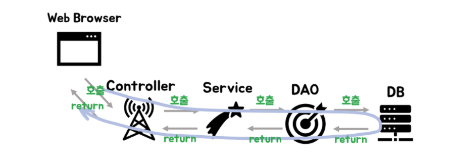
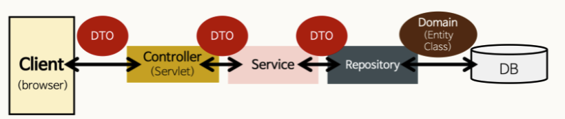

# Controller , Service , Repository

## Controller 란 ?
- MVC 패턴에서 C에 해당하며 주로 사용자의 요청을 처리한 후 지정된 뷰에 모델 객체를 넘겨주는 역할을 한다.
- 즉 사용자의 요청이 진입하는 지점이며 요청에 따라 어떤 처리를 할지 결정을 Service에 넘겨준다. 그 후 Service에서 실질적으로 처리한 내용을 View에 넘겨준다.

<br>

### Controller 사용 이유
만약 대규모 서비스중 a b c 서비스가 있다고 해보자. 그러면 이 많은 종류의 서비스를 한 클래스를 만들어서 꽉꽉 몰아 처리할 게 아니라 Controller라는 중간제어자를 만들어서 a 서비스에 대한것은 a-Controller가 맡고 b 서비스에 대한것은 b-Controller가 이런식으로 `역할`에 따라 설계를 하고 코딩을하면 개발비용이나 유지보수비용이 대폭 줄기때문에 Controller를 사용합니다.

<br>

### Spring에서의 Controller 사용법
스프링에서 컨트롤러를 지정해주기 위한 어노테이션은 `@Controller`와 `@RestController`가 있습니다.

<br>

1. @Controller(Spring MVC Controller)  
전통적인 Spring MVC의 컨트롤러인 @Controller는 주로 View를 반환하기 위해 사용합니다. 하지만 @ResponseBody 어노테이션과 같이 사용하면 RestController와 똑같은 기능을 수행합니다.


```java
@Controller
public class UsingController {
    @GetMapping("/home") //home으로 Get요청이들어오면
    public String homePage(){
        return "home.html"; //home.html생성
    }
}
```

2. @RestController(Spring Restful Controller)Permalink  
RestController는 Controller에서 @ResponseBody 어노테이션이 붙은 효과를 지니게 됩니다.  
  
즉 주용도는 JSON/XML 형태로 객체 데이터 반환을 목적으로 합니다.
```java
@RestController // JSON으로 데이터를 주고받음을 선언
public class ProductRestController{

  private final ProductService productService;
  private final ProductRepository productRepository

  // 등록된 전체 상품 목록 조회
  @GetMapping("/api/products")
  public List<Product> getProducts(){
    return productRepository.findAll();
  }
}
```

<br>

## Service 란?
Service를 이해하기 위한 큰 틀을 보겠다.
1. Clinet가 Request를 보낸다.
2. Request URL에 알맞는 Controller가 수신을 받는다.(@Controller, @RestController)
3. Controller는 넘어온 요청을 처리하기 위해 Service를 호출한다.
4. Service는 알맞는 정보를 가공하여 Controller에게 데이터를 넘긴다.
5. Controller는 Service의 결과물을 Client에게 전달해준다.

Service가 알맞은 정보를 가공하는 과정을 `비즈니스 로직을 수행한다` 라고 합니다.  
Service가 비즈니스 로직을 수행하고 데이터베이스에 접근하는 DAO를 이용해서 결과값을 받아 옵니다.

<br>

### DAO란?
- 단순하게 페이즈를 불러오고 DB정보를 한번에 불러오는 간단한 프로젝트의 경우 Service와 DAO는 차이가 거의 없을 수 있다고 합니다.
- DAO는 쉽게 말해서 MySQL 서버에 접근하여 SQL문을 실행할 수 있는 `객체` 입니다.

<br>

### DAO와 JPA
Spring Data JPA는 매우 적은 코드로 DAO를 구현할 수 있도록 해줍니다. 즉 인터페이스를 만드는 것 만으로도 Entity(@Entity) 클래스에 대한 insert , Update, Delete, Select를 실행할 수 있게 해줍니다. 뿐만 아니라 인터페이스에 메소드를 선언하는 것 만으로 라이트한 쿼리를 수행하는 코드를 만드는것과 동등한 작업을 수행합니다.  
  
그러면 JPA를 사용하면 DAO는 직접 구현을 안해도 되겠다 라는 생각을 할 수 있습니다. 하지만 JPA가 만들 수 있는 코드는 매우 가볍고 쉬운 쿼리를 대체하는 것이라서 복잡도가 높아지면 사용하기 매우 어렵습니다.  
  
이때 JPA만으로만 사용한다면 수행능력이 SQL을 직접 사용해서 개발하는 것보다 못한 상황이 벌어질 수 있습니다.  
그래서 JPA를 깊게 공부해서 JPA로 복잡도가 높은 쿼리를 짜거나 아니면 복잡도가 높은곳은 DAO로 같이 사용합니다.


<br>

## Repository 란?
- Entity에 의해 생성된 db에 접근하는 메서드를 사용하기 위한 인터페이스다.
- @Entity라는 어노테이션으로 db구조를 만들었다면 여기에 crud를 해야한다. 이것을 어떻게 할 것인지 정의해주는 계층이라고 생각하면 된다.

<br>

### 결론
