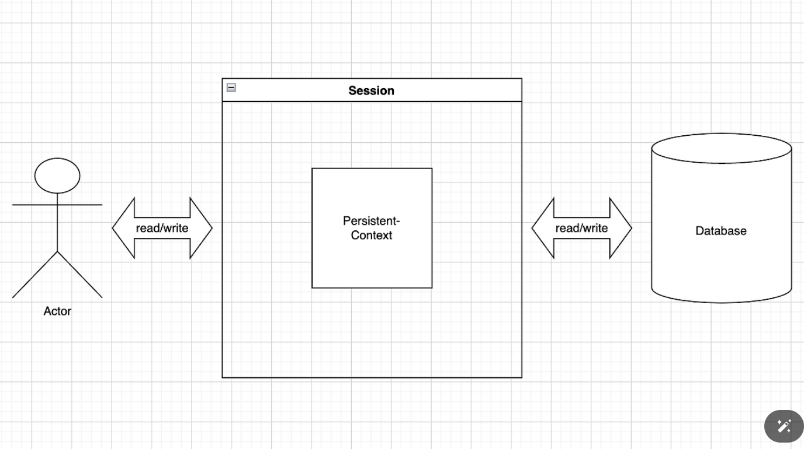
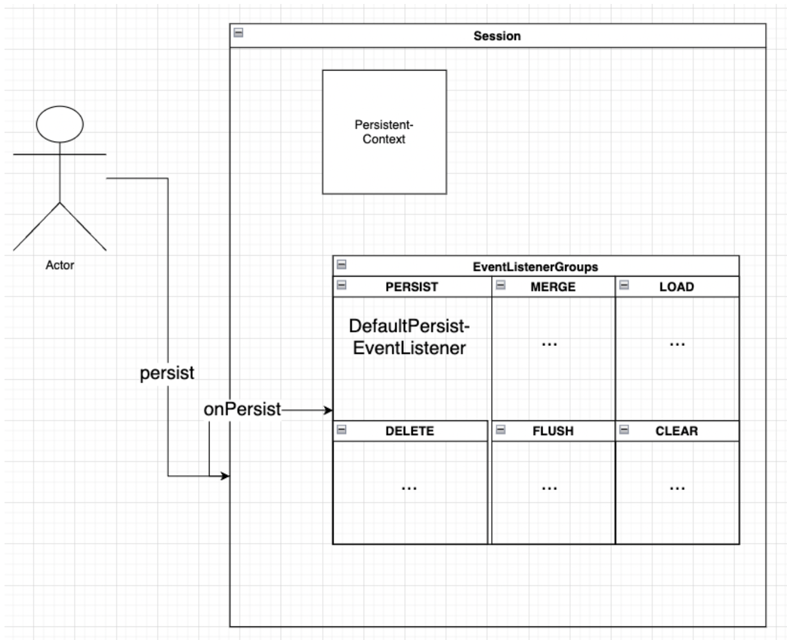
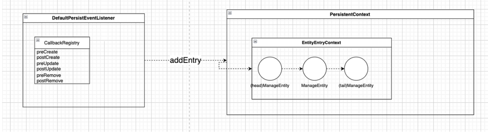
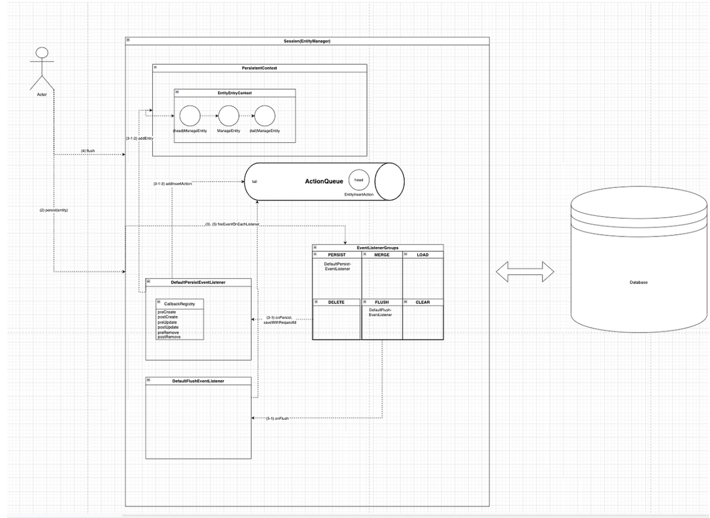

# Spring Data JPA 동작 원리

Spring Data JPA는 Spring Data 모듈로 JPA 기반의 데이터 접근 레이어를 편하게 구현할 수 있도록 지원하는 프레임워크다. RDB기반의 데이터베이스를 활용해서 개발하는 스프링 프레임워크와 함께 사용되는 모듈이다.

Spring JPA는 Hibernate의 기능을 스프링 프레임워크에서 맞게 확장한 모듈이다. 따라서 기본적인 구조와 동작은 하이버네이터 구현을 기반으로 한다.

### Persistence Context

jpa하면 자주 나오는 용어가 영속성 컨텍스트인데 흔히 1차 캐시라고도 불리며 데이터베이스로부터 로드된/로드할 엔티티를 manage하고 caching한다. entityManager or Session과 1:1 관계를 맺는다. Session은 entityManager의 구현체이며 데이터베이스와 연결을 맺으며 생성된다.

> Sessions/EntityManager 구현체인 SessionImpl과 PersistenceContext의 구현체인 StatefulPersistenceContext 기준으로 설명한다.

 

### jpaRepository.save() 호출시 일어나는 동작들

`JpaRepository.save()`를 호출하게 되면 어떤 동작들이 일어날까?

해당 메서드를 호출해 신규 생성 엔티티를 저장하면 SessionImpl의 persist()가 호출된다. 하이버네이트는 이벤트 기반으로 동작하는데, 각 이벤트마다 Event Listener Group이 존재하고 기본으로 등록된 리스너가 존재한다.

persist 역시 이벤트로 발행되며 기본 리스너로 DefaultPersistEventListener가 등록되어있다. persist가 호출되면 AbstractEvent 구현체인 PersistEvent로 넘겨 persist 이벤트 그룹의 DefaultPersistEventListener의 onPersist가 호출된다. DefaultPersistEventListener에서 엔티티 영속화 작업이 동작한다. 영속화는 영속성 컨텍스트 내에서 관리되는 ManagedEntity가 되는 것으로 이해하면 된다.

영속화된 엔티티는 EntityEntryContext에서 리스트 자료구조로 관리된다. 가장 최근에 영속화된 Entity가 tail에 가장 먼저 영속화된 엔티티는 head에 위치한다.

다음에 신규 엔티티가 영속화되기 위해 데이터베이스 insert를 해야한다. 이 때 insert 명령이 바로 실행되지 않고 **ActionQueue**에 EntityInsertAction을 Enque한다. 경우에 따라서 바로 실행되기도함.

ActionQueue에는 INSERT외에도 UPDATE, DELETE 등의 액션이 담긴다. 스프링 jpa의 지연 쓰기의 비밀이 바로 ActionQueue다.

모든 영속화 작업이 끝나면 Session의 flush가 호출된다. FlushEvent를 Flush Event Group에 넘겨 DefaultFlushEventListener의 onFlush를 호출한다. DefaultFlushEventListener는 ActionQueue의 executeActions을 실행해 ActionQueue에 담긴 Action들을 일괄 실행한다. Action의 execute 함수가 실행되며 Action의 종류에 따라 INSERT/UPDATE/DELETE 구문이 생성되어 실행된다.

요약하면

1. 데이터베이스와 연결하면 세션 또는 엔티티 매니저가 생성된다.
2. 신규 엔티티를 영속화 하는 이벤트를 발행한다.
3. 세션 내부의 영속성 컨텍스트를 관리받는 엔티티로 등록된다.
4. EntityInsertAction이 ActionQueue에 추가 된다.
5. Flush 이벤트를 발행한다.
6. ActionQueue에 담긴 Action을 일괄 실행한다.
7. INSERT 구문이 실행된다.

