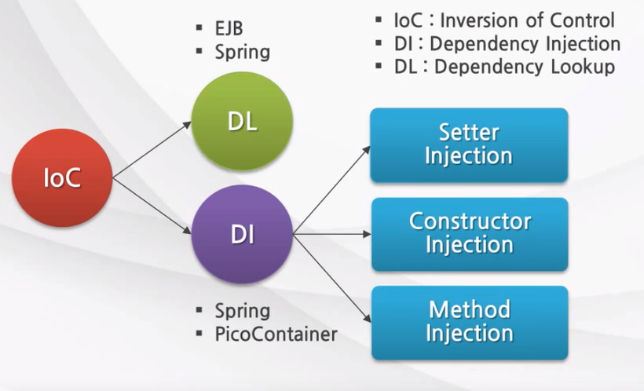
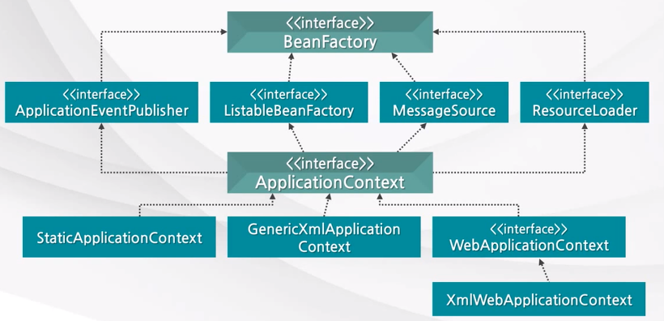

# IoC 컨테이너 (Inversion of Control)

### IoC
- IoC를 번역하면 `제어, 반전`을 뜻하고 있습니다.
- **IoC(제어 반전)이란**, 객체의 생성 , 생명주기의 관리까지 모든 객체에 대한 제어권이 바뀌었다는 것을 의미한다.
- 컴포넌트 의존관계 설정 , 설정 및 생명주기를 해결하기 위한 `디자인 패턴` 입니다.

### 컨테이너
> 컨테이너 - 컨테이너는 보통 객체의 생명주기를 관리, 생성된 인스턴스들에게 추가적인 기능을 제공하도록 하는 것
  
스프링 프레임워크도 객체를 생성하고 관리하고 책임지고 의존성을 관리해주는 컨테이너가 있다. 그것이 바로 IoC컨테이너(스프링 컨테이너)다.  
  
**인스턴스 생성부터 소멸까지의 인스턴스 생명주기 관리를 개발자가 아닌 컨테이너가 대신 해줍니다. 객체관리 주체가 프레임워크(컨테이너)가 되기 때문에 개발자는 로직에 집중할 수 있다는 장점이 있습니다.**
- IoC 컨테이너는 객체의 생성을 책임지고, 의존성을 관리한다.
- POJO의 생성, 초기화, 서비스, 소멸에 대한 권한을 가진다.
- 개발자들이 직접 POJO를 생성할 수 있지만 컨테이너에게 맡긴다.
- 개발자는 비즈니스 로직에 집중가능하다.
- 객체 생성 코드가 없어지므로 TDD가 용이하다.

> POJO(Plain Old Java Object)란?  
> 주로 특정 자바 모델이나 기능, 프레임워크를 따르지 않는 Java Object를 지칭한다. 
> .Java Bean 객체가 대표적이다.간단하게 getter / setter를 생각하면 될 것 같다.

 

### IoC의 분류

#### DL(Dependency Lookup)과 DI(Dependency injection)

- `DL` : 저장소에 저장되어 있는 빈에 접근하기 위해 컨테이너가 제공하는 API를 사용하여 빈을 Lockup 하는 것.
- `DI` : 각 클래스간의 의존관계를 빈 설정 정보를 바탕으로 컨테이너가 자동으로 연결해주는 것
  - Setter Injection(수정자 주입)
  - Constructor Injection(생성자 주입)
  - Method Injection(필드 주입)

**DL사용시 컨테이너 종속이 증가하기 때문에 주로 DI를 사용한다.**

 

### 스프링 컨테이너(IoC)의 종류
스프링 컨테이너가 관리하는 객체를 `빈(Bean)`이라고 하고,  
이 빈들을 관리한다는 의미에서 컨테이너를 `빈 팩토리` 라고 부릅니다.

- 객체의 생성과 객체 사이의 런타임 관계를 DI 관점에서 볼 때 컨테이너를 `BeanFactory`라고 합니다.
- BeanFactory에 여러가지 컨테이너 기능울 추가한 **어플리케이션컨텍스트(ApplicationContext)**가 있습니다.

### BeanFactory , ApplicationContext

#### 1. BeanFactory
- BeanFactory 계열의 인터페이스만 구현한 클래스는 단순히 컨테이너에서 객체를 생성하고 DI를 처리하는 기능만 제공합니다.
- Bean을 등록, 생성, 조회 , 반환 관리를 합니다.
- 팩토리 디자인 패턴을 구현한 것으로 BeanFactory는 빈을 생성하고 분배하는 책임을 지는 클래스입니다.
- 빈을 조회할 수 있는 getBean() 메서드가 정의되어 있습니다.

#### 2. ApplicationContext
- Bean을 등록, 생성, 조회, 반환 관리하는 기능은 BeanFactory와 같습니다.
- 스프링의 각종 부가기능을 추가로 제공합니다.

**BeanFactory 보다 더 추가적으로 제공하는 기능**
  - 국제화가 지원되는 텍스트 메시지를 관리 해준다.
  - 이미지같은 파일 자원을 로드할 수 있는 포괄적인 방법을 제공해준다.
  - 리스너로 등록된 빈에게 이벤트 발생을 알려준다.

> 따라서 대부분의 어플리케이션에서는 빈팩토리보다 어플리케이션콘텍스트를 사용하는 것이 더 좋다.