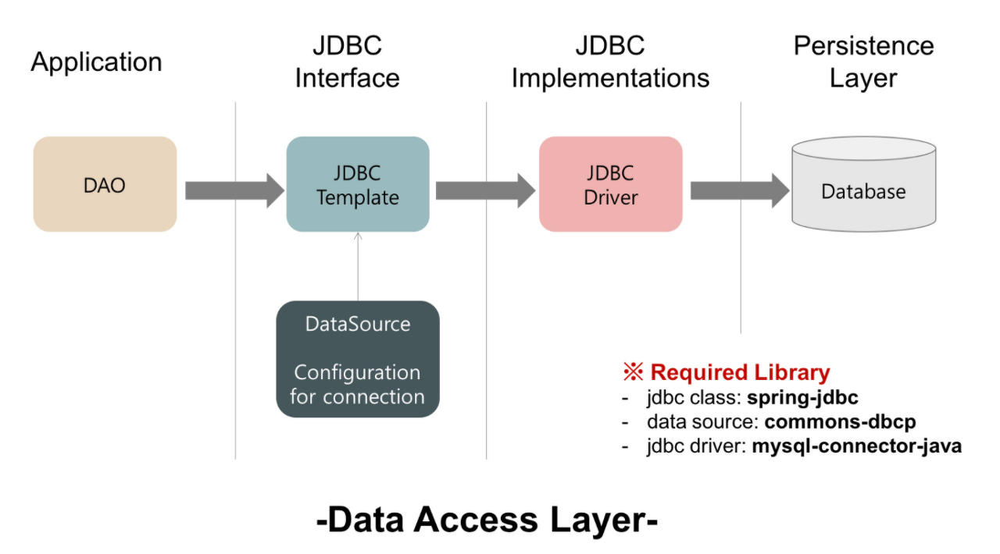

# Spring JDBC, DataSorce란?

### DataSource란 ?
- DB와 관계된 커넥션 정보를 담고있으며 빈으로 등록하여 인자로 넘겨준다. >> 이 과정을 통해 Spring은 DataSource DB와의 연결을 획득한다.
  - DB 서버와의 연결을 해준다.
  - DB Connection pooling 기능

- 종류 : JDBC Driver vendor(MySQL, Oracle)별로 여러가지 존재한다.

### DataSource를 설정하고 빈에 등록, 주입법
1. DB와의 연결을 위해 **DB서버 정보(Property)**를 설정한다. (하드코딩을 피하기 위해 파일로 설정 -> 이곳에서만 수정하면 다른 모든부분에 변경내용이 적용되므로 이렇게 하는것이 좋다.)
2. 설정한 property file을 통해 DataSource를 빈으로 등록한다.
3. 생성된 DataSource빈을 Spring JDBC에 주입한다.

### DB Connection Pooling 이란?
- 자바 프로그램에서 데이터베이스 연결(커넥션 객체를 얻는것)은 오래걸림
- 일정량의 Connection 객체를 미리 만들어 저장해두었다. 요청시 꺼내쓴다!
- 속도와 퍼포먼스가 좋아짐
- 커넥션풀을 관리하고, 커넥션 객체를 풀에서 꺼냈다 반납하는 이러한 과정을 DataSource가 하는 것!

 

## JDBC 란 ?
**DB에 접근할 수 있도록 자바에서 제공하는 API (Java Database Connectivity**  
즉, 데이터베이스에서 자료를 쿼리하거나 업데이트하는 방법을 제공한다.  
JDBC를 이용하면 데이터베이스에 비 종속적인 DB 연동 로직을 구현할 수 있다. 즉 mysql을 쓰다가 postgre로 얼마든지 옮길 수 있다는건데 이는 jdbc api가 여러 DB Driver를 호환할 수 있는 인터페이스를 제공하기 때문이다.

### Plain JDBC 문제점
- 쿼리를 실행하기 전과 후의 많은 코드를 작성해야한다.(연결생성,명령문,등등)
- 예외처리코드와 트랜잭션 처리등에 시간과 자원이 소모
  - jdbc에서 발생하는 에러는 Runtime Exception이다. 따라서 모두 예외처리를 해줘야함
- 이러한 문제점을 보완하여 생겨난 것이 Spring JDBC

 

## Spring JDBC란?
JDBC의 단점을 보완하여 더 편리한 기능을 제공

### Spring JDBC가 하는일
- Connection 열기와 닫기
- Statement 준비와 닫기
- Statement 실행
- ResultSet Loop 처리
- Exception 처리와 반환
- Transaction 처리
  
### Spring JDBC에서 개발자가 할일
핵심적으로 해야 될 작업만 해주면 나머지는 프레임워크가 알아서 처리해준다.
- datasource 설정
- sql문 작성
- 결과 처리