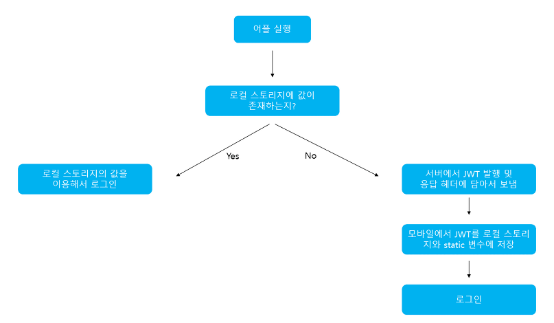
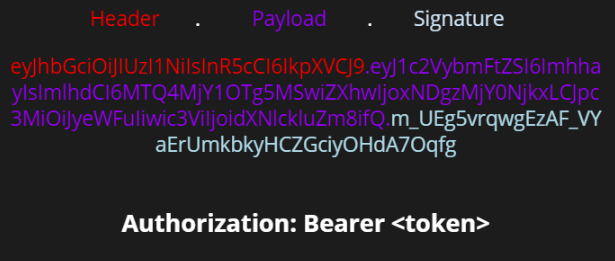

# Jwt (Json Web Token) 알아보기


### Jwt 개념
- Json 포맷을 이용하여 사용자에 대한 속성을 저장하는 Claim 기반의 Web Token이다. 
- Jwt는 토큰 자체로 사용하는 Self-Contained 방식으로 정보를 안전하게 전달한다.
- 주로 회원 인증이나 정보 전달에 사용되는 Jwt는 아래의 로직으로 처리된다.



애플리케이션이 실행될 때, Jwt를 static 변수와 로컬 스토리지에 저장하게 된다. static 변수에 저장되는 이유는 HTTP 통신을 할 때 Jwt를 HTTP 헤더에 담아서 보내야 하는데, 이를 로컬 스토리지에서 계속 불러오면 오버헤드가 발생하기 때문이다. 클라이언트에서 JWT를 포함해 요청을 보내면 서버는 허가된 Jwt인지를 검사한다. 또한 로그아웃을 할 경우 로컬 스토리지에 저장된 Jwt 데이터를 제거한다.(실제 서비스에 경우에는 로그아웃 시, 사용했던 토큰을 blacklist라는 DB 테이블에 넣어 해당 토큰의 접근을 막는 작업을 해주어야 한다.)

<br>

### 구조
- Jwt는 Header, Payload, Signature의 3부분으로 이루어지며, Json 형태인 각 부분은 Base64Url로 이놐딩 되어 표현된다.
- 또한 각각의 부분을 이어 주기 위해, 구분자를 사용하여 구분한다.
- 추가로 Base64Url은 암호화된 문자열이 아니고, 같은 문자열에 대해 항상 같은 문자열을 반환한다.

<br>

#### Header
토큰의 헤더는 typ , alg 두 가지 정보로 구성된다. alg는 헤더를 암호화 하는 것이 아니고, Signature를 해싱하기 위한 알고리즘을 지정하는 것이다.
- typ: 토큰의 타입을 지정 ex) Jwt
- alg : 알고리즘 방식을 지정하며, 서명(Signature) 및 토큰 검증에 사용한다. ex) HS256(SHA256) 또는 RSA

```json
{
    "alg": "HS256",
    "typ": JWT
}
```

#### PayLoad
- 토큰의 페이로드에는 토큰에서 사용할 정보인 조각들인 `클레임`이 담겨 있다.
- 클레임은 총 3가지로 나누어지며, Json(Key/Value)형태로 다수의 정보를 넣을 수 있다.

#### 등록된 클레임(Registered Claim)
등록된 클레임은 토큰 정보를 표현하기 위해 이미 정해진 종류의 데이터들로, 모두 선택적으로 작성이 가능하며 사용할 것을 권장한다. 또한 Jwt를 간결하게 하기 위해 key는 모두 길이 3의 String이다. 여기서 subject로는 unique한 값을 사용하는데, 사용자 이메일을 주로 사용한다.
- iss : 토큰 발급자(issuer)
- sub : 토큰 제목(subject)
- aud :  토큰 대상자(audience)
- exp : 토큰 만료 시간(expiration), NumericDate 형식으로 되어 있어야 함 ex) 123456787654
- nbf : 토큰 활성 날짜(not before), 이 날이 지나기 전의 토큰은 활성화되지 않음
- iat : 토큰 발급 시간(issued at), 토큰 발급 이후의 경과 시간을 알 수 있음
- jti : Jwt 토큰 식별자(Jwt Id), 중복 방지를 위해 사용하며, 일회횽 토큰(Access Token) 등에 사용


#### 공개 클레임(Public Claim)
- 공개 클레임은 사용자 정의 클레임으로, 공개용 정보를 위해 사용된다.
- 충돌 방지를 위해 URI 포맷을 이요하여, 예시는 아래와 같다.

```json
{
    "https://...." : true
}
```

#### 비공개 클레임(Private Claim)
```json
{
    "token_type" : access
}
```


#### Signature(서명)
- 서명은 토큰을 인코딩하거나 유효성을 검증을 할 때 사용하는 고유한 암호화 코드이다.
- 서명은 위에서 만드는 헤더와 페이로드의 값을 각각 BASE64Url로 인코딩하고, 인코딩한 값을 비밀 키를 이용해 헤더에서 정의한 알고리즘을 해싱을 하고, 이 값을 다시 BASEUrl로 인코딩하여 생성한다.

<br>`

#### Jwt 토큰 예시



생성된 토큰은 HTTP 통신을 할 때 Authorization이라는 key의 value로 사용된다. 일반적으로 value에는 Bearer이 앞에 붙여진다.
```json
"Authorization" : "Bearer {생성된 토큰 값}",
```

### Jwt 단점 및 고려사항
- Self-contained: 토큰 자체에 정보를 담고 있으므로 양날의 검이 될 수 있다.
- Payload 인코딩: 페이로드 자체는 암호화 된 것이 아니라. BASE64Url로 인코딩 된 것이다. 중간에 Payload를 탈취하야 디코딩하면 데이터를 볼 수 있으므로, JWE로 암호화하거나 Payload에 중요 데이터를 넣지 않아야 한다.
- Stateless: JWT는 상태를 저장하지 않기 때문에 한번 만들어지면 제어가 불가능하다. 즉, 토큰을 임의로 삭제하는 것이 불가능하므로 토큰 만료 시간을 꼭 넣어주어야 한다.
- Store Token : 토큰은 클라이언트 측에서 관리해야 하기 때문에, 토큰을 저장해야 한다.