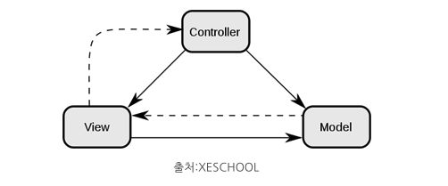

# MVC 패턴이란 무엇일까?

### MVC 패턴
 `Model-View-Controller`의 약자로 개발을 할 때 3가지 형태로 역학을 나누어 개발하는 방법론이다.

- `Model` : 애플리케이션이 무엇을 할 것인지 정의하는 부분이다. 즉 데이터베이스와 연동하여 사용자가 입력한 데이터나 사용자에게 출력할 데이터를 다룹니다.
- `View` : 사용자에게 시각적으로 보여주는 부분입니다. (UI)
- `Controller` : Model이 데이터를 어떻게 처리할지 알려주는 역할입니다. 사용자에 의해 클라이언트가 보낸 데이터가 있으면 모델을 호출하기전에 적절히 가공을 하고 모델을 호출합니다. 그런다음 모델이 업무 수행을 완료하면 그 결과를 가지고 View에게 전달하는 역할을 합니다.

 

### MVC 패턴을 사용하는 이유
- 사용자가 보는 페이지, 데이터처리, 그리고 이 2가지를 중간에서 제엏나느 컨트롤러, 이 3가지로 구성되는 하나의 애플리케이션을 만들면 각각 맡은바에만 집중을 할 수 있게 됩니다.
- 즉 서로 분리되어 각자의 역할을 집중할 수 있게끔하여 개발을 하고 그렇게 애플리케이션을 만든다면 `유지보수성` , `애플리케이션의 확장성` , `유연성`이 증가하고 중복 코딩이라는 문제점 또한 사라집니다.

