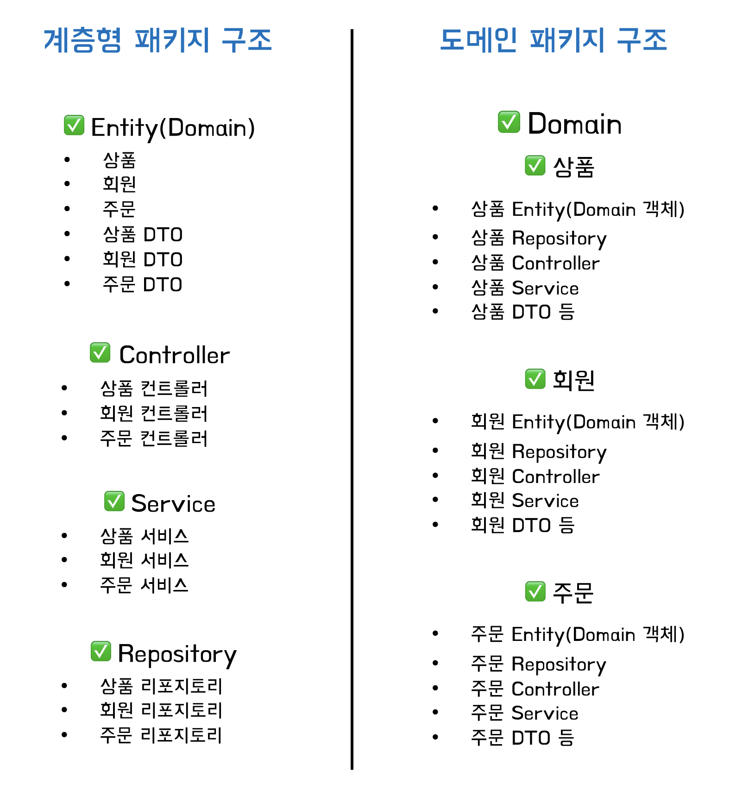

# 스프링 패키지 구조(Spring Package Structure) - 계층형 vs 도메인형

패키지 구성은 크게 두 가지 유형이 있다.
1. 계층형
2. 도메인형

### 계층형 패키지 구조
- 계층형으로 패키지를 설계하는 방식
- 전체적인 구조를 빠르게 파악할 수 있는 장점이 있지만 디렉토리 클래스들이 너무 많이 모이게 되는 단점이 존재  
  
**장점**
1. 해당 프로젝트에 이해가 상대적으로 낮아도 전체적인 구조를 빠르게 파악 가능

**단점**
1. 디렉토리에 클래스들이 너무 많이 모이게 됨
2. 모듈 단위로 분리 시 어려움이 있음

### 도메인형 패키지 구조
- 도메인 단위로 디렉토리 구성
- 도메인 구조는 관련된 코드들이 응집해 있는 장점이 있지만, 프로젝트에 대한 이해도가 낮을 경우 전체적인 구조를 파악하기 힘든 어려운 점이 있음

**장점**
- 관련된 코드들이 응집해 있음
- 모듈 단위로 분리할 때 유리함

**단점**
- 프로젝트에 대한 이해도가 낮을 경우 전체적인 구조를 파악하기 어려움
- 개발자의 성향에 따라 도메인을 구분하는 기준이 다를 수 있고, 내 예상과 다른 패키지에 존재하는 경우 관련 코드를 찾기 어려움
- 패키지 간 순환 참조가 발생할 가능성이 있음
  - 같은 패키지 내부에 있어도 되는 파일인데도 불구하고 모듈별로 구분되어 있기 때문에 다른 패키지에 존재하게 되고, 서로를 참조할 수 있음

 

### 계층형, 도메인형 예시

 

### 결론

복잡도가 높고 제공하는 기능이 많아 하나의 계층에 속하는 클래수 수가 많고,  
제공하는 기능을 명학환 기준으로 분리할 수 있고,  
추후에 모듈별로 별도 서비스로 쪼개질 가능성이 있는경우  
-> **도메인형 구조**

  
복잡도가 낮고 제공하는 기능이 적어 하나의 계층에 속하는 클래스 수가 적고,  
제공하는 기능을 명확한 기준으로 분리하기가 애매하고,  
추후에 모듈별로 분리하게 될 일이 없을 것 같은 작은 규모의 프로젝트 일 경우  
-> **계층형 구조**

로 방향을 잡을 것 같다.