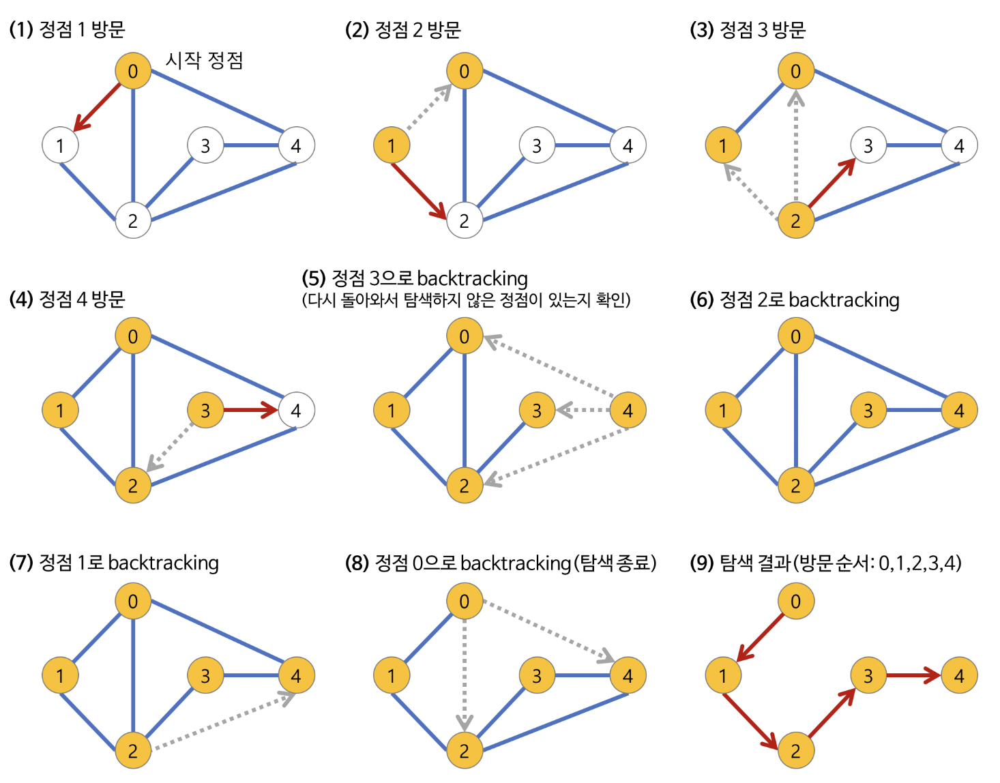

# 깊이 우선 탐색(DFS, Depth-First Search

### 그래프 탐색
- 하나의 정점으로부터 시작하여 차례대로 모든 정점들을 한번 씩 방문하는 것
- ex : 특정 도시에서 다른 도시로 갈 수 있는지 없는지, 전자 회로에서 특정 단자와 단자가 서로 연결되어 있는지


### 깊이 우선 탐색이란
루트 노드나 혹은 다른 임의의 노드에서 시작해 다음 분기로 넘어가기 전에 해당 분기를 완벽하게 탐색하는 방법

- 미로를 탐색할 때 한 방향으로 갈 수 있을때까지 계속 가다가 더 이상 갈 수 없게 되면 다시 가장 가까운 갈림길로 돌아와 이곳으로부터 다른 방향으로 다시 탐색을 진행하는 방법과 유사하다.
- 즉 넓게 탐색하기 전에 깊게 탐색하는 것이다.
- 사용하는 경우 : **모든 노드를 방문**하고자 하는 경우에 이 방법을 선택한다.
- 깊이 우선 탐색이 너비 우선 탐색보다 좀 더 간단하다.
- 단순 검색 속도 자체는 너비 우선 탐색에 비해 느리다.

### 깊이 우선 탐색의 특징
- 자기 자신을 호출하는 순환 알고리즘 형태를 가지고 있다.
- 전위 순회를 포함한 다른 형태의 트리 순회는 모드 DFS의 한 종류이다.
- 이 알고리즘을 구현할 때 가장 큰 차이점은, 그래프 탐색의 경우 어떤 노드를 방문했었는지 여부를 반드시 검사해야 한다는 것이다.
  - 이를 검사하지 않을 경우 무한루프에 빠질 위험이 있다.



1. a 노드 즉 시작노드를 방문후 방문한 노드를 방문했다고 표시
2. a 와 인접한 노드들을 차례대로 순회, 인접한 노드가 없다면 종료
3. a와 이웃한 노드 b를 방문했다면, a와 인접한 또 다른 노드를 방문하기 전에 b의 이웃 노드들을 전부 방문해야 한다.
   - b를 시작 정점으로 DFS를 다시 시작하여 b의 이웃노드를 방문한다.
4. b의 분기를 전부 완벽하게 탐색했다면 다시 a에 인접한 정점들 중에서 아직 방문이 안된 정점을 찾는다.
    - 즉, b의 분기를 전부 완벽하게 탐색한 뒤에야 a의 다른 이웃 노드를 방문할 수 있다는 뜻이다.
    - 아직 방문이 안 된 정점이 없으면 종료한다.
    - 잇으면 다시 그 정점을 시작 정점으로 DFS를 시작한다.


### 구현 코드

```java
oid search(Node root) {
  if (root == null) return;
  // 1. root 노드 방문
  visit(root);
  root.visited = true; // 1-1. 방문한 노드를 표시
  // 2. root 노드와 인접한 정점을 모두 방문
  for each (Node n in root.adjacent) {
    if (n.visited == false) { // 4. 방문하지 않은 정점을 찾는다.
      search(n); // 3. root 노드와 인접한 정점 정점을 시작 정점으로 DFS를 시작
    }
  }
}
```

```java
순환 호출을 이용한 DFS 구현 (java 언어)
import java.io.*;
import java.util.*;

/* 인접 리스트를 이용한 방향성 있는 그래프 클래스 */
class Graph {
  private int V;   // 노드의 개수
  private LinkedList<Integer> adj[]; // 인접 리스트

  /** 생성자 */
  Graph(int v) {
      V = v;
      adj = new LinkedList[v];
      for (int i=0; i<v; ++i) // 인접 리스트 초기화
          adj[i] = new LinkedList();
  }

  /** 노드를 연결 v->w */
  void addEdge(int v, int w) { adj[v].add(w); }

  /** DFS에 의해 사용되는 함수 */
  void DFSUtil(int v, boolean visited[]) {
      // 현재 노드를 방문한 것으로 표시하고 값을 출력
      visited[v] = true;
      System.out.print(v + " ");

      // 방문한 노드와 인접한 모든 노드를 가져온다.
      Iterator<Integer> i = adj[v].listIterator();
      while (i.hasNext()) {
          int n = i.next();
          // 방문하지 않은 노드면 해당 노드를 시작 노드로 다시 DFSUtil 호출
          if (!visited[n])
              DFSUtil(n, visited); // 순환 호출
      }
  }

  /** 주어진 노드를 시작 노드로 DFS 탐색 */
  void DFS(int v) {
      // 노드의 방문 여부 판단 (초깃값: false)
      boolean visited[] = new boolean[V];

      // v를 시작 노드로 DFSUtil 순환 호출
      DFSUtil(v, visited);
  }

  /** DFS 탐색 */
  void DFS() {
      // 노드의 방문 여부 판단 (초깃값: false)
      boolean visited[] = new boolean[V];

      // 비연결형 그래프의 경우, 모든 정점을 하나씩 방문
      for (int i=0; i<V; ++i) {
          if (visited[i] == false)
              DFSUtil(i, visited);
      }
  }
}
/** 사용 방법 */
public static void main(String args[]) {
    Graph g = new Graph(4);

    g.addEdge(0, 1);
    g.addEdge(0, 2);
    g.addEdge(1, 2);
    g.addEdge(2, 0);
    g.addEdge(2, 3);
    g.addEdge(3, 3);

    g.DFS(2); /* 주어진 노드를 시작 노드로 DFS 탐색 */
    g.DFS(); /* 비연결형 그래프의 경우 */
}
```

- 깊이 우선 탐색(DFS)의 시간 복잡도

- DFS는 그래프(정점의 수: N, 간선의 수: E)의 모든 간선을 조회한다.
  - 인접 리스트로 표현된 그래프: O(N+E)
  - 인접 행렬로 표현된 그래프: O(N^2)
- 즉, 그래프 내에 적은 숫자의 간선만을 가지는 희소 그래프(Sparse Graph) 의 경우 인접 행렬보다 인접 리스트를 사용하는 것이 유리하다.