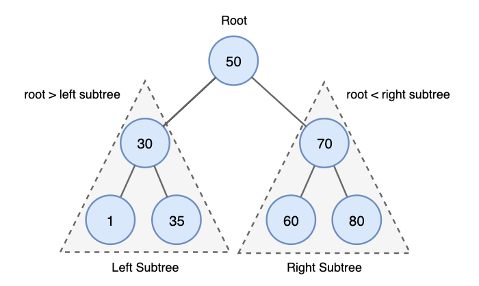
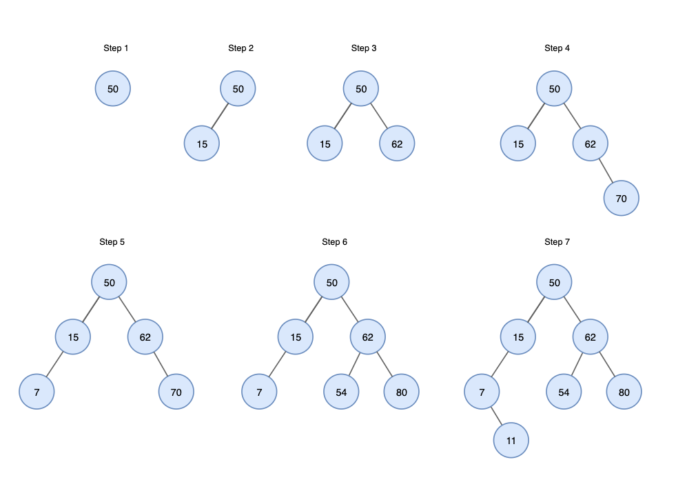
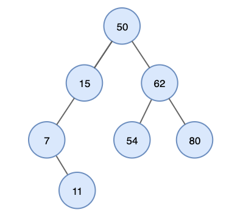
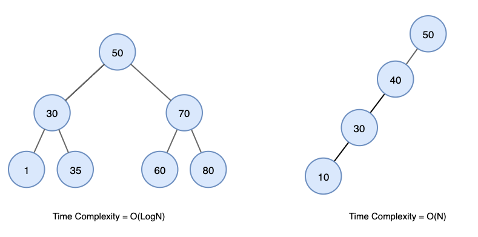
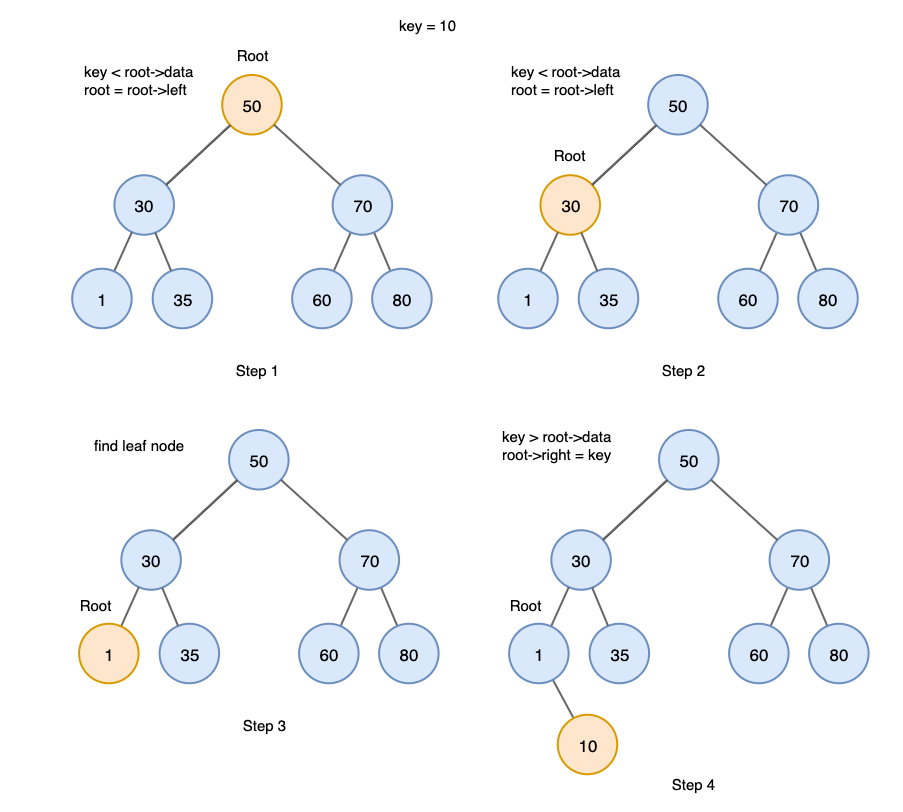
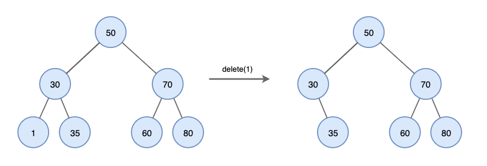
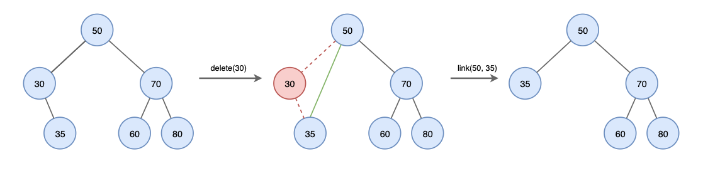
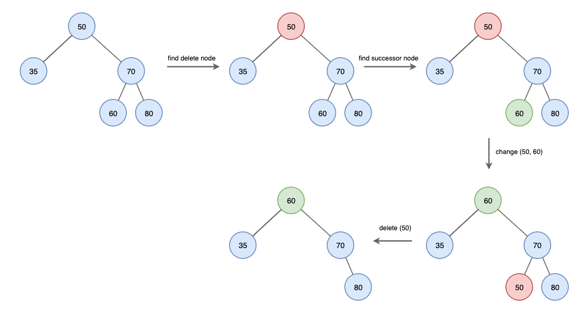

# 이진 탐색 트리 BST Binary Search Tree

### 이진 탐색 트리의 속성 
이진 탐색트리란 정렬된 이진트리로써 다음과 같은 속성을 가지고있다.
- 노드의 왼쪽 하위 트리에는 노드의 키보다 작은 키가있는 노드만 포함된다.
- 노드의 오른쪽 하위 트리에는 노드의 키보다 큰 키가있는 노드만 포함된다.
- 왼쪽 및 오른쪽 하위 트리에도 각각 이진 탐색 트리여야 한다.
- 중복된 키를 허용하지 않는다.



이러한 이진 탐색 트리의 특성 때문에 효율적인 검색이 가능합니다.

### 생성 예시
```
50, 15, 62, 80, 7, 54, 11
```
주어진 요소를 사용하여 BST를 생성하는 과정은 다음과 같다.

1. 50을 트리의 루트로 트리에 삽입한다.
2. 다음 요소를 읽고 루트 노드 요소보다 작으면 왼쪽 하위 트리의 루트로 삽입한다.
3. 그렇지 않으면 오른쪽 하위 트리의 오른쪽 루트로 삽입한다.



### 이진 탐색 트리의 특징

1. BST의 Inorder Traversal을 수행하여 모든 키를 정렬된 순서로 가져올 수 있습니다.



위 트리의 inorder traversal 결과는 다음과 같습니다.
8 11 15 50 54 62 80

2. BST의 검색에 대한 시간 복잡도는 균형 상태이면 O(logN)의 시간이 걸리고 불균형 상태라면 최대 O(N) 시간이 걸립니다.



<br>

### 이진트리의 연산

#### 검색

이진 탐색 트리에서 특정 요소의 위치를 찾습니다.
  
검색 과정은 다음과 같습니다.
1. 루트에서 시작한다.
2. 검색 값을 루트와 비교한다 루트보다 작으면 왼쪽에 대해 재귀하고 크다면 오른쪽으로 재귀한다.
3. 일치하는 값을 찾을때까지 절차를 반복한다.
4. 검색 값이 없으면 Null을 반환한다.

#### 삽입
이진 검색트리에 데이터를 삽입하는 작업을 합니다. 중복 허용 x  
새 키는 항상 리프 노드에 삽입됩니다.  
  
삽입 과정은 다음과 같습니다.
1. 루트에서 시작
2. 삽입 값을 루트와 비교합니다. 루트보다 작으면 왼쪽으로 크면 오른쪽으로 재귀합니다.
3. 리프 노드에 도달한 후 노드보다 크다면 오른쪽에 작다면 왼쪽에 삽입합니다.



#### 삭제

이진 탐색 트리에서 특정 노드를 삭제한다. 이진 탐색 트리에서 노드를 삭제하는 세 가지 상황이 있다.

1. 삭제할 노드가 리프노드인 경우

노드를 삭제하기만 하면 된다.



2. 삭제할 노드에 자식이 하나만 있는 경우

노드를 삭제하고 자식 노드를 삭제한 노드의 부모에 직접 연결한다.



3. 삭제할 노드에 자식이 둘 있는 경우

자식이 둘 있는 경우 successor 노드를 찾는 과정이 추가됩니다.  
  
surrcessor 노드란
- right subtree에 최소값
- 즉, inorder 순회에서 다음 노드를 말합니다.

삭제 과정은 다음과 같다.
1. 삭제할 노드를 찾는다.
2. 삭제할 노드의 successor 노드를 찾습니다.
3. 삭제할 노드와 successor 노드의 값을 바꿉니다.
4. successor 노드를 삭제합니다.


