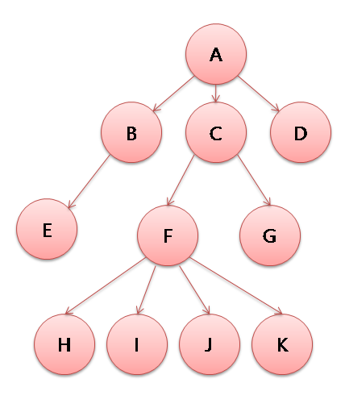
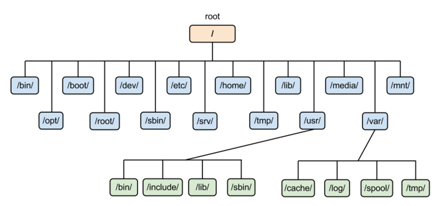
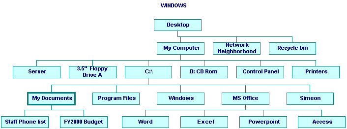
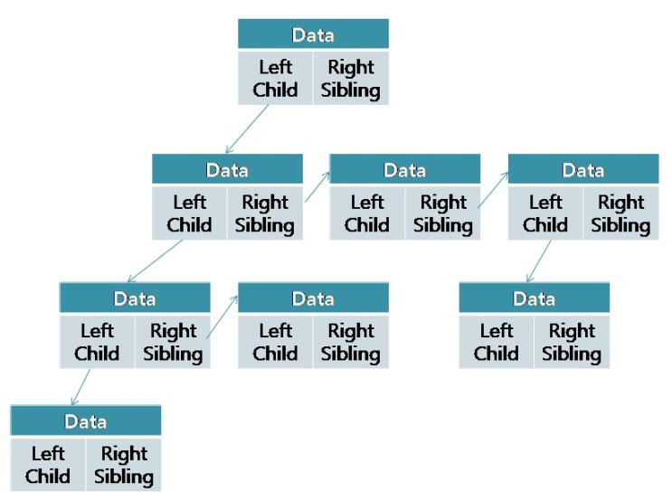

# 트리 Tree

### 트리란?
- 트리는 나무와 비슷하다고 생각하면된다. 나무는 하나의 뿌리가 있고 거기에 가지를 쳐나간다. 그 가지에는 또다른 잔가지가 나고 그 잔가지에는 또다란 잔가지가 난다. 이러한 자료구조를 트리라고 한다.
- 트리는 이때까지와의 자료구조 즉 스택과 큐와 덱과 같은 자료구조라는 그 존재 목적부터 궤를 달리한다.
- 연결리스트와 배열과 같은 자료구조는 다른 자료구조를 만드는데 모티브가되는 자료구조이며
- 스택과 큐와 덱은 시스템 내부적인 구현에서 사용하기에 내부를 공개할 필요가 없고 닥치고 성능에 충실한 자료구죠다.
- 트리는 드디어 사람이 사용하기에 편리하게하기위해 즉 사람이 쓰기 좋기 위해 만들어진 자료구조다.



트리는 이러한 구조를 갖는다.  
시작하는 하나의 노드가 존재하며 그 노드를 기준으로 하위노드로 노드가 연결된다.  
이때 일반적인 트리는 하위노드의 갯수의 제한이 없다. 즉 A노드에 연결되어있는 노드의 갯수는 1개가 될 수도 있고 100개가 될 수도 있으며 심지어는 없을 수도 있다. 그리고 밑으로 내려가는데도 제한이 없다.  
  
예를 들어 A > C > F > I 로 내려가는 4단계의 길이 존재할 수 도 있지만 이게 100단계가 될 수도 1000단계가 될 수도 있다. 
- 여기서 A라는 최상위 노드, 즉 모든노드를 들어가는 입구인 시작노드를 `Root노드` 혹은 뿌리노드라고 부른다. 
- 그리고 A를 기준으로 B C D는 A의 직속으로 연결되어있는 노드다. 이러한 노드를 `자식노드` 라고 부른다. 
- 반대로 B C D 기준으로 A노드는 `부모노드`로 불린다.
- 또한 B를 기준으로 C D는 같은 대열에 있다. 이러한 노드를 `형제노드`라고 한다.
- 그리고 D노드 처럼 자식이 단 한나도 존재하지 않는 노드를 `리프노드`라고 한다.
- 반대로 루트를 제외하고 자식을 하나라도 가지는 노드를 `가지노드`라고 한다.

#### 정리
```
Root(뿌리) 노드 - 최상위 노드

Child(자식) 노드 - 어떤 노드의 하위 노드

Parent(부모) 노드 - 어떤 노드의 상위 노드

Brother,Sibling(형제) 노드 - 어떤 노드의 같은 등급의 노드

Leaf(잎) 노드 - 자식 노드가 존재하지 않는 노드

Branch(가지) 노드 - 자식 노드가 하나라도 존재하는 노드중에 Root가 아닌 노드
```

### 트리 용어

- A라는 루트노드를 기준으로 I까지의 최단경로는 4개의 노드르 거치게 된다 그리고 루트를 기준으로 E노드의 경우는 3개의 노드를 거친다. 이렇게 루트에서 어떠한 노드까지의 경로의 갯수를 `깊이(Depth)`라고 부른다.
- 또한 이 깊이를 `레벨(Level)`이라 부르기도 하는데 약간 느낌이 다른게 E노드는 깊이가 3이고 레벨역시 3인데 이렇게 생각하면 된다. 누군가 E노드의 깊이는 얼마야? 이런식으로 물어보는 경우는 있지만 누군가 깊이가 3인 노드가 뭐가 있어? 라고 표현은 안쓰고 레벨이 3인 노드는 뭐가 있어? 이런 형식으로 쓴다고 보면된다. 거의 비슷한 뜻임
- 그리고 H I J K 노드가 이 트리에서 가장 깊이가 깊은데 이렇게 가장 숫자가 큰 깊이를 이 노드의 `높이(Height`)라고 부른다.
- 그리고 어떠한 노드의 자식의 갯수를 `차수(Degree)`라고 부른다. 예를 들어 A노드의 차수는 3이다.

#### 정리
```
깊이(Depth) - 루트에서 어떤 노드까지의 경로의 갯수

레벨(Level) - 같은 깊이의 집합

높이(Height) - 이 트리에서 가장 높은 깊이

차수(Degree) - 어떠한 노드의 자식의 갯수 
```

<br>

### 트리의 용도





각각 리눅스와 윈도우의 파일시스템 구조다. 이 두 파일 시스템은 모두 트리를 이용해 만든다.  
이렇게 전형적으로 파일시스템은 트리의 변형 트리들로 만드는 경우가 많으며  
또한 계층적 구조를 사용해야 되는 여러가지 자료에서 트리구조를 사용한다.  
그리고 엄청난 양의 데이터 저장에도 트리가 용이한 경우가 많다.

### 트리 아록리즘과 시간 복잡도

- 왼쪽 자식/으론쪽 형제 표현법




위의 알고리즘보다 구현으니 쉽지만 덜 직관적인 알고리즘입니다만 구현이 쉽다는 이유로 주로 이 알고리즘이 많이 쓰입니다.  
이진트리와 만드는 맥락은 사실 같다고 볼 수 있습니다. 이 트리를 풀어 해치면 사실 이진트리와 똑같죠.  
왼쪽으로 가면 자식을, 오른쪽으로 가면 형제노드를 방문할 수 있습니다.  
예를들어 위의 트리의 경우 레벨2의 노드가 3개가 있는데 이는 레벨2노드의 떼이터중 가장 앞의 데이터를 통해서만 방문 가능합니다.  
  
이러한 소위 LCRS(Left Child Right Sibling)방식의 장점은  
구현이 N 링크방식에 비해서는 매우 쉬운편이며 늘어나느 데이터에도 효과적으로 만들 수 있다는 장점이 있습니다. (사실 N링크방식에서도 알고리즘을 복잡하게 하는 대신 동적 배열로 만들면 되므로 이는 장점이라 보기 힘들 수도 있습니다.)  
그러나 단점이라면 부모노드에서 자식 노드로 한방에 방문할 방법이 전무하단 것입니다.  
즉 내 자식임에도 불구하고 내 자식이 몇명인지, 또 무슨 데이터를 가졌는지 확인하려면 운행이 필요하다는 단점이 있습니다.  
  
시간 복잡도는 일반적은 함수의 구현에서는 N링크방식과 시간복잡도 같지만 그렇다고 대부분 상황에서 시간복잡도가 같다는 말이 아닙니다.  
예를들어 N링크방식에서는 어떤 노드에 n번째 자식노드를 방문하는데 걸리는 시간은 시간복잡도가 O(1)지만. LCRS에서는 O(n)입니다.  
여기서 임의의 노드의 자식의 수를 n , 전체 데이터수를 m이라고 가정하고 시간복잡도를 보겠습니다.

```
Add - O(n)

데이터를 추가하는데 걸리는 시간복잡도는 O(n)의 시간이 걸리게 됩니다. 왜냐하면 한번에 자료를 추가할 수 있는 방법이 LCRS방식에는 없습니다. 따라서 무조건 n번째 자식까지 건너건너 가야하기 때문에 시간복잡도가 n이 걸리게됩니다.


Search - O(m)

모든 노드를 모조리 돌아봐야하기 때문에 최악의 경우는 O(m)이 나온다고 할 수 있습니다. 특히 최선의 경우의 수가 나올 확률은 N링크법보다 많이 떨어지게되는데 N링크법은 도중에 발견될 확률이 높고 그 때 Search를 종료해 버리면되지만 LCRS방식은 그게 힘듭니다.


Delete - O(1) Or O(m)

N링크 법과 마찬가지로 C/C++ 에서는 시간 복잡도다 O(m)이 걸리게되고 자바에서는 상수시간이 걸리게됩니다. 


Change - O(1)

말할 필요가 없죠. 바꾸기만 하면되니 O(1)의 시간이 걸립니다.
```

### 구현

```java
package Tree;

public class Tree {
	int count;
	
	public Tree() {
		count = 0;
	}
	
	public class Node {
		Object data;
		Node left;
		Node right;
	
		// 생성 시 매개변수를 받아 초기화하는 방법으로만 선언 가능
		public Node(Object data) {
			this.data = data;
			left = null;
			right = null;
		}

		public void addLeft(Node node) {
			left = node;
			count++;
		}

		public void addRight(Node node) {
			right = node;
			count++;
		}

		public void deleteLeft() {
			left = null;
			count--;
		}

		public void deleteRight() {
			right = null;
			count--;
		}
	}
	
	public Node addNode(Object data) {
		Node n = new Node(data);
		return n;
	}
	
	public void preOrder(Node node) {
		if(node == null) {
			return;
		}
		
		System.out.print(node.data + " ");
		preOrder(node.left);
		preOrder(node.right);
	}

	public void inOrder(Node node) {
		if(node == null) {
			return;
		}
		
		inOrder(node.left);
		System.out.print(node.data + " ");
		inOrder(node.right);
	}

	public void postOrder(Node node) {
		if(node == null) {
			return;
		}
		
		postOrder(node.left);
		postOrder(node.right);
		System.out.print(node.data + " ");
	}
}

 

- Run 클래스(코드 실행 클래스)

import Tree.*;
import Tree.Tree.Node;

public class Run {
	public static void main(String[] args) {
		// 트리 생성
		Tree tree = new Tree();
		
		// 노드 생성
		Node node1 = tree.addNode(1);
		Node node2 = tree.addNode(2);
		Node node3 = tree.addNode(3);
		Node node4 = tree.addNode(4);
		Node node5 = tree.addNode(5);
		Node node6 = tree.addNode(6);
		Node node7 = tree.addNode(7);
		
		// 트리 연결관계 생성
		/*  트리 모양       
		 *        1
		 *     2     3
		 *   4  5  6   7
		 */
		node1.addLeft(node2);
		node1.addRight(node3);
		node2.addLeft(node4);
		node2.addRight(node5);
		node3.addLeft(node6);
		node3.addRight(node7);
		
		// 순회
		tree.preOrder(node1);
		System.out.println();
		tree.inOrder(node1);
		System.out.println();
		tree.postOrder(node1);
		System.out.println();
		
		// 삭제
		node2.deleteLeft();
		node3.deleteRight();
		/* 삭제 이후 트리 모양
		 *        1
		 *     2     3
		 *      5  6   
		 */
		
		// 순회
		System.out.println();
		tree.preOrder(node1);
		System.out.println();
		tree.inOrder(node1);
		System.out.println();
		tree.postOrder(node1);
		System.out.println();
	}
}
```