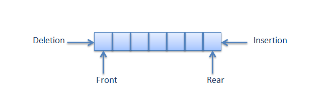

# 큐 queue

큐의 구조는 스택과 다르게 선입선출(FIFO)의 구조를 가지고 있다.  
스택은 막힌 박스와 같아 먼저 들어온 것이 가장 나중에 나가는 구조지만, 큐는 먼저 들어온 것이 먼저 나가는 구조다. 좋은 예로 은행에 있는 번호표가 있다. 은행에 방문하여 기다리는데, 저보다 늦게 온 다른 분이 먼저 업무를 본다면 기분이 나쁘겠죠? 이러한 상황을 만들지 않기 위해 은행에서는 번호표를 나눠준다. 먼저 온 손님은 늦게 온 손님보다 먼저 서비스를 받게 하기 위해서다. 이러한 은행의 븐허표 체계가 큐다.  
  
### ex
은행의 번호표를 다시한번 생각해보자. 내가 619번의 번호표를 뽑았다고 가정했을때. 지금은 618번까지 서비스를 받고있는 상태고, 그러면 번호표 시스템 내부에서는 다음 서비스를 받을 번호를 어떻게 기억해야할까? 그리고 가장 나중에 온 손님이 번호표를 뽑았을 때 몇 번의 번호표를 뽑아줘야할까? 어떻게 기억할까? 번호표 기계도 프로그래밍으로 구현된 하나의 프로그램인데 1번부터 확인하면서 이 손님이 서비스를 받았는지 안받았는지 확인하며 다음으로 호출할 번호를 정할까? 이러면 너무 비효율적이다. 단순하게 생각하면 서비스를 받을 처음 위치와 마지막 위치만 기억하면 쉽게 풀린다.  

> 이 위치들을 큐에서는 front, rear 라고 한다.



위 그림을 보면 Deletion, Insertion이라는 용어가 있다. 이 용어보다는 많은 사람들이 Dequeue, Enqueue라는 용어를 사용한다. Enqueue는 위 그림에서 Insertion과 같다. 마지막으로 온 손님에게 번호표를 주는 것이다. 그럼 Dequeue는 서비스를 받은 번호표는 대기목록에서 지우는 것이다. 그래야 다음으로 호출할 번호를 알 수가 있다.  
  
정리를 해보면
1. Enqueue : 큐 맨 뒤에 어떠한 요소를 추가, 마지막으로 온 손님에게 번호표 발부
2. Dequeue : 큐 맨 앞쪽의 요소를 삭제, 창구에서 서비스를 받은 손님의 번호표를 대기 목록에서 삭제
3. Peek : front에 위치한 데이터를 읽음, 다음 서비스를 받을 손님이 누구인지 확인
4. front : 큐의 맨 앞에 위치(인덱스), 다음 서비스를 받을 손님으 번호
5. rear : 큐의 맨 뒤의 위치(인덱스), 마지막에 온 손님의 번호


### 구현

```java
public class ArrQueue {

	private int front;

	private int rear;

	private int size;

	private Object[] arrQueue;

	

	public ArrQueue(int size){

		this.front = 0;

		this.rear = -1;

		this.size = size;

		this.arrQueue = new Object[this.size];

	}

	

	//Queue 배열이 꽉 차있는지 확인

	public boolean isFull(){

		if(rear >= size-1) return true;

		else return false;

	}

	

	//Queue 배열이 비어있는지 확인

	public boolean isEmpty(){

		if(rear < front) return true;

		else return false;

	}

	

	//원하는 데이터를 추가하는 메쏘드

	public void enQueue(Object item){

		if(isFull()) throw new ArrayIndexOutOfBoundsException();

		

		this.rear++;

		arrQueue[rear] = item;
	}

	

	//front에 위치한 데이터가 무엇인지 확인하는 메쏘드

	public Object peek(){

		return arrQueue[front];

	}

	

	//Queue의 front에 위치한 데이터 삭제

	public Object deQueue(){

		if(isEmpty()) throw new ArrayIndexOutOfBoundsException();

		Object backUpItem = peek();

		this.front++;

		return backUpItem;

	}

}

public class main {


	public static void main(String[] args) {

		ArrQueue arrQueue = new ArrQueue(4);

		arrQueue.enQueue("Hello");

		arrQueue.enQueue(5);

		arrQueue.enQueue("queue");

		

		while(!arrQueue.isEmpty()){

			System.out.println(arrQueue.deQueue());

		}

	}


}
```