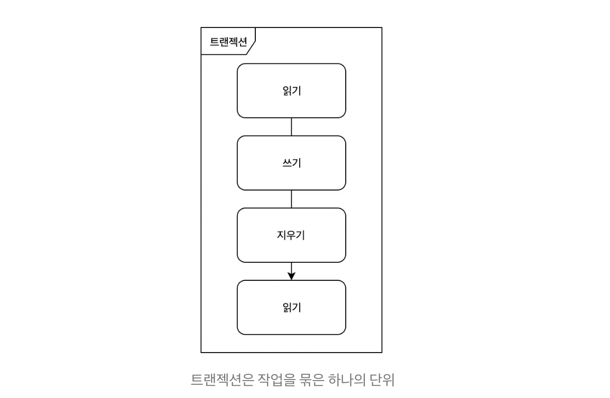

### 트랜잭션과 ACID

### 트랜잭션
여러작업들을 하나로 묶은 단위입니다. 한 덩어리의 작업들은 모두 실행되거나, 실행되지 않습니다.

#### 트랜잭션이 필요한 이유
예를 들면 A은행 -> B은행으로 돈을 보내기 위하여 출금하고 송금한다고 가정합니다. A은행에서 돈을 출금하고나서 B은행으로 송금하려고 하는데 갑자기 시스템이 멈추면 어떻게 될까요? 돈은 출금되었지만, 송금되지 않고 증발하게 되는 끔찍한 상황이 발생합니다.  
  
트랜잭션은 이런 상황이 일어나지 않도록 보장해줍니다.  
  
대부분의 데이터베이스는 송금이 되다가 마는 상황이 발생하지 않도록 여러가지 방법을 제공하지만, 공통적으로 제공하는 가장 기본적인 방법은 트랜잭션을 통하여 데이터의 유효성을 보장하는 것 입니다.  
  
### ACID
ACID는 무슨 뜻일까요? `산`인가요?  

- ACID는 데이터의 유효성을 보장하기 위한, 트랜잭션의 특징들의 앞글자를 딴 단어입니다.

#### Atomicity(원자성)
모든 작업이 반영되거나 모두 롤백되는 특성입니다.

#### Consistency(일관성)
데이터는 미리 정의된 규칙에서만 수정이 가능한 특성을 의미합니다. 숫자컬럼에 문자열값을 저장이 안되도록 보장해줍니다.

#### Isolation(독립성 , 고립성)
A와 B 두개의 트랜잭션이 실행되고 있을 때, A의 작업들이 B에게 보여지는 정도를 의미합니다.

#### Durability(영구성)
한번 반영된 트랜잭션의 내용은 영원히 적용되는 특성을 의미합니다.