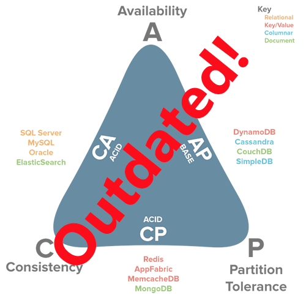

# CAP 이론

### CAP 이론이란?
CAP 이론(또는 Brewer's theorem)이란 Network로 연결된 분산된 **데이터베이스 시스템은 일관성(Consistency), 가용성(Availability), 분할 내구성(Partition Tolerance)의 3가지 특성중 2가지 특성만을 충족 할 수 있고 3가지 모두 충족할 수 없다는 이론**입니다. 그러면 각 구성요소에 대해서 알아보도록 하겠습니다.

### 일관성 (Consistency)
**일관성을 가진다는 것은 모든 데이터를 요청할 때 응답으로 가장 최신의 변경된 데이터를 리턴 또는 실패를 리턴**한다는 것입니다. 즉, 모든 읽기에 대해서 DB노드가 항상 동일한 데이터를 가지고 있어야한다는 의미입니다.  
  
DB가 2개의 인스턴스를 유지하고 있다면 a에 요청하든 b에 요청하든 동일한 값이 반환됨을 의미합니다. 이 말은 a에 update를 하든 b에 update를 했을 경우 누군가 동기화 되기전 READ를 한다면 바로 반환하는 것이 아니라 모두 동기화 후 처리합니다.

### 가용성 (Availability)
**가용성은 모든 요청에 대해서 정상적인 응답을 한다는 것**입니다. 즉, **클러스터 노드 일부에서 장애가 발생하더라도 READ와 WRITE등의 동작은 항상 성공적으로 리턴**되어야 한다는 것입니다.

### 분할 내구성 (Partition Tolerance)
**분할 내구성이란 DB Node간의 통신 장애가 발생하더라도 동작해야한다는 것**입니다. 인스턴스 a b 가 있을때 a b의 인스턴스간의 네트워크 장애가 발생했다고 해보자. 유저는 a DB에서 쿼리를 했고 인스턴스 A는 B의 상태를 알지 못하지만 A 자체만으로 동작합니다. 이를 분할 내구성이라고 합니다.

### 가용성 VS 분할 내구성
가용성과 분할 내구성의 개념이 조건 헷갈릴 수 있을 것입니다. 개인적으로 확인 했을때 **가용성은 노드에서 장애가 발생하여 다운**되었을 때, 분할 내구성은 **노드간의 통신이 정상적으로 이루어지지 않을 때**라고 확인하였습니다.
  
Client 입장에서보면 차이가 있습니다. 전자의 경우 client a와 b가 있을때 모두 동일한 장애가 나지 않는 node를 이용하지만, 후자의 경우 client 별로 바라보고 있는 Node가 ㄷ를 수 있습니다.

 

## 실제 DB 비교

CAP 이론에 맞춰 DB가 어떤 특성 2가지를 가지고 있는지 확인한 삼각형 그래프입니다.  
몇가지 DB를 예를들어 확인해보도록 하겠습니다.

### MySQL
MySQL은 위의 삼각형 그래프에서 CA에 속합니다. 하지만 실질적으로는 설정하기에 따라서 CP또는 CA에 속할 수 있습니다. 기본적으로 MySQL을 그냥 사용했을 때는 CA에 속하게 됩니다. 왜냐하면 main이 되는 master노드가 있고 그 노드를 복제해서 사용하는 slave가 있는 패러다임을 사용하기 때문입니다. 이때 MySQL은 가용성과 일관성을 만족하게 됩니다.  
  
**하지만 MySQL은 cluter 설정을 지원합니다. 이 설정을 하면 MySQL은 CP를 만족하는 시스템**이 됩니다. 왜냐하면 data를 유지할만한 cluster노드가 존재하지 않으면 cluster는 종료될 것이기 때문입니다.

### DynamoDB
DynamoDB는 aws에서 지원하는 key/Value의 NoSQL로 AP에 속한다고 알려져있습니다. Dynamo는 key값을 hashing 하고 또 이 값을 mod하여 맞는 서버에 저장해둡니다. 그리고 전체 노드 중 일부 node에 복제해 둡니다. 그리고 data versioning도 진행합니다.** DynamoDB에는 strongly consistent 설정을 할 수 있습니다**. 이 설정을 하게 되면 DynamoDB는 CP로 변하게 됩니다. 이 설정을 하게 되면 가장 최신의 데이터를 반드시 리턴하게 됩니다. 따라서 모든 노드를 찾기 때문에 가용성은 조금 떨어지게 됩니다.