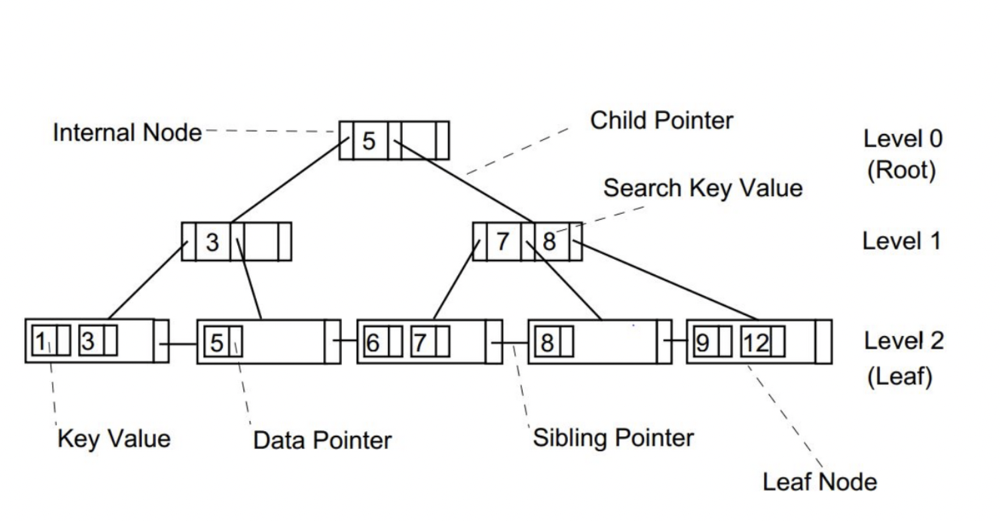

# 데이터베이스 성능을 위한 Index와 동작원리

### 인덱스 사용 이유

위 예시에서 SELECT 문을 활용해 SCOUNTER 테이블엥 있는 AIRPORT Column에 있는 LCY라는 값을 조회한다고 해보자. 그렇다면 SELECT 문은 모든 테이블에 있는 데이터를 모두 조회한 후 최종적으로 LCY가 포함된 모든 값들을 반환하는 로직으로 작동할 것이다. 인간이 위 테이블을 직관적으로 봐서 결과를 찾아낼 때에는 LCY가 마지막으로 들어 있는 `위치`를 알고 아래 데이터들은 무시할 수 있다. 하지만 데이터베이스 조회 구문은 LCY 값의 마지막 위치가 어디인지 모르기 때문에 데이터 전체를 탐색함으로써 결과를 반환해준다. 그리고 만약 데이터가 수십만 개가 들어 있을때 조회 기능이 자주 실행되는 서비스가 있다면 계속해서 데이터베이스를 처음부터 끝까지 조회하면 값을 반환하기 때문에 트래픽에 따라 성능이 저하될 수 밖에 없다. 그래서 데이터베이스에서도 이러한 문제점을 방지하고자 `index`를 활용해 자주 조회되는 Column에 대한 Index Table을 따로 만들어 SELECT 문이 들어왔을 때 Index 테이블에 있는 값들로 결과 값을 조회해 온다. 그래서 Index를 잘 사용한다면 `검색` 연산을 실행했을때 성능을 드라마틱하게 올릴 수 있게 된다.

 

### Index는 어떻게 동작하는가?

위 예시를 그대로 이어 설명하면 SCOUNTER TABLE 생성 시 AIRPORT 칼럼에 대한 인덱스를 주면 AIRPORT 칼럼에 대한 인덱스 테이블이 생성이 된다. 그리고 나중에 SCOUNTER 테이블에 AIRPORT 칼럼에 대한 WHERE 문이 포함된 쿼리가 나갈 떄 AIRPORT인덱스 테이블에 저장된 key-value 값을 참조해서 SCOUNTER 테이블에서 결과 값을 반환해온다.  
  
**동작순서**
- Index Table에서 where에 포함된 값을 찾음.
- 해당 값의 table_id[PK]를 가져옴.
- 가져온 table_id [PK] 값으로 원본 테이블에서 값을 조회해옴. 

그리고 DBMS는 INDEX를 다양한 알고리즘으로 관리를 하고 있는데 일반적으로 사용되는 알고리즘은 B+ Tree 알고리즘이다.

 

### B+Tree 인덱스 알고리즘

#### B-Tree 구성
- 리프 노드 : 실제 데이터가 저장되는 노드
- 논리 노드 : 리프 노드까지의 경로 역할을 하는 노드
- 루트 노드 : 경로의 출발점 노드

B+Tree 는 리프 노드에 이르기까지 자식 노드에 대한 포인터가 저장되어 있어 탐색에 있어 루트 노드에서 어떤 리프 노드에 이르는 한 개의 경로만 검색하면 되기 때문에 검색에 있어 매우 효율적이 알고리즘이다.

 

### Index 종류

인덱스 기존 DB 테이블과 달리 데이터 중복성을 가질 수 있다. 그래서 다양한 종류의 인덱스 형태가 존재하는데, 인덱스 종류는 내가 사용하는 목적에 따라 적절하게 사용하는 것이 좋다.

#### 키에 따른 인덱스 분류
- 기본 인덱스: 기본키를 포함하는 인덱스(키의 순서가 레코드의 순서를 결정 지음)
- 보조 인덱스: 기본 인덱스 이외의 인덱스 (키의 순서가 레코드의 순서를 의미하지는 않음)

#### 파일 조직에 따른 인덱스
- 집중 인덱스 : 데이터 레코드의 물리적 순서가 그 파일에 대한 인덱스 엔트리 순서와 동일 혹은 유사하게 유지되도록 구성된 인덱스.
- 비집중 인덱스 : 집중 형태가 아닌 인덱스

#### 데이터 범위에 따른 인덱스 분류
- 밀집 인덱스 : 데이터 레코드 각각에 대해 하나의 인덱스 엔트리가 만들어진 인덱스
- 희소 인덱스 : 레코드 그룹 또는 데이터 블록에 대해 하나의 엔트리가 만들어지는 인덱스

 

## 언제 인덱스를 사용할까?

### 인덱스의 특징

#### 인덱스 테이블
- 인덱스는 하나의 테이블을 생성해 값을 저장해놓고 사용함. 그래서 다른 테이블에 의존적인 새로운 테이블이 하나 생성된다는 점에서 무분별한 인덱스 생성은 오히려 성능 저하를 초래할 수 있다.

#### 정렬
- 인덱스 테이블은 "이진트리 검색"을 사용하기 때문에 기본적으로 정렬되어 있다. 그래서 만약 인덱스 테이블이 참조하는 테이블에서 "삽입", "삭제" , "수정"이 자주 일어나게 된다면 인덱스 테이블에서는 데이터를 정렬하면서 삽입, 삭제, 수정이 이루어지기 때문에 전체적인 성능 저하를 초래할 수 있다.

- 예를들어 배달의 민족과 같은 서비스는 주로 사용자가 지역별 배달 음식점을 조회하고 검색하는 기능이 서비스의 주요 기능이라 인덱스를 사용하면 데이터베이스의 성능을 최적화 시킬 수 있다
- 그러나 페이스북과 같은 소셜 미디어는 새로운 글딜이 끊임없이 사용자들이 생성하기 때문에 인덱스 기능을 사용하면 오히려 성능을 저하 시킬 수 있다.

결론적으로 인덱스는 검색에 최적화 된 기능이기 때문에 , 삽입 삭제 수정이 자주 일어나는 비즈니스 로직 혹은 테이블 사용 용도에 따라 인덱스 사용 여부를 신중하게 고민해보아야 한다.