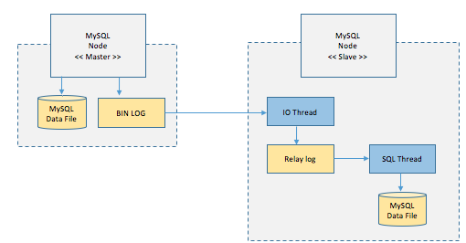

# 리플리케이션(Replicatioin) vs 클러스터링(Clustering)

### 리플리케이션이란?

- **여러개의 DB를 권한에 따라 수직적인 구조로 구축하는 방식이다.**
- 리플리케이션에서 Master Node는 쓰기 작업만을 처리하며 Slave Node는 읽기 작업만을 처리한다.
- 리플리케이션은 비동기 방식으로 노드들 간의 데이터를 동기화하는데, 자세한 처리 방법은 아래와 같다.

위의 그림은 MySQL의 리플리케이션 방식에 대한 그림이며 자세한 처리 순서는 아래와 같다.

1. Master 노드에서 쓰기 트랜잭션이 수행된다.
2. Master 노드는 데이터를 저장하고 트랜잭션에 대한 로그를 파일에 기록한다.(BIN LOG)
3. Slave 노드의 IO Thread는 Master 노드의 로그 파일(BIN LOG)를 파일(Replay Log)에 복사한다.
4. Slave 노드의 SQL Thread는 파일(Replay Log)를 한 줄씩 읽으며 데이터를 저장한다.

리플리케이션 Master와 Slave간의 데이터 무결성 검사를 하지 않는 비동기방식으로 데이터를 동기화한다. 이러한 구조의 이해 리플리케이션 방식은 다음과 같은 장단점을 가지고있다.

#### 장점
- DB 요청의 60~80% 정도가 읽기 작업이기 때문에 리플리케이션만으로도 충분히 성능을 높일 수 있다.
- 비동기 방식으로 운영되어 지연 시간이 거의 없다

#### 단점
- 노드들 간의 데이터 동기화가 보장되지 않아 일관성있는 데이터를 얻지 못할 수 있다.
- Master 노드가 다운되면 복구 및 대처가 까다롭다.

 

### 클러스터링이란?
- 클러스터링이란 **여러 개의 DB를 수평적인 구조로 구축하는 방식**이다.
- 클러스터링은 분산 환경을 구성하여 Single point of failure와 같은 문제를 해결할 수 있는 Fail Over 시스템을 구축하기 위해 사용된다.
- 클러스터링은 동기 방식으로 노드들 간의 데이터를 동기화 하는데, 자세한 처리 방법은 아래와 같다.

1. 1개의 노드에 쓰기 트랜잭션이 수행되고 COMMIT을 실행한다.
2. 실제 디스크에 내용을 쓰기 전에 다른 노드로 데이터 복제를 요청한다.
3. 다른 노드에서 복제 요청을 수락했다는 신호를 보내고, 디스크에 쓰기 시작한다.
4. 다른 노드로부터 신호를 받으면 실제 디스크에 데이터를 저장한다.

클러스터링은 DB들 간의 데이터 무결성 검사(데이터가 일치하는지)를 하는 동기방식으로 데이터를 동기화한다. 이러한 구조에 의해 클러스터링 방식은 다음과 같은 장점과 단점을 갖고 있다.

#### 장점
- 노드들 간의 데이터를 동기화하여 항상 일관성있는 데이터를 얻을 수 있다.
- 1개의 노드가 죽어도 다른 노드가 살아 있어 시스템을 계속 장애없이 운영할 수 있다.

#### 단점
- 여러 노드들 간의 데이터를 동기화하는 시간이 필요하므로 리플리케이션에 비해 성능이 떨어진다.
- 장애가 전파된 경우 처리가 까다로우며, 데이터 동기화에 의해 스케일링에 한계가 있다.