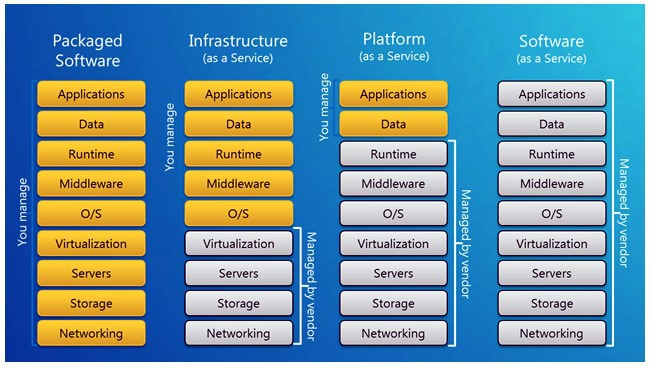

# IaaS, PaaS, SaaS 차이

- `IaaS` : os 설치 전까지 VM 환경을 구성해 준다.
- `PaaS` : 개발자가 운영할 수 있는 운영 환경까지 구성을 해준다.
- `SaaS` : 사용자가 바로 사용할 수 있게 모든 환경을 제공해준다.

### IaaS (Infrastructure as a Service)
- Infrastructure 레벨을 제공하는 서비스 (VM Hosting)
- 서버, 스토리지, 데이터베이스 등과 같은 시스템이나 서비스를 구축하는데 필요한 IT 자원을 서비스 형태로 제공받아 사용
- Amazon의 EC2(Amazon Elastic Computer Cloud) 서비스가 사용하는 방식

### PaaS (Platform as a Service)
- 개발자가 응용 프로그램을 작성할 수 있도록 플랫폼 및 환경을 제공하는 클라우드 서비스
- 사용자는 어플리케이션 서비스가 실행되는 실행 환경을 서비스 형태로 제공받아 사용
  - node.js, java와 같은 소프트웨어를 미리 구성해 놓아서, 사용자는 소스 코드가 입력하면 바로 서비스가 되는 방식
- 사용자는 OS, Server H/W, Network등을 고려할 필요가 없음
- 마이크로소프트 Azure Platform 서비스가 사용하는 방식

### SaaS(Software as a Service)
- 사용자가 네트워크로 접속 해 메일, 워드 프로세스 같은 어플리케이션을 사용
- 소프트웨어를 서비스 형태로 제공받는 방식
- 모든 것이 소프트웨어 제공자에 의해 관리됨

