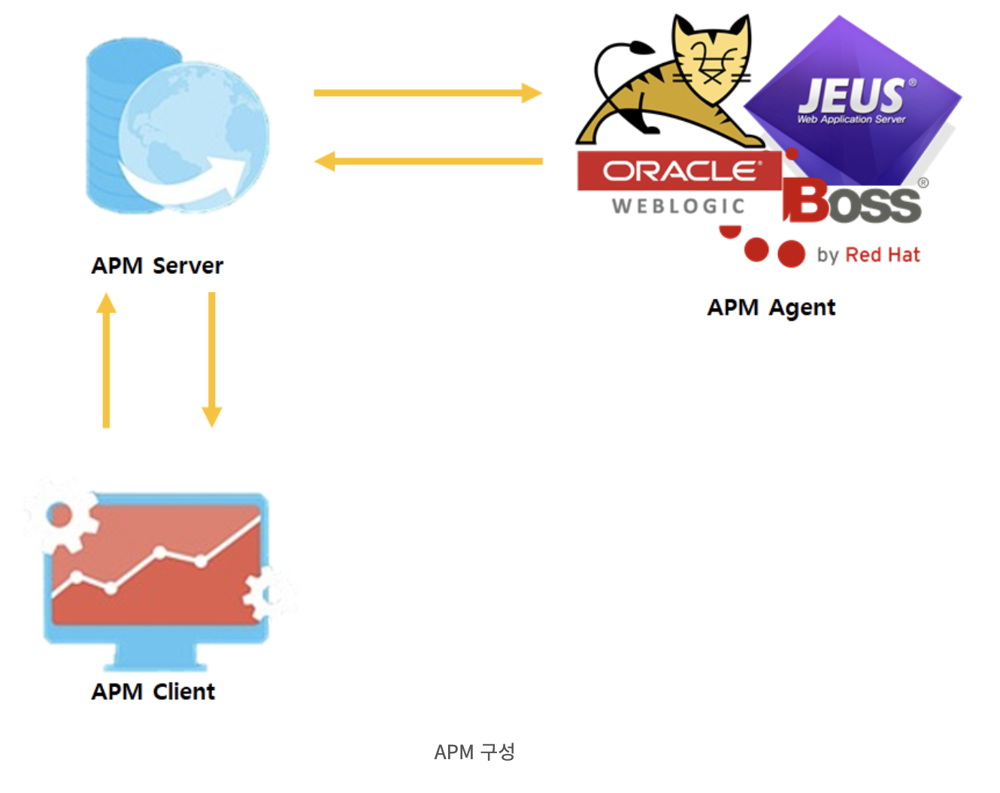

# APM(Application Performance Management)

## APM
풀 네임 그대로 애플리케이션의 성능을 관리하는 서비스입니다.

웹 서비스를 제공하는데 있어 안정적으로 운영할 수 있도록 지원하는 서비스입니다.

### APM 도입시기
서비스 개발이 완료되고 테스트 단계부터 도입하여 운영하는 것이 효율적입니다.

다양한 어플리케이션 지원 | 모니터링 | 성능 관리 | 장애 관리
--|--|--|--
오픈소스, 상용 어플리케이션과 연동 | 실시간 대쉬보드 제공, 사용자 정의에 따른 모니터링 제공, 통계 제공 | 연관 분석 기능, 응답속도 측정 후 분석 | 장애 발생 시 경보, 장애 발생 원인 정보 제공

### APM 구성

APM은 크게 3가지로 구성되어 있습니다.
- APM Server: APM Agent로 부터 수집된 데이터를 분석하고 실제 동작하는 서버
- APM Agent: APM Server에서 데이터를 수집하기위해 Agent가 설치된 어플리케이션 서버
- APM Client: APM Server에서 수집 및 분석한 데이터를 사용자들에게 제공

### APM Solution

Scouter, Prometheus, WhaTap 등의 모니터링 솔루션은 종류가 정말 많다