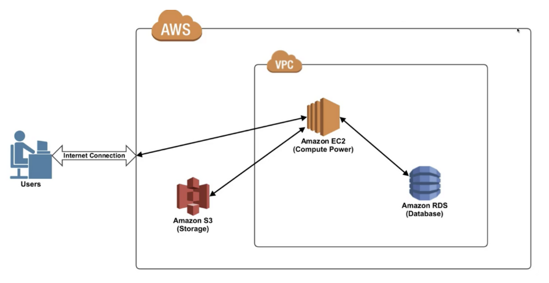

# 클라우드와 AWS의 기본 개념

### 클라우드
클라우드 서비스란 컴퓨터가 가상의 공간에 있다고 가정하고 자유롭게 쓰는 것이다. (말이 가상의 공간이지, 사실 실제로 매우 큰 데이터센터를 지어놓고 프로그램으로 그 리소스를 갖다 쓸 수 있게 하는 것이다.)  
  
우리가 흔히 하는 클라우드 서비스는 구글 드라이브가 있겠으나, 이는 클라우드 서비스 중에서 SaaS(Software as a Service)라고 클라우드 하드웨어, 운영체제, 프로그램까지 다른 곳에 있고 서비스만 가상 공간에서 갖다 쓰는 것이다.  
  
그러나 AWS같은 경우는 기본적으로 IaaS(Infrastructure as a service)이다. 즉, 가상의(해당 회사의 데이터센터의) 하드웨어만 제공받으면 그 위에 올라가는 운영체제나 프로그램등을 모두 자유롭게 서비스로 이용하는 것이다.

#### 클라우드 서비스의 장점

- **확장성 (scalability)**
  - 내가 데이터센터를 직접 구축할 필요가 없으니 필요한 만큼 쓰다가 더 많은 리소스가 필요하면 그 만큼 돈만 내면 되는 것이다,
  - 빠르게 원하는 만큼의 서비스 확징이 가능하다.
- **탄력성 (elasticity)**
  - 서비스가 특정 시기에만 트래픽이 몰릴 수도 있다.
  - 이러한 경우 클라우드 서비스를 사용하면 사람들이 많이 접속할 때만 리소스를 많이 썼다가 사람들이 빠지면 다시 되돌릴 수도 있다.
- **높은 접근성(high availability)**
  - 클라우드 서비스를 이용하면 언제 어디서든 해당 클라우드에 접근하거나 클라우드가 제공하는 서비스를 사용할 수 있다.
- **장애 허용성 (fault tolerance)**
  - 보통 클라우드 서비스 제공자들은 우리가 저장한 데이터를 한 곳에만 저장하지 않고, 여러 공간(다른 데이터센터)에 나누어 저장한다.
  - 이럴 경우 한 곳에서 자연재해가 발생하더라도 우리의 데이터는 안전하다.

 

### AWS란?
- 아마존이 제공하는 클라우드 서비스다.
- 기본적인 개념은 위와 같다.
- 상세한 서비스 이름이나 사용 방식 정도만 서비스업체별로 조금 차이가 나는 것 뿐이다.

유저가 우리의 서비스에 들어오면 정확히는 AWS에 있는 데이터센터 중에서 우리가 구입한 만큼의 기능을 가진 서비스에 접근하는 것이다.  
  
우리가 구입한 부분을 모아둔 것을 VPC라 생각하자.

#### VPC

VPC란 virtual private cloud의 약자로  
페이스북 - 내 페이지의 관계가 AWS - VPC의 관계라고 생각하면 된다.  
  
즉, 내가 등록한 무언가를 전체공개할지 특정 사람에게만 공개할지, 어떤 것을 등록할지 모아둔 나만의 개인적인 공간으로 `security`의 제약을 줄 수가 있다.  
  
페이스북 내에서 내 포스트를 등록하듯이  
VPC안에서 등록하는 내 가상 컴퓨터의 가장 대표적인 것이 EC2이다.

#### EC2

EC2는 elastic cloud compute의 약자로.  
그냥 컴퓨터라고 생각하면 된다.  
컴퓨터에 보통 cpu, os, 하드웨어 ram , 네트워크 카드, 방화벽 등이 있듯이  
가상의 공간(실제 데이터베이스)에 나만의 컴퓨터를 등록하는 것이다.  
  
주로 우리가 웹사이트를 개발하기 위한 코드를 만들면 그 코드를 넣어두고 동작하게 하는 컴퓨터(웹 호스팅 서버)로 사용한다.

#### RDS

RDS는 Relational Database Service의 약자로, 관계형 데이터베이스를 서비스하는 기능이다.  

#### S3

S3는 Simple Storage Service의 약자로  
영화, 비디오, 이미지 등 파일을 저장해두는 기능을 제공하는 서비스이다.  
방대한 양을 오래동안 안전하게 보관하고 사용할 수 있다.