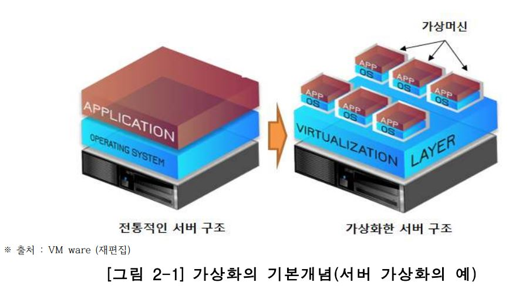
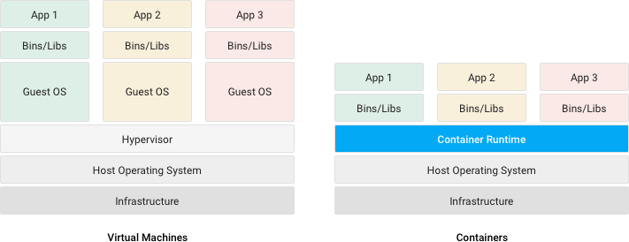

# 가상머신(Virtual Machine) vs 컨테이너(Container)

### 가상화 개념
가상화(Virtualization)는 물리적인 컴포넌트(Components, HW장치)를 논리적인 객체로 추상화 하는 것을 의미하는데, 마치 하나의 장치를 여러개처럼 동작 시키거나 반대로 여러개의 장채를 묶어 마치 하나의 장치인 것 처럼 사용자에게 공유자원으로 제공할 수 있어 클라우드 컴퓨팅 구현을 위한 핵심 기술이다.  
  
가상화의 대상이 되는 컴퓨팅 자원은 프로세서(CPU), 메모리(Memory), 스토리지(Storage), 네트워크(Network)를 포함하며, 이들로 구성된 서버나 장치들을 가상화함으로써 높은 수준의 자원 사용률(물리서버 10 ~ 15퍼 , 가상화 70퍼 이상) vs 과 분산 처리 능력을 제공할 수 있다.

 

### 가상 머신

가상화를 통해 구현되는 복제된 컴퓨팅 환경.  

**운영 목적**
1. 하나의 하드웨어 위에 동시에 여러 종류의 운영체제나 프로토콜 실행
2. 하나의 하드웨어 자원을 여러 사용자에게 분할
3. 가상화를 통해 분할된 시스템 간 상호 간섭이 없는 독립성을 보장

### 하이퍼 바이저
공용 컴퓨팅 자원을 관리하고 가상머신들을 컨트롤하는 중간 관리자

### 컨테이너

모듈화되고 격리된 컴퓨팅 공간 또는 컴퓨팅 환경을 의미하며, 시스템 환경 의존성을 탈피하고 안정적으로 구동.  
  
컨테이너 기술의 등장 배경: 개발한 프로그램이 구동환경의 달라짐에 따라 예상하지 못한 각종 오류를 발생시키는 것을 해결하기 위함(= 컴퓨팅 환경 간 이식성 증가)

 

### 가상머신과 컨테이너의 차이점

1. 컨테이너는 가상화에서 하이퍼바이저와 게스트os 불필요
2. 대신, 컨테이너는 OS 레벨에서 프로세스를 격리해 모듈화된 프로그램 패키지로써 수행함
3. 따라서 컨테이너는 가상머신보다 가볍고 빠름
4. 이는 더 많은 응용프로그램을 더 쉽게 하나의 물리적 서버에서 구동시키는 것을 가능케 함

