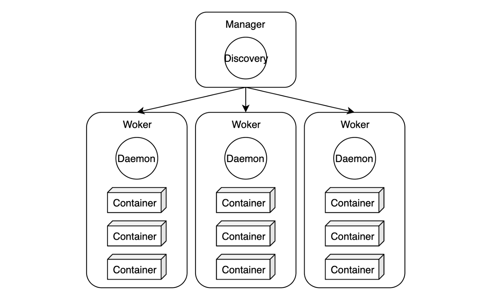

# Docker Swarm

### Docker Swarm 이란

Docker Swarm은 도커 컨테이너를 위한 클러스터링, 스케줄링 툴이다.  
Swarm을 이용하면 여러 개의 서버와 컨테이너 관리를 쉽게 할 수 있다.  
즉 Docker Swarm은 여러 대의 Docker 호스트들을 마치 하나인 것처럼 만들어주는 Orchestration 도구이다.

### Docker 용어 정리
도커 스웜을 실습에서 사용하기 전에 이해를 위해 간단히 스웜에 쓰이는 용어를 정리해보도록 하자. 

### Node
- 텍스트클러스터에 속한 도커 서버 단위. 보통 **한 서버에 하나의 도커 데몬**을 실행하기 때문에 **노드는 곧 서버**라고 이해할 수 있다. (1 node = 1 server)

### Manager
- 매니저는 **클러스터의 상태를 관리**한다. 명령어는 매니저 노드에서만 실행할 수 있다. 아키텍처상에서 매니저는 High Avaliability(고가용성)을 위하여 여러대 실행되어야 한다. 일반적으로 노드마다 매니저가 배포된다.
- 매니저 노드는 아래의 업무를 통해 **도커 클러스터를 관리한다.**

1. 클러스터의 상태를 유지: 땟목 알고리즘 사용
2. 스케줄링 서비스: 작업자 노드에게 컨테이너를 배포한다. 특정 노드에게만 배포하거나, 모든 노드에 하나씩 배포할 수도 있다.
3. 스웜 모드 제공: docekr swarm init

- 매니저는 땟목 합의 알고리즘을 이용해 스웜 전체와 거기서 돌아가는 서비스들이 일관된 상태를 유지할 수 있도록 한다. 뗏목 합의 알고리즘은 쉽게 말해 여러 서버 중 일부에 장애가 생겨도 나머지 서버가 정상적인 서비스를 할 수 있도록 하는 것이다.(장애가 생긴 서버는 전체 서비스를 중단하지 않고도 복구할 수 있다.)
- 이 때문에 하나의 매니저로만 스웜을 운영하면 서비스는 제 기능을 하겠지만, **북구를 위해 새로운 클러스터를 하나 더 만들어야 한다.** 따라서 장애가 생겨도 계속 서비스를 유지하려면 **여러 개 홀수로**의 노드를 운영하는 것이 좋다. 도커에세는 최대 수를 7개로 잡고 있으며 그 이상의 노드는 성능 저하를 일으킬 수 있다고 경고한다.

### Worker
- 도커에서 일반적으로 **컨테이너를 실행하는 노드**를 작업자 노드라고 한다.
매니저의 **명령을 받아 컨테이너를 생성하고 상태를 체크**한다.
일반 사원에게 관리직을 맡기지 않는 것처럼 작업자 노드에게 매니저 노드가 하는 일(스케줄링, 합의)을 맡기지 않는다. 서비스 규모에 맞게 많이 실행하고, 요청이 많아 지면 Worker를 스케일아웃 한다.
- **작업자 노드**들의 클러스터는 **반드시 하나 이상의 관리자 노드**를 가져야 한다. 매니저 노드 역시 작업자에 속하긴 한다. 단일 매니저를 둔 노드 클러스터에서도 **docker service create라는 명령어로** 도커 스웜을 실행할 수 있다.
- 도커 스웜을 실행할 때, 스케줄러가 매니저 노드에게 작업자 노드가 하는 **Task(컨테이너를 배포하고 관리)를 실행시키지 않기 위해서**는 아래의 명령어로 매니저 노드의 가용성을 drain(배수, 빼내다 등의 의미)으로 설정한다. 스케줄러는 drain 상태의 노드에는 task를 맡기지 않고 active 상태의 노드에게만 task를 할당한다.

#### Node를 Drain 상태로 변경
docker node update

#### Node를 Active 상태로 변경
docker node inspect

### Service Discovery
- 서비스 디스커버리 컨테이너의 실행 위치와 상태를 제공해준다. 이를 위하여 자체 DNS 서버를 가지고 있다. 컨테이너를 생성하면 **서비스명과 동일한 도메인을 등록**하고, 반대로 멈추면 도메인을 제거한다.
- Consul, etcd, zookeeper와 같은 외부 서비스를 사용하지 않아도 되고, Swarm이 내부에서 자체적으로 처리해준다. OpenStack의 Keystone와 AWS의 IAM과 비교할 수 있다.

### Service
- 기본적인 배포 단위다.  하나의 서비스는 하나의 이미지를 기반으로 생성하고 동일한 컨테이너를 한개 이상 실행할 수 있다. 최종적으로 배포되는 서비스는 여러 개의 task로 구성된다.

### Task
- 컨테이너 배포 단위다. 각각의 테스크가 컨테이너를 관리한다. 보통 개별 도커 컨테이너를 의미하지만, 컨테이너를 실행할 때 명령어도 포함한다.
