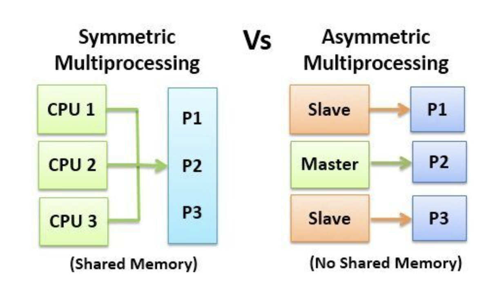
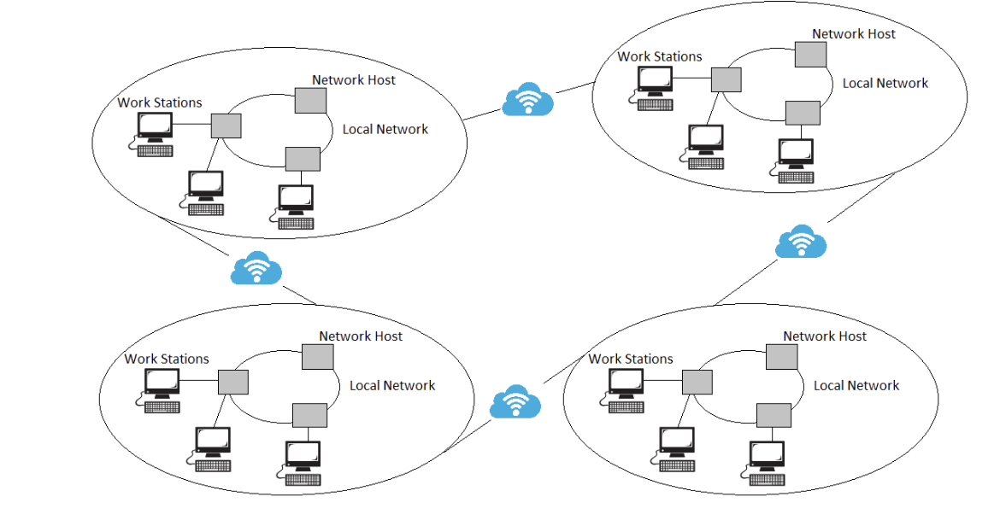

# 컴퓨팅 시스템 Computing System

## 병렬 시스템 Parallel System

다중 프로세서(Mutli Processors) 시스템이다.

2개 이상의 CPU가 각자 맡은 역할을 수행하는 개념으로 이해하는 것이 쉽다.

Tightly coupled system - 프로세서들이 메모리와 클락을 공유하면서 사용한다.
  
2가지 구조가 있다.

### 대칭 구조 Symmetric multiprocessing, SMP

각각의 프로세서가 동일한 운영체제 사본을 가지고 수행한다. 또한 많은 프로세서가 퍼포먼스가 나빠지지 않으며 한 번에 수행된다. 대부분의 OS가 이를 지원하고 있다.

### 비대칭 구조 Asymmetric multiprocessing, AMP

각각의 프로세서가 각자의 역할에 존재하며 마스터 프로세서와 노예 프로세스들로 구성되어 있다.

마스터 프로세스(CPU)가 노예 프로세서들에게 일을 할당하는 구조이다. 거대한 시스템에서 사용하고 있다.

### 장점

1. 경제적이다.
2. 처리량이 높다
3. graceful degradation, fail-soft system: 시간이 지날 수록 실패하는 비율이 작다.
4. 신뢰성이 높다: 하나의 CPU가 고장이 나더라도 다른 CPU가 일을 수행할 수 있다.

쉬운 이해: 공장에서 여러 사람들이 각자의 물품을 만들어 내는 과정을 생각하면 병렬 시스템이다.

 

## 분산 시스템 Distributed System

분산 시스템의 등장은 개인용 컴퓨터가 보급되면서 인터네싱 활성화되기 시작하고 분산 시스템의 개념이 나왔습니다.

대형 메인 프레임 컴퓨터를 사용하는 것보다 개인용 컴퓨터를 여러 개 사용하여 하나로 묶어 대형 컴퓨터에 버금가는 시스템을 만드는데 이것이 바로 분산 시스템입니다.

LAN 같은 네트워크 인프라를 필요로 합니다. 구조는 클라이언트 - 서버로 되어있습니다.

Loosely coupled system - 각각의 프로세서는 각자의 로컬 메모리를 가지고 있다.

병렬 시스템과 차이점이다. (병렬 시스템은 메모리를 공유) 또한 high-speed 버스와 네트워크를 통해 다른 프로세서오의 소통을 한다.

### 장점

1. 자원의 공유
2. 속도가 빠르다
3. 신뢰성이 높다
4. 커뮤니케이션을 한다.

쉬운 이해: 하나의 작품을 만들기 위해 여러 사람들이 붙어서 제작하는 것

 

## 클러스터 시스템 Clusterd System

네트워크에 있는 여러 컴퓨터들을 병렬적으로 하나의 거대한 시스템으로 만드는 것.

분산 시스템이든 병렬 시스템이든 하나의 단일 시스템구조가 목표다. 여러 시스템들에게 공유 저장소를 허용한다.

- 비동기식 클러스터링: 다른 서버들이 대기하는 동안 하나의 서버가 응용 프로그램을 실행하는 구조
- 동기식 클러스터링: 모든 N개의 호스트 서버들이 응용 프로그램을 실행하는 구조

### 장점
높은 신뢰성을 띈다.

 

## Real-Time 시스템

특정 분야에 특화된 시스템으로 보통 과학 실험과 의학적 시스템, 산업 제어 시스템, 가상현실, 전투기 등에 쓰이는 시스템이다.

제한된 고정 시간 안에 처리되는 구조다. Hard-real time과 Soft-real time으로 구분된다.

또한 Real-Time 시스템은 정확성이 핵심이다.

### Hard real-time

일반적인 OS는 지원하기 어렵다. ms 단위로 처리되기 때문에 시간을 준수하지 못한다면 심각한일이 발생할 수 있다.

또한 항상 시스템의 모든 환경과 동기를 유지하고 있어야 한다. 보조 저장소가 제한되거나 없는 경우가 있으며, 데이터는 short-term memory나 ROM에 저장된다.

### Soft real-time
Hard real-time에 비해서 시간 준수의 엄격함이 조금 떨어지긴 하나, 시간을 넘긴다면 불편함이나 잘못됨이 발생할 수 있다.

시스템의 과부하가 발생할 시에는 응답 시간이 증가할 수 있다는 장점이 있다.

Soft real-time에 오류가 발생한다면 체크포인트 이전으로 복구를 진행하여 처리한다.

 

## Handled 시스템
예전에 휴대폰에서 사용하던 시스템. 특징은 제한된 메모리 용량과 느린 프로세서 성능, 작은 화면 사이즈다