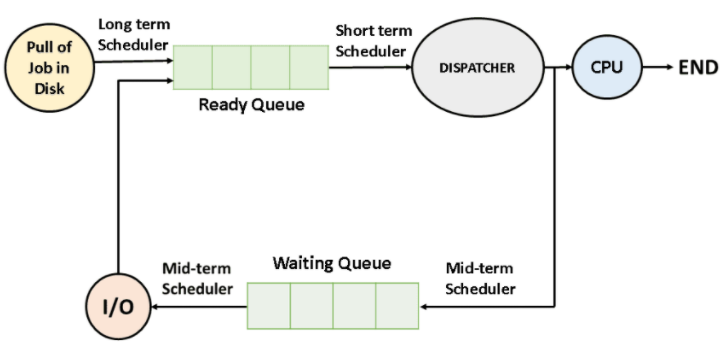
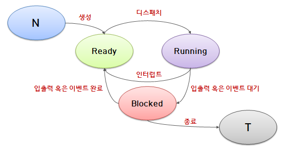

# CPU Scheduling

- OS가 CPU를 사용하려고 하는 프로세스들 사이의 우선순위를 관리하는 작업 => **자원을 어떤 프로세스에 얼마나 할당하는지 정책을 만드는 것**
- 프로세스들에게 자원을 최대한 공평하게 배분하며 처리율과 CPU 이용률을 증가시키고, 오버헤드, 응답시간, 대기시간을 최소화하기 위한 기법
- **선점형 스케쥴링** 과 **비선점형 스케쥴링**이 있음.
- 메모리에 여러 개의 프로세스를 올려놓고(다중 프로그래밍) , CPU의 가동시간을 적절히 나누어(시분할) 각각의 프로세스에게 분배하여 실행

  

## 프로세스 상태 전이
  

- 생성(New)
제일 첫번째로 New에서 Ready로 전이되는 과정입니다. 프로세스가 생성되고 나서 생성

- 디스패치
디스패치란 준비 상태에서 실행 상태로 전이되는 과정을 말하며, 이는 작업 스케줄러가 해당 프로세스를 선택하여 실행되어지는 것으로, 이때 실행된 프로세스가 CPU를 점유하게 됩니다.

- 인터럽트
인터럽트 신호를 받게되면, 실행중이던 프로세스는 준비 상태로 전이되고, 우선순위가 높은 프로세스를 실행 상태로 전이시킵니다.(프로세스는 각각 우선순위를 부여받고, 우선순위에 따라 프로세스가 준비 상태로 전이되거나, 실행 상태로 전이됩니다.)

- 입출력 혹은 이벤트 대기
CPU를 점유하고 있는 프로세스가 입출력 처리를 해야만 하는 상황이라면, 실행되고 있는 프로세스는 실행 상태에서 대기/보류 상태로 바뀝니다. 그리고 대기 상태로 바뀐 프로세스는 입출력 처리가 모두 끝날때까지 대기 상태로 머뭅니다. 그리고 실행 상태이던 프로세스가 대기 상태로 전이됨과 함께, 준비 상태이던 또다른 프로세스가 실행 상태로 전이됩니다. 또한 대기 상태인 프로세스는 우선순위가 부여되지 않으며 스케줄러에 의해 선택될 수 없습니다.

- 입출력 혹은 이벤트 완료
입출력 처리가 끝난 프로세스는 대기 상태에서 준비 상태로 전이되어 스케줄러에게 선택될 수 있게 됩니다. 추가로 프로세스를 종료시킬 때에도 Blocked상태를 거칠 수 있다는 사실을 기억해 두시길 바랍니다.

  

## 비선점 vs 선점형 스케줄링

### 비선점형 스케쥴링
- 프로세스가 입출력 요구 등으로 CPU를 자진 반납할 때까지 CPU에 의한 실행을 보장해주는 스케줄링이다. 작업 실행 시간 전체 또는 한번의 CPU 배당에 적용된다.
- 모든 프로세스에 대한 요구를 공정하게 처리할 수 있지만, 짧은 작업을 수행하는 프로세스가 긴 작업 종료 시까지 대기해야할 수도 있다.(**convey 현상**)
- 처리시간 편차가 적은 특정 프로세스 환경에 용이

 

### 선점형 스케쥴링
- 시분할 시스템에서 타임슬라이스가 소진되었거나 인터럽트 혹은 시스템 호출 종료로 인한 여파로 높은 우선순위의 프로세스가 현 프로세스보다를 강제로 중단시키고 CPU를 회수하는 스케쥴링 방식이다.
- 비교적 응답이 빠르다는 장점이 있지만, 처리 시간을 예측하기 힘들고 높은 우선순위 프로세스들이 계속 들어오는 경우 오버헤드를 초래
- 실시간 응답시간, Deadline 응답환경 등 우선순위가 높은 프로세스를 빠르게 처리해야할 경우 등에 유용

CPU 스케쥴링 | 종류
---|---
비선점형 스케쥴링 | FCFS  SJF  우선순위 스케줄링
선점 스케쥴링 | RR SRT 다단계큐 다단계 피드백 큐