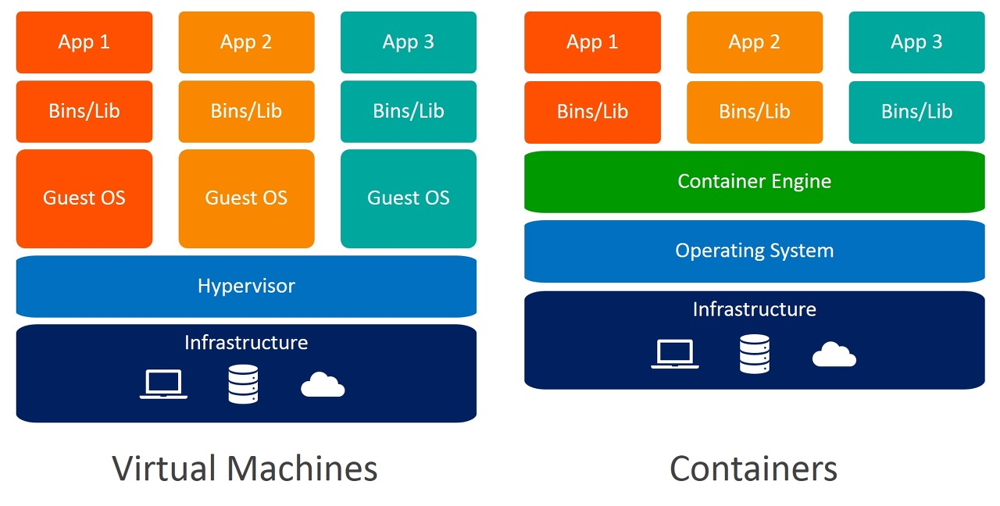

# 도커와 쿠버네티스

 

### Doker(도커)

**컨테이너 기반의 오픈소스 가상화 플랫폼**
- 하나의 큰 애플리케이션을 서비스 단위로 분할하여 빠른 배포 가능
- 컨테이너끼리 서로에게 영향을 끼치지 않음
- 도커는 기술적인 개념이자 도구이며 이미지를 컨테이너에 띄우고 실행하는 기술
- 한 개의 컨테이너를 관리하는데 최적

> `이미지 `: 컨테이너 실행에 필요한 파일과 설정값들을 포함하고 있는 것  
> `컨테이너` : 격리된 공간에서 프로세스가 동작하는 기술

 
  
**가상 머신과 다른 점**
 
  
- `가상머신` : 서버 - Hypervisior 위에 VM들 올리기
- `컨테이너` : 서버 - Hot Os - Doker Engine - Container 들 올리기
  
**장점**
1. 필요한 자원만큼을 컨테이너에 할당하고 운영체제와 자원을 공유하므로 효율적이고 배포가 빠름
2. 또한 하나의 같은 서버에 다른 환경의 컨테이너를 설정할 수 있고 각각의 컨테이너는 독립돼있음!

 

### Kubernetes (쿠버네티스)
**리눅스 컨테이너 작업을 자동화하는 오픈소스 플랫폼이며, 도커를 관리하는 오케스트레이션 툴**  
- 도커를 관리하는 툴
- 도커를 기반으로 컨테이너를 관리하는 서비스
- 여러 개의 컨테이너를 서비스 단위로 관리하는 데 최적화

> 오케스트레이션 : 다수의 컨테이너 실행을 관리 및 조율하는 시스템 (스케쥴링 , 클러스터링, 서비스 디스커버리, 로드 밸런싱, 로깅 및 모니터링 등)
다른 오케스트레이션 툴 -도커 스웜, EC2, Nomad 등등

 

### 요약
`도커` : 하나의 이미지를 컨테이너에 띄우고 실행하는 도구
`쿠버네티스` : 도커를 기반으로 컨테이너를 관리하는 서비스