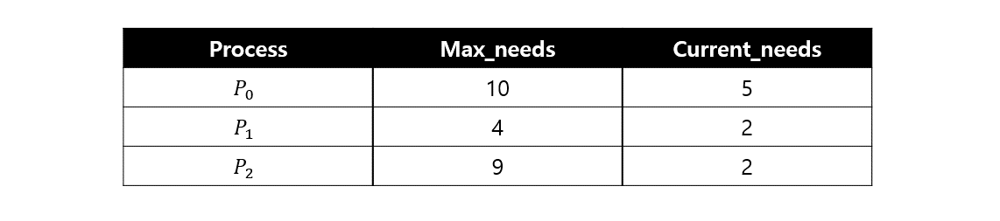

# Synchronize(동기화)와 Deadlock

## 프로세스 동기화
프로세스와 스레드가 동작하면서 공유메모리/자원을 사용하게 된다. 따라서 동기화 문제를 짚고 가야 한다, 공유된 자원에 여러 프로세스/스레드가 동시에 접근할 경우(경쟁 상태, race condition) 문제가 발생하는데 이를 막기 위한 특별한 규칙을 프로세스(스레드) 동기화라 한다.
- 경쟁 상태 : 여러 프로세스/스레드가 공유 자원에 동신 접근 시 그 순서에 따라 결과가 달라지는 문제
- 유저 모드 동기화 : 성능의 이점, 기능의 제한
  - 임계 구역(Critical Section : CS)
- 커널 모드 동기화 : 기능의 이점, 속도의 제한
  - 뮤텍스 기반, 세마포어 기반

 

### 동기화 관련 문제 예시
1. 독자, 저자 문제 : read는 동시 접속이 가능하나 write는 한 명만 가능
  - 계속해서 reader가 들어오면 writer는 무한히 대기해야함
2. 식사하는 철학자 문제 : 원형 테이블에 철학자가 앉아있고 양쪽의 젓가락을 모두 들어서 식사해야함
   1. 모든 철학자가 왼쪽 젓가락을 먼저 들고 이후 오른쪽 젓가락을 들려고 할 때 남아잇는 젓가락이 없기에 그 누구도 식사하지 못하고 무한히 대기해야 함(데드락 상태)

 

### 임계 구역

임계 구역을 여러 프로세스/스레드가 공유 자원에 동시 접근했을 경우 하나의 프로세스/스레드만 접근 하도록 제한하는 코드 영역
- 독자 , 저자 문제에서의 Critical Section : 책 - 공유 DB
- 식사하는 철학자 문제에서의 Critical Section : 젓가락
- Critical Section 문제에서의 해결 조건
  - 상호 배제 : 누군가 임계 구역에 들어가면 다른 이는 접근 불가
  - 진행 : 임계 구역에 작업 종료 프로세스/스레드 적절히 선택
  - 유한 대기 : 기아상태 방지 위해 접근했을 경우 다음 진입시 제한
- 소프트웨어 기반 동기화
  - 피터슨 알고리즘 / 데커 알고리즘 : 프로세스 2개일 때만 사용 가능, busy-wait 문제 발생 가능
  - 램포트의 빵집 알고리즘 : 프로세스 2개 이상일 경우에 사용가능
- 하드웨어 기반 동기화
  - lock 이용 : 프로세스가 락을 획득해야 진입 가능, 임계구역 벗어나면 lock 반납
    - lock 기반 방식은 멀티 프로세서 환경에서 효율성으로 인해 인터럽트 차단이 곤란하여 성능 보장이 안된다.

 

### 세미포어

동기화를 위한 소프트웨어 도구로 동시에 접근 가능한 자원의 수를 관리한다. 커널에 저장된 변수 개념으로 두 가지 atomic 연산 P,V가 존재한다. P는 test를 의미, acquire() 기능이고 V는 increment , release() 기능이다.

1. 프로세스가 임계영역 진입 시 P연산으로 세마포어의 값 감소
2. 작업 수행 완료 후 임계영역 밖으로 나오면 V연산이 세마포어의 값 증가
  
- Busy-Wait 방식 : 루프를 실행하여 접근 가능 체크
- Block-WakeUp 방식 : 요청 시 일단 자원 카운트 감소, 자원이 0 이하라면 대기 큐 삽입, 작업이 완료되어 카운트 증가시키며 반납해도 변수가 0 이하라면 대기 프로세스가 존재함을 의미하게 pop left후 wakeup
- 임계 영역이 길면 Block-WakeUp 방식, 짧은 Busy-Wait이 유리
- 카운팅 세마포어 : 임계영역 안에 프로세스/스레드 진입 시 카운트 증가시켜 일정 숫자 유지
- 이진 세마포어 0과 1로만 이루어진 세마포어로 임계 영역 안에 하나의 프로세스만 들어가게 함. 뮤텍스라고도 한다.
  - 뮤텍스 : 영어를 읽기 편하게 줄인 말. locking 매커니즘으로 취득/반환의 개념이다.
- 세마포어, 뮤텍스 차이점 : 뮤텍스는 동기화 대상이 1개, 세마포어는 1개 이상일 때 사용
- 세마포어에서도 데드락 발생 가능

 

### 모니터

모니터 내에서 한 번에 한 개의 프로세스만 동작, 뮤텍스의 상위호환 개념으로 프로그래머가 프로세스에 lock을 거는 등 동기화 제약 조건을 명시적으로 코딩할 필요가 없어 세마포어에 비해 간단함

  

## 데드락(Deadlock)
OS에서의 데드락(교착 상태)이란 시스템 자원에 대한 요구가 뒤엉킨 상태를 의미한다. 일련의 프로세스들이 서로가 가진 자원을 기다리며 block된 상태로 무한 대기에 빠진 상황이다.
### 데드락 발생 조건

1. 상호 배제 : 한 번에 프로세스 하나만 해당 자원을 사용할 수 있음. 다른 프로세스는 요청된 자원이 해제될 때까지 대기
   - 철학자가 젓가락 1개를 들고 있으면 다른 이는 그 젓가락을 이용할 수 없음
2. 점유 대기 : 자원을 가진 프로세스가 다른 자원을 기다릴 때 보유 자원을 놓지 않음
   - 철학자가 다른 한 쪽의 젓가락을 기다릴 때 들고 있는 젓가락을 놓지 않음

3. 비선점 : 한 프로세스가 자료를 사용하는 중에는 커널이 빼앗아서 다른 프로세스에 배분할 수 없음
   1. 철학자가 집어든 젓가락은 다른 철학자가 뺏을 수 없음

 

- 위 4 가지 조건을 만족하더라도 드물게 발생한다.
  - 4가지가 성립해야만 비로소 교착상태의 발생확률이 존재
- 컴퓨터 환경에 치명적이고 교착상태에 의한 오류 해결이 힘든 편이다.

 

### 데드락 예방

데드락의 발생 조건 4가지 중 하나라도 발생하지 않으면 데드락이 발생하지 않기 때문에 각 조건을 부정하여 발생 가능성 차단

1. 상호 배제 해결 : 공유 불가능한 상태를 해제하면 동기성 문제가 발생할 여지가 있어 현실적으로 불가능함
2. 점유 대기 해결 : 자원을 가진 상태에선 다른 자원을 기다리게 하지 않는 방법으로 여러 자원이 필요하다면 모든 자원을 얻을 수 있는 경우에만 자원을 요청하여 일부만 얻은 경우 반납함. 자원의 활용률과 성능이 저하되고 starvation이 발생할 수 있음
3. 비선점 해결 : 선점이 가능하다면 CPU의 경우는 문제가 없겠지만 프린트 등을 스위칭하면 곤란함. Save&Restore가 가능한 자원에서만 가능
4. 순환 대기 해결 : 앞의 세 가지보다는 적용할 여지가 있다. 모든 자원에 번호를 매기고 오름차순으로 자원을 요청하는 등 한쪽 방향으로만 자원을 요구한다. 이 역시 자원의 활용률 저하 문제가 있음

- 4가지 조건을 하나를 부정하려 해도 비용이 발생하기에 데드락으로 인한 비용보다 시스템 저하 비용이 작은 군사, 의료 , 항공우주 등의 분야에서나 사용함이 좋음

 
> 데드락 회피
교착상태 회피는 데드락을 지원 요청에 대한 잘못된 승인에서 기인한다고 판단
  
- 안정 상태 : 프로세스들이 요청하는 모든 자원을 데드락 없이 차례대로 모두에게 할당할 수 있는 상태

- 안전 순서 : 자원 할당, 실행, 종료 시 데드락이 발생하지 않는 순서
  - cycle이 없음을 의미한다
  - 단점 : 구현 시 할당 기능 & 이용 가능한 자원의 수와 프로세스가 요구하는 자원의 수 등 사전 정보를 요구한다.
- 안전한 할당을 하여 circular-wait을 회피해야 한다. 불완전한 할당은 데드락 발생의 가능성이 있다.

- 은행원 알고리즘 : 자원의 타입이 여러 개인 경우에 적용, 프로세스가 자원을 요구할 때 자원을 할당한 뒤 안정 상태로 남게 되는지 사전에 검사하여 교착상태 회피
  - 단점 : 할당하는 자원이 일정하고 최대 자원 요구량을 알아야 하며 항상 불안정 상태를 회피해야 하므로 자원 이용률이 낮다

  
 

### 데드락 검출 및 복구
- OS가 주기적으로 교착상태가 발생했는 지 검사
- 주기가 짧으면 오버헤드가 커짐, 길면 복구 가능성 낮아짐
- 탐지 알고리즘
  - Signal Instance의 경우 자원할당 그래프 활용
  - Multiple instance의 경우 은행원 알고리즘 활용

- 복구 기법
  - process termination : 한 번에 모든 프로세스 혹은 한 개씩 종료
    - 한 번에 데드락이 걸린 모든 프로세스 중단 : 연산 중이던 프로세스도 모두 일시 중단되어 중간 결과가 폐기됨
    - 하나씩 중단시키며 탐지 알고리즘으로 데드락 탐지/회복 : 오버헤드 문제
  - resource Preemption : 선점 비용이 최소인 victim 프로세스를 선택하여 자원을 빼앗음

### 데드락의 무시
- 교착상태 필요조건 4가지를 충족하더라도 데드락은 드문 현상임에 착안
- 드물게 발생하는 데드락을 처리하기 위한 비용은 비효율적이라 판다나여 데드락에 아무런 조치도 하지 않음.
- 시스템에서 데드락이 발생한 경우 프로그래머가 직접 process를 죽이는 행위로 대응